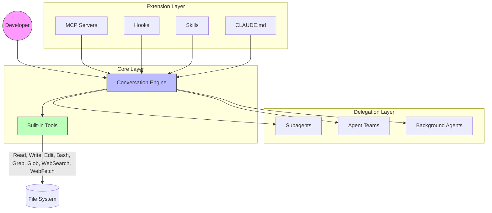
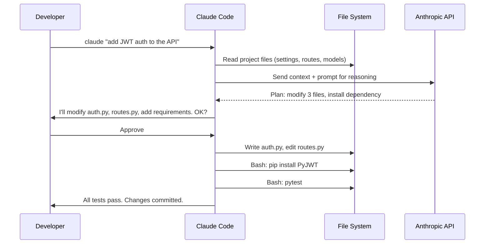
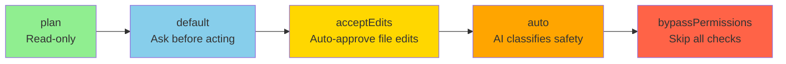
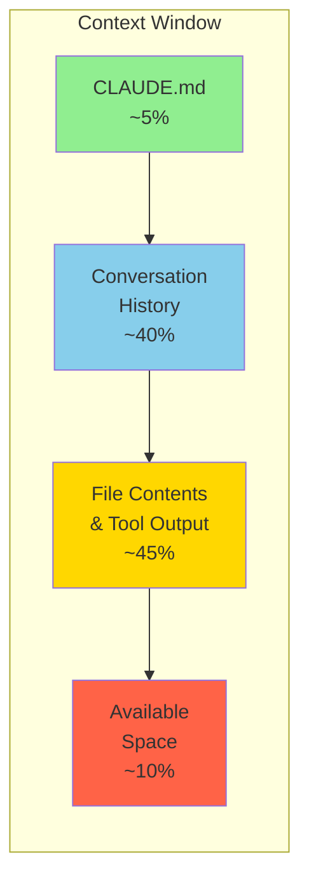
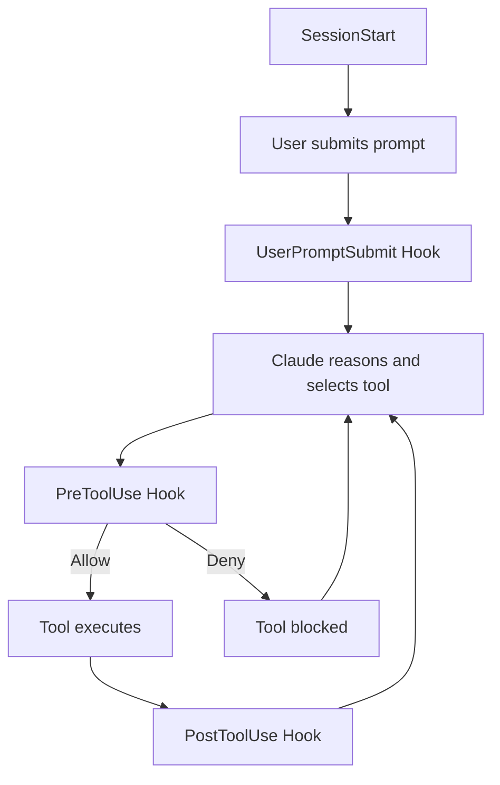
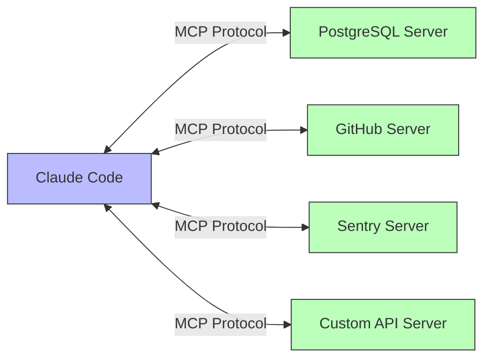
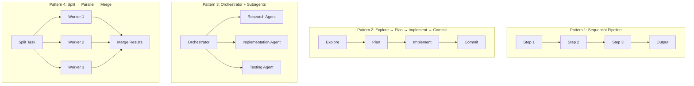
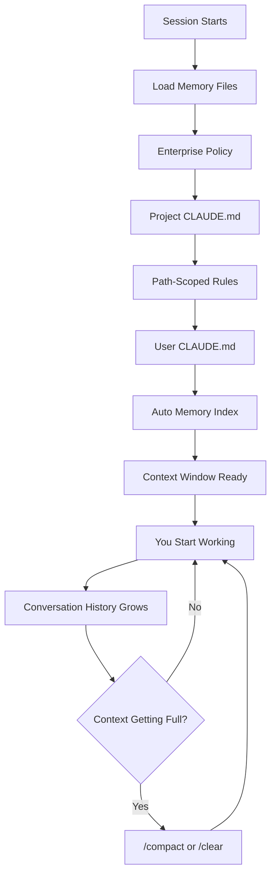
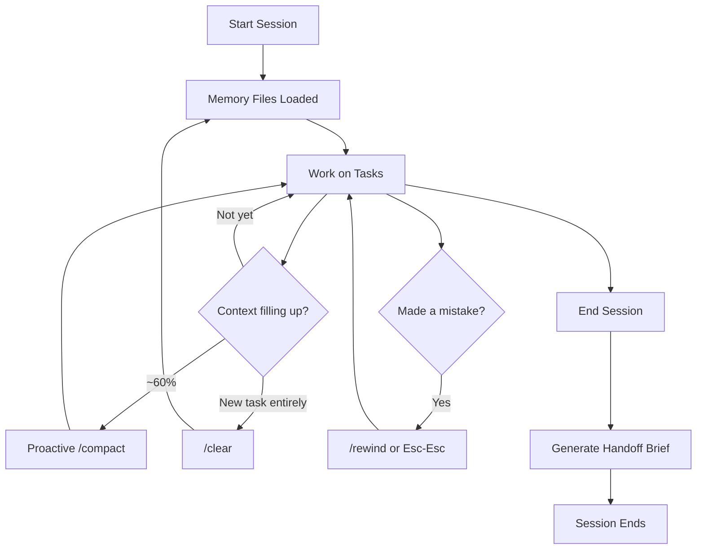
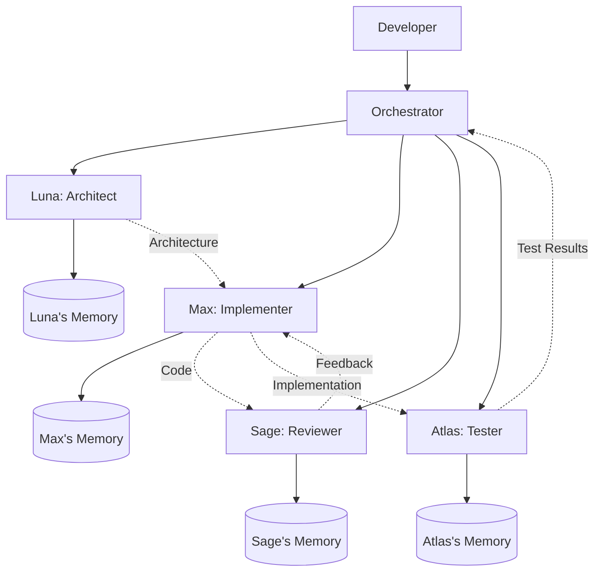

# Claude Code Mastery Guide: From Novice to Pro

> **A comprehensive, hands-on tutorial for mastering Anthropic's agentic coding tool.**
> Written for experienced Python developers who want to unlock the full power of Claude Code — from first install to building production-grade multi-agent systems with persistent memory.

## Key Terms & Concepts

| Term | Definition |
|------|-----------|
| **Agentic coding tool** | A software engineering assistant that plans and executes multi-step tasks autonomously, rather than merely suggesting completions. |
| **Context window** | The maximum amount of text (tokens) Claude can process in a single session. Exceeding it degrades performance. |
| **CLAUDE.md** | A project-level markdown file Claude reads at session start to learn conventions, commands, and architecture decisions. |
| **Skill** | A custom slash command defined by a `SKILL.md` file that encodes reusable workflows. |
| **Hook** | A deterministic trigger that runs shell commands or blocks/approves Claude's tool calls at defined lifecycle events. |
| **MCP (Model Context Protocol)** | An open standard that allows Claude Code to connect to external tools, databases, and services via a standardized server interface. |
| **Subagent** | A child Claude Code session spawned by the parent session to handle an isolated subtask in its own context window. |
| **Agent Team** | A group of specialized Claude Code agents that communicate peer-to-peer and share a task list for complex collaborative workflows. |
| **Background Agent** | A Claude Code session detached from the terminal that runs autonomously and can be monitored separately. |
| **Permission Mode** | A setting controlling how aggressively Claude acts autonomously: `plan` (read-only) through `bypassPermissions` (no checks). |
| **Print mode (`-p`)** | Non-interactive execution: Claude runs the task and exits, making it composable with Unix pipes and scripts. |
| **SDK (Python Agent SDK)** | The `claude-agent-sdk` Python library for embedding Claude Code in applications and automation pipelines. |
| **Tool** | A built-in Claude Code capability such as Read, Write, Edit, Bash, Glob, Grep, WebSearch, or WebFetch. |
| **Session** | A single conversation thread with Claude Code, including all context, history, and working state. |
| **`/compact`** | The slash command that summarizes conversation history to reclaim context window space. |
| **Orchestrator** | A parent agent that decomposes tasks and delegates to specialized subagents, collecting and synthesizing results. |
| **Worktree** | A separate git working directory used to isolate file changes when running parallel agents to prevent conflicts. |

---

## Table of Contents

- [Part I — Beginner: Foundations](#part-i--beginner-foundations)
  - [1. Introduction: What Is Claude Code and Why Should You Care?](#1-introduction-what-is-claude-code-and-why-should-you-care)
  - [2. Installation & Environment Setup](#2-installation--environment-setup)
  - [3. Your First Session: Core Commands & Interaction Model](#3-your-first-session-core-commands--interaction-model)
  - [4. Understanding the Permission System](#4-understanding-the-permission-system)
  - [Mini-Project 1: Scaffold a Python CLI Tool](#mini-project-1-scaffold-a-python-cli-tool)
  - [Quiz 1: Beginner Fundamentals](#quiz-1-beginner-fundamentals)
- [Part II — Intermediate: Configuration & Customization](#part-ii--intermediate-configuration--customization)
  - [5. CLAUDE.md — Teaching Claude Your Project](#5-claudemd--teaching-claude-your-project)
  - [6. Context Management & Session Strategy](#6-context-management--session-strategy)
  - [7. Slash Commands — The Complete Reference](#7-slash-commands--the-complete-reference)
  - [8. The Skills System: Reusable Workflows](#8-the-skills-system-reusable-workflows)
  - [9. The Hook System: Deterministic Automation](#9-the-hook-system-deterministic-automation)
  - [Mini-Project 2: Build a Custom Development Environment](#mini-project-2-build-a-custom-development-environment)
  - [Quiz 2: Intermediate Concepts](#quiz-2-intermediate-concepts)
- [Part III — Advanced: Integration & Programmatic Control](#part-iii--advanced-integration--programmatic-control)
  - [10. MCP: Connecting Claude to External Systems](#10-mcp-connecting-claude-to-external-systems)
  - [11. The Python Agent SDK](#11-the-python-agent-sdk)
  - [12. Multi-Turn Workflows & CI/CD Automation](#12-multi-turn-workflows--cicd-automation)
  - [13. Memory Deep Dive: Persistence, Context & Session Management](#13-memory-deep-dive-persistence-context--session-management)
  - [Mini-Project 3: Build an Automated Code Review Pipeline](#mini-project-3-build-an-automated-code-review-pipeline)
  - [Quiz 3: Advanced Integration](#quiz-3-advanced-integration)
- [Part IV — Expert: Multi-Agent Orchestration](#part-iv--expert-multi-agent-orchestration)
  - [14. Subagents: Delegation & Isolation](#14-subagents-delegation--isolation)
  - [15. Background Agents & Parallel Execution](#15-background-agents--parallel-execution)
  - [16. Agent Teams: Collaborative Multi-Agent Systems](#16-agent-teams-collaborative-multi-agent-systems)
  - [Mini-Project 4: Parallel Security Audit System](#mini-project-4-parallel-security-audit-system)
  - [Quiz 4: Expert Multi-Agent Concepts](#quiz-4-expert-multi-agent-concepts)
- [Part V — Capstone Project: Multi-Agent Development System](#part-v--capstone-project-multi-agent-development-system)
  - [17. System Architecture & Design](#17-system-architecture--design)
  - [18. Building the Memory System](#18-building-the-memory-system)
  - [19. Creating Agent Personalities](#19-creating-agent-personalities)
  - [20. The Orchestration Engine](#20-the-orchestration-engine)
  - [21. Putting It All Together: Full Implementation](#21-putting-it-all-together-full-implementation)
  - [22. Running the System: Example Scenario](#22-running-the-system-example-scenario)
- [Appendix A: Claude Design — The Visual Frontier](#appendix-a-claude-design--the-visual-frontier)
- [Appendix B: Quick Reference Card](#appendix-b-quick-reference-card)
- [Appendix C: Quiz Answer Key](#appendix-c-quiz-answer-key)
- [Appendix D: Pro Tips & Power Patterns](#appendix-d-pro-tips--power-patterns)

---

# Part I — Beginner: Foundations

> **In this part, you will learn to:**
> - Install Claude Code and authenticate on macOS, Linux, and Windows
> - Understand the fundamental difference between Claude Code (agentic) and code completion tools
> - Start interactive and non-interactive sessions and use essential keyboard shortcuts
> - Configure the permission system to control what Claude can do autonomously
> - Build your first project with Claude Code using the mini-project exercise

## 1. Introduction: What Is Claude Code and Why Should You Care?

[↑ Table of Contents](#table-of-contents)

This section introduces **Claude Code** as an **agentic coding tool**, explains how it differs from code completion assistants, and frames the architecture concepts used throughout the guide.

### The Paradigm Shift

If you've used code completion tools like GitHub Copilot, you know the feeling: you type a function signature and the tool suggests the body. Useful, but limited. You're still the one driving — deciding which files to edit, running tests, interpreting errors, and managing git.

**Claude Code operates at a fundamentally different level.** It doesn't suggest code — it *acts*. Give it a task in natural language, and it will:

1. **Read** your entire codebase to understand the architecture
2. **Plan** a sequence of actions to accomplish the goal
3. **Execute** those actions — editing files, running terminal commands, managing git
4. **Iterate** — running tests, fixing errors, and refining until the task is complete
5. **Ask** for your approval before anything destructive

This is the difference between a co-pilot and an *agent*. Claude Code is an autonomous software engineering agent that happens to live in your terminal.

### What You'll Learn in This Guide

By the end of this guide, you will be able to:

- Install, configure, and use Claude Code fluently in your daily workflow
- Customize Claude's behavior with project-specific instructions, skills, and hooks
- Connect Claude to external tools and databases via MCP
- Build programmatic automation pipelines using the Python Agent SDK
- Master memory management, context optimization, and session continuity techniques
- Design and implement multi-agent systems where specialized agents collaborate on complex projects
- Build a complete capstone project: a 4-agent development team with persistent memory and distinct personalities

### Architecture at a Glance

Claude Code is built on a three-layer architecture:



| Layer | Purpose | Components |
|-------|---------|------------|
| **Core** | Main interaction loop | Conversation engine, built-in tools (Read, Write, Edit, Bash, Glob, Grep, WebSearch, WebFetch) |
| **Delegation** | Focused subtasks & parallelism | Subagents, Agent Teams, Background Agents |
| **Extension** | Customization & integration | MCP servers, Hooks, Skills, CLAUDE.md |

### Key Differentiators

| Feature | Code Completion Tools | Claude Code |
|---------|----------------------|-------------|
| Scope | Single file / function | Entire project |
| Action model | Suggests text | Plans and executes actions |
| Tool integration | Editor only | Git, terminal, test runners, linters, databases |
| Autonomy | None — you drive | Agent — it drives, you approve |
| Extensibility | Plugins | MCP, hooks, skills, custom agents |
| Execution | In-editor | Terminal, IDE, desktop, CI/CD |

> **Key Takeaways**
> - Claude Code is an *agentic* tool: it reads your codebase, plans actions, executes them, and iterates — unlike completion tools that only suggest text.
> - The three-layer architecture (Core → Delegation → Extension) determines what Claude can do, what it delegates, and what you can customize.
> - Every task goes through a cycle: read context → reason → plan → execute → verify. Understanding this loop lets you structure prompts that work with it.

[↑ Top of section](#1-introduction-what-is-claude-code-and-why-should-you-care) | [↑ Table of Contents](#table-of-contents)

---

## 2. Installation & Environment Setup

[↑ Table of Contents](#table-of-contents)

This section explains how to install Claude Code, verify your environment, authenticate, choose a model, and connect the CLI to IDE workflows.

### System Requirements

| Requirement | Specification |
|------------|---------------|
| **OS** | macOS 13.0+, Windows 10 (1809+), Ubuntu 20.04+, Debian 10+, Alpine 3.19+ |
| **Hardware** | 4 GB RAM minimum (8–16 GB recommended), x64 or ARM64 |
| **Network** | Internet connection (Claude runs locally but calls Anthropic's API) |
| **Account** | Claude Pro, Max, Team, or Enterprise subscription |

### Step 1: Install Claude Code

The recommended installation uses the native installer — a self-contained binary with automatic background updates and zero external dependencies.

```bash
# macOS / Linux / WSL
curl -fsSL https://claude.ai/install.sh | bash

# Windows PowerShell
irm https://claude.ai/install.ps1 | iex
```

**Alternative package managers:**

```bash
# Homebrew (macOS/Linux)
brew install --cask claude-code

# apt (Debian/Ubuntu)
sudo install -d -m 0755 /etc/apt/keyrings
sudo curl -fsSL https://downloads.claude.ai/keys/claude-code.asc \
  -o /etc/apt/keyrings/claude-code.asc
echo "deb [signed-by=/etc/apt/keyrings/claude-code.asc] \
  https://downloads.claude.ai/claude-code/apt/stable stable main" \
  | sudo tee /etc/apt/sources.list.d/claude-code.list
sudo apt update && sudo apt install claude-code

# WinGet (Windows)
winget install Anthropic.ClaudeCode
```

> **Note:** The npm-based installation (`npm install -g @anthropic-ai/claude-code`) is deprecated. Migrate to the native installer.

### Step 2: Verify Installation

```bash
claude --version    # Confirm the binary is on your PATH
claude doctor       # Run a full system health check
```

`claude doctor` validates your environment — shell compatibility, network connectivity, authentication state, and version currency. Run it whenever something feels off.

### Step 3: First Run & Authentication

```bash
cd /path/to/your/project
claude
```

On first run, Claude opens your default browser for OAuth authentication. Sign in with your Claude Pro/Max/Team/Enterprise account. The token is cached locally — you won't need to re-authenticate unless it expires.

**Alternative authentication methods:**

```bash
# API key-based (for Anthropic Console users)
claude auth login --console
# or set the environment variable:
export ANTHROPIC_API_KEY="sk-ant-..."

# Generate a long-lived token for CI/CD
claude setup-token
```

### Step 4: Choose Your Model

Claude Code supports Anthropic's full model lineup:

| Model | ID | Strengths | Use When |
|-------|----|-----------|----------|
| **Claude Opus 4.8** | `claude-opus-4-8` | Deepest reasoning, codebase-scale migrations | Complex architecture, subtle bugs, multi-file refactoring |
| **Claude Sonnet 4.6** | `claude-sonnet-4-6` | Balanced speed & capability (default) | Daily development work |
| **Claude Haiku 4.5** | `claude-haiku-4-5-20251001` | Fastest, lowest cost | Simple formatting, renaming, high-volume batch tasks |
| **Claude Fable 5** | `claude-fable-5` | Creative and narrative tasks | Generating docs, READMEs, user-facing copy |

Override per session:

```bash
claude --model claude-opus-4-8 "design the database schema for a social network"
claude --model claude-haiku-4-5-20251001 "rename all instances of 'usr' to 'user'"
```

**Fast mode:** Opus 4.8 supports a fast output mode (`/fast` to toggle) that delivers Opus-quality reasoning at significantly higher speed — it does not downgrade to a smaller model.

### Step 5 (Optional): IDE Integration

Claude Code is available as a native extension for VS Code and JetBrains IDEs, in addition to the terminal.

**VS Code** — Install the Claude Code extension from the VS Code Marketplace. It adds a dedicated sidebar panel with inline diffs, letting you see Claude's changes in real time without leaving your editor. The extension shares the same session state as the terminal — you can start work in the terminal and continue in VS Code.

**JetBrains** — IntelliJ, PyCharm, WebStorm, and other JetBrains IDEs are supported via the Claude Code plugin. Install from the JetBrains Marketplace.

**When to use the IDE vs. terminal:**
- Use the **IDE extension** when you want to review diffs visually and integrate Claude into your existing editor workflow.
- Use the **terminal** for scripting, CI/CD, background sessions, and when you need full CLI flag control.

Both modes have full access to the same features: hooks, MCP servers, skills, and subagents.

---

### The Lifecycle of a Claude Code Session



> **Key Takeaways**
> - Use the native installer (`curl -fsSL https://claude.ai/install.sh | bash`), not the deprecated npm package.
> - `claude doctor` is your diagnostic entry point — run it whenever something feels wrong before debugging further.
> - Choose your model deliberately: Opus 4.8 for deep reasoning, Sonnet 4.6 for daily work, Haiku 4.5 for fast batch tasks.
> - IDE extensions (VS Code, JetBrains) share session state with the terminal — start in one, continue in the other seamlessly.

[↑ Top of section](#2-installation--environment-setup) | [↑ Table of Contents](#table-of-contents)

---

## 3. Your First Session: Core Commands & Interaction Model

[↑ Table of Contents](#table-of-contents)

This section covers how to start **sessions**, use core CLI flags and slash commands, and control cost, scope, and reasoning depth in daily work.

### Starting Sessions

There are three fundamental ways to interact with Claude Code:

```bash
# 1. Interactive session — opens a REPL
claude

# 2. Interactive with initial prompt
claude "explain the architecture of this project"

# 3. Non-interactive (print mode) — execute and exit
claude -p "list all TODO comments in the codebase"
```

**Print mode (`-p`)** is your workhorse for scripting and automation. It executes the task and exits, making it composable with Unix pipes:

```bash
# Pipe content into Claude
cat error.log | claude -p "summarize the root causes of these errors"
git diff main | claude -p "review this diff for bugs and security issues"
git log --oneline -20 | claude -p "generate release notes from these commits"

# Chain with other tools
claude -p --output-format json "list all API endpoints" | jq '.endpoints[] | .path'
```

### Session Management

```bash
claude -c              # Continue the most recent conversation
claude -r              # Resume a specific session (interactive picker)
claude -r abc123       # Resume by session ID
```

### Essential Slash Commands

Once inside an interactive session, these slash commands control the session:

| Command | What It Does | When to Use |
|---------|-------------|-------------|
| `/init` | Generate a `CLAUDE.md` file for your project | First time in a new project |
| `/plan` | Ask Claude to outline its approach before acting | Before complex changes |
| `/compact` | Summarize conversation history to free context | Context usage > 80% |
| `/clear` | Hard reset — wipe all conversation history | Switching to unrelated task |
| `/bg` | Move current session to background | When you need your terminal back |

> This table covers the commands you need to get started. For the complete reference — every built-in command by category, how to create custom commands, argument passing, shell execution, and subagent skills — see [7. Slash Commands — The Complete Reference](#7-slash-commands--the-complete-reference) in Part II.

### Interactive Keyboard Shortcuts

| Shortcut | Action |
|----------|--------|
| `Tab` | Accept Claude's suggestion |
| `Esc` | Interrupt current generation |
| `Esc` `Esc` | Rewind to previous checkpoint |
| `Alt+T` | Toggle extended thinking |
| `Ctrl+R` | Search prompt history (reuse or edit previous prompts) |
| `Shift+Down` | Navigate between Agent Team members |

### Controlling Cost & Scope

Two critical safety flags prevent runaway sessions:

```bash
# Cap spending at $5 for this session
claude -p --max-budget-usd 5.00 "refactor the entire auth module"

# Limit to 10 conversation turns
claude -p --max-turns 10 "fix all failing tests"
```

### Effort Levels

Control how deeply Claude reasons about a problem:

```bash
claude --effort low "rename the variable 'x' to 'count'"     # Quick, minimal reasoning
claude --effort medium "add input validation to the API"      # Standard (default)
claude --effort high "design a caching strategy for this app" # Deep reasoning
claude --effort max "find the race condition in this system"  # Maximum reasoning budget
```

> **Key Takeaways**
> - Print mode (`-p`) is the foundation for scripting: it executes and exits, composable with Unix pipes and JSON parsers.
> - Use `--max-budget-usd` and `--max-turns` to prevent runaway sessions on open-ended tasks.
> - The effort flag (`--effort high/max`) trades speed for deeper reasoning — reserve `max` for race conditions, security analysis, and complex debugging.
> - One focused session per task beats one long session that exhausts its context window.

[↑ Top of section](#3-your-first-session-core-commands--interaction-model) | [↑ Table of Contents](#table-of-contents)

---

## 4. Understanding the Permission System

[↑ Table of Contents](#table-of-contents)

This section explains **permission modes**, tool-level allow/deny rules, sandboxing, and settings precedence so you can control Claude's autonomy safely.

Claude Code's permission system is one of its most important features. It determines what Claude can do without asking and what requires your approval.

### Permission Modes



| Mode | Behavior | Safety Level | Use Case |
|------|----------|-------------|----------|
| `plan` | Read-only. Explores and plans, never modifies. | 🟢 Safest | Architecture review, codebase exploration |
| `default` | Asks before every potentially dangerous action. | 🔵 Safe | Daily development (recommended) |
| `acceptEdits` | Auto-approves file edits in working directory. | 🟡 Moderate | Trusted projects, rapid iteration |
| `auto` | A trained transcript classifier gates each tool call; subagents run the same pipeline recursively. Security improves as classifier coverage and model judgment improve over time. | 🟠 Reduced safety | Experienced users, CI/CD pipelines |
| `bypassPermissions` | Skips ALL permission checks. | 🔴 Dangerous | Isolated containers/VMs only |

```bash
# Explore a new codebase without modifying anything
claude --permission-mode plan "analyze the architecture of this project"

# Fast iteration on a trusted personal project
claude --permission-mode acceptEdits "refactor the database layer"
```

**Troubleshooting mode:** The `--safe-mode` flag (or `CLAUDE_CODE_SAFE_MODE=1`) starts Claude Code with all customizations disabled — CLAUDE.md, skills, hooks, MCP servers, and plugins are all skipped. Use this to isolate whether a problem is caused by your configuration.

```bash
claude --safe-mode   # or: CLAUDE_CODE_SAFE_MODE=1 claude
```

### Fine-Grained Tool Permissions

You can control permissions at the individual tool level in your settings:

```json
{
  "permissions": {
    "allow": [
      "Read",
      "Glob",
      "Grep",
      "WebSearch",
      "Bash(npm test)",
      "Bash(pytest)"
    ],
    "deny": [
      "Bash(rm -rf *)",
      "Bash(sudo *)",
      "Bash(npm publish)"
    ],
    "ask": [
      "Write",
      "Edit",
      "Bash"
    ]
  }
}
```

**Critical rule:** `deny` takes precedence over everything — even `bypassPermissions` mode. This is your hard safety net.

### Sandboxing

For the highest level of autonomous safety, Claude Code supports OS-level **sandboxing** that restricts filesystem and network access using platform isolation (e.g., macOS sandbox profiles, Linux namespaces). When sandboxing is active, Claude can work freely within the defined boundaries without being able to affect the rest of your system.

Sandboxing is most useful when:
- Running Claude in `auto` or `bypassPermissions` mode on untrusted code
- Evaluating third-party repositories
- Running as part of a CI/CD pipeline with elevated permissions

Enable sandboxing through your organization's managed policy or by configuring the sandbox profile in settings. Note that new tools or MCP servers may need to be explicitly allowed within the sandbox configuration.

### The Settings Hierarchy

Settings are resolved in this precedence order (highest to lowest):

1. **Managed** — Organization-level (`/etc/claude-code/`) — cannot be overridden
2. **Command-line flags** — `claude --permission-mode plan`
3. **Project local** — `settings.local.json` (git-ignored, personal overrides)
4. **Project** — `.claude/settings.json` (committed, shared with team)
5. **User** — `~/.claude/settings.json` (personal defaults across all projects)

> **Key Takeaways**
> - The `deny` rule in tool permissions overrides everything, including `bypassPermissions` mode — it is your absolute safety net.
> - Start new projects in `plan` mode (read-only) to explore safely; graduate to `acceptEdits` for trusted iterative work.
> - `--safe-mode` disables all customizations (CLAUDE.md, hooks, MCP, skills) — use it to isolate configuration bugs.
> - Settings precedence from highest to lowest: Managed → CLI flags → Project local → Project → User.

[↑ Top of section](#4-understanding-the-permission-system) | [↑ Table of Contents](#table-of-contents)

---

## Mini-Project 1: Scaffold a Python CLI Tool

[↑ Table of Contents](#table-of-contents)

**Goal:** Use Claude Code to scaffold a complete Python CLI tool from scratch.

### Steps

1. Create a new directory and start Claude:
   ```bash
   mkdir ~/my-cli-tool && cd ~/my-cli-tool
   claude
   ```

2. Initialize the project:
   ```text
   /init
   ```

3. Give Claude the task:
   ```text
   Create a Python CLI tool called "logwatch" that:
   - Monitors a log file for specific patterns (errors, warnings)
   - Supports real-time tail mode (like tail -f)
   - Outputs colored summaries using the "rich" library
   - Has proper CLI arguments using "click"
   - Includes a pyproject.toml with all dependencies
   - Includes basic unit tests using pytest

   Use Python 3.12 conventions. Follow PEP 8.
   ```

4. Review Claude's plan, approve the changes, and run the tests:
   ```text
   Run pytest to verify everything works
   ```

5. Try the tool:
   ```bash
   python -m logwatch --help
   ```

**What you practiced:** Starting sessions, using `/init`, giving structured prompts, reviewing and approving changes, running tests through Claude.

[↑ Top of section](#mini-project-1-scaffold-a-python-cli-tool) | [↑ Table of Contents](#table-of-contents)

---

## Quiz 1: Beginner Fundamentals

[↑ Table of Contents](#table-of-contents)

**1.** What is the primary difference between Claude Code and code completion tools like GitHub Copilot?

A) Claude Code is free  
B) Claude Code operates at the project level and executes multi-step actions autonomously  
C) Claude Code only works with Python  
D) Claude Code requires a GPU

**2.** Which command runs Claude in non-interactive mode (execute and exit)?

A) `claude --exec "query"`  
B) `claude -p "query"`  
C) `claude --run "query"`  
D) `claude --batch "query"`

**3.** What does the `plan` permission mode do?

A) Creates a project plan document  
B) Allows Claude to modify only plan files  
C) Makes Claude read-only — it can explore and plan but never modify  
D) Enables planning mode for Agent Teams

**4.** In the settings hierarchy, which takes the highest precedence?

A) User settings (`~/.claude/settings.json`)  
B) Project settings (`.claude/settings.json`)  
C) Command-line flags  
D) Managed settings (organization-level)

**5.** What is the purpose of `claude doctor`?

A) Fixes broken code  
B) Runs a full system health check on your Claude Code installation  
C) Connects to a medical API  
D) Diagnoses bugs in your project

**6.** Which flag caps the maximum spending for a Claude Code session?

A) `--cost-limit`  
B) `--budget`  
C) `--max-budget-usd`  
D) `--spending-cap`

**7.** How do you continue the most recent conversation?

A) `claude --last`  
B) `claude -c`  
C) `claude --resume`  
D) `claude -r`

*(Answers in [Appendix C](#appendix-c-quiz-answer-key))*

[↑ Top of section](#quiz-1-beginner-fundamentals) | [↑ Table of Contents](#table-of-contents)

---

# Part II — Intermediate: Configuration & Customization

> **In this part, you will learn to:**
> - Write and maintain effective `CLAUDE.md` project configuration files
> - Manage context window utilization to maintain optimal session performance
> - Master the full slash command reference, including the 80+ built-in commands
> - Create custom slash commands (Skills) to encode reusable team workflows
> - Set up deterministic automation guardrails using the Hook system

## 5. CLAUDE.md — Teaching Claude Your Project

[↑ Table of Contents](#table-of-contents)

This section shows how **CLAUDE.md** provides persistent project context, what information belongs in it, and how to structure instruction files for large repositories.

### Why CLAUDE.md Matters

Every time you start a Claude Code session, the first thing Claude does is read `CLAUDE.md` from your project root. This file is your **persistent project context** — it tells Claude about your tech stack, coding standards, architecture decisions, and workflow conventions.

Without `CLAUDE.md`, Claude has to rediscover your project conventions every session. With it, Claude starts every session already knowing how your project works — which commands to run, which patterns to follow, which areas to avoid. The payoff compounds: a well-maintained `CLAUDE.md` is the single highest-leverage investment you can make in your Claude Code workflow.

### How Claude Loads CLAUDE.md

> **Source:** [Explore the .claude directory](https://code.claude.com/docs/en/claude-directory.md) — official Claude Code documentation.

Claude Code builds its context from multiple instruction files, loaded in a specific order and merged into the system prompt before your first message. Understanding every location — and when each one loads — lets you put instructions exactly where they belong.

#### All Instruction File Locations

| File | When loaded | Committed to git? | Purpose |
|------|-------------|-------------------|---------|
| `~/.claude/CLAUDE.md` | Every session | No (global) | Personal preferences across all projects |
| `~/.claude/rules/*.md` | Session start or on file match (see below) | No (global) | Personal modular rules, optionally path-scoped |
| `./CLAUDE.md` | Every session | Yes | Team conventions at the project root |
| `./.claude/CLAUDE.md` | Every session | Yes | Alternative project-root location (same effect) |
| `<parent>/CLAUDE.md` | Every session | Yes | Inherited by all subdirectories; Claude walks up from the working directory to the repo root loading every `CLAUDE.md` it finds |
| `<subdir>/CLAUDE.md` | When Claude works in that subtree | Yes | Package- or module-specific rules in a monorepo |
| `./.claude/rules/*.md` | Session start or on file match (see below) | Yes | Project-scoped rules, optionally path-filtered |
| `./CLAUDE.local.md` | Every session | **No** — gitignore this | Personal overrides for a specific project (not shared with the team) |

#### Priority Order

When instructions conflict, higher entries win:

```text
1. Enterprise/managed policy (IT-controlled, not editable)
2. Project CLAUDE.md (./CLAUDE.md or ./.claude/CLAUDE.md)
3. Project rules (./.claude/rules/)
4. User CLAUDE.md (~/.claude/CLAUDE.md)
5. User rules (~/.claude/rules/)
6. Local overrides (./CLAUDE.local.md)
```

#### Parent-Directory Traversal

When you open a project, Claude walks up the directory tree from the working directory to the repository root, loading every `CLAUDE.md` it finds along the way. In a monorepo this means instructions compose naturally — a `packages/api/CLAUDE.md` adds to, rather than replaces, the root `CLAUDE.md`. Instructions from deeper files take precedence over shallower ones for the same topic.

#### Path-Scoped Rules in `.claude/rules/`

Files in `.claude/rules/` (project) or `~/.claude/rules/` (global) can carry a `paths:` frontmatter block. Without it, the file loads at session start like any `CLAUDE.md`. With it, Claude loads the file only when it reads a file whose path matches one of the globs:

```yaml
---
paths:
  - "src/api/**"
  - "**/*.route.ts"
---
# API layer conventions

- Every route handler must validate input with zod before touching the DB.
- Return RFC 7807 problem+json for all error responses.
```

This keeps large rule sets out of the context window until they're actually relevant — useful for monorepos where frontend and backend rules would otherwise collide.

#### CLAUDE.local.md — Personal Project Overrides

`CLAUDE.local.md` sits at the project root and loads every session, but you gitignore it so it never reaches your teammates. Use it for preferences that are real but personal:

```markdown
# Personal overrides — not committed

- I'm working on the payments feature this sprint; focus suggestions there.
- Prefer verbose explanations when I ask for code review.
- My local DB is on port 5433, not the default 5432.
```

> **Note:** All loaded instruction files share the same context window. A well-focused set of `CLAUDE.md` files typically occupies ~5% of the window. Sprawling, duplicated, or contradictory instructions waste space that could hold actual code — keep each file tight and non-overlapping.

#### When to Split CLAUDE.md into Rules Files

The right reason to split is **path-scoping**, not size. Rules files earn their keep when a section only applies to certain file types or directories — so Claude avoids loading irrelevant instructions for unrelated work. If every section you'd extract applies globally all the time, splitting into always-loaded rules files adds filesystem complexity with zero context savings, since all files still load every session.

**Split when:**
- The file grows past ~500 lines and distinct domains are identifiable
- You add language- or framework-specific rules that don't apply universally — e.g., TypeScript conventions scoped to `**/*.ts`, or FastAPI patterns scoped to `src/api/**`
- You work across multiple languages and want to load only the relevant subset per session

**Don't split just because:**
- The file feels long — 300–400 lines at ~4k tokens is well within budget
- You want "organisation" — a single well-structured file with clear headings is easier to maintain than a directory of always-loaded fragments
- A section is rarely needed (e.g., a scaffolding reference) but has no `paths:` pattern to match — it can't be conditionally loaded, so splitting it buys nothing

The right mental model: splitting `CLAUDE.md` into rules files is a context-window optimisation, not a filing system. Apply it only when you have rules that are genuinely irrelevant to some files Claude will touch.

### Creating Your First CLAUDE.md

```bash
cd /path/to/your/project
claude
/init    # Claude analyzes your project and generates a CLAUDE.md
```

The `/init` command reads your project structure, existing config files (`pyproject.toml`, `package.json`, `Makefile`, `go.mod`, etc.), and code patterns to generate a sensible starting point. Treat it as a first draft — review it, cut anything obvious, and add what it missed.

You can also create one manually from scratch. Many engineers find hand-written `CLAUDE.md` files end up more useful than generated ones because you're forced to be deliberate about what Claude actually needs to know.

### Anatomy of a Well-Crafted CLAUDE.md

A good `CLAUDE.md` answers four questions Claude cannot easily answer by reading the code alone:

1. **How do I build, test, and run this project?** (commands, not obvious from file structure)
2. **What are the non-obvious architectural decisions?** (things that would surprise a new engineer)
3. **What conventions must I follow?** (things that diverge from common defaults)
4. **What must I never touch?** (areas that are off-limits and why)

````markdown
# CLAUDE.md

This file provides guidance to Claude Code (claude.ai/code) when working
with code in this repository.

## Commands

```bash
# Install
pixi install

# Run dev server (hot-reload)
pixi run dev

# Tests
pytest -x --tb=short          # stop on first failure
pytest -k "test_auth"         # single test by name
pytest --cov=src --cov-report=term-missing

# Linting / formatting
ruff check . && ruff format .
mypy src/
```

## Architecture

This is a FastAPI service using clean architecture:
- `src/domain/` — pure business logic, no framework imports
- `src/application/` — use cases that orchestrate domain objects
- `src/infrastructure/` — DB, HTTP clients, external services
- `src/api/` — thin FastAPI routers; no business logic here

All database access goes through repository interfaces defined in
`src/domain/`. Concrete implementations live in `src/infrastructure/repos/`.
Never import SQLAlchemy models into the domain layer.

## Conventions

- Async/await for all I/O — no sync DB calls
- Type hints required on all public function signatures
- Use `loguru` for logging; never `print()`
- Pydantic v2 models for all API request/response shapes
- Migrations: `alembic revision --autogenerate -m "description"` then review

## Off-Limits

- `alembic/versions/` — migration files are immutable once merged
- `.github/workflows/` — CI/CD owned by the platform team
- `infrastructure/` — Terraform managed separately, never edit here
````

Notice what this example does **not** include: it doesn't explain what FastAPI is, doesn't list every file in the project, and doesn't repeat information already in `pyproject.toml`. Claude can read those files. `CLAUDE.md` fills the gaps that code and config can't.

### What to Include — and What to Skip

The most common mistake is writing a `CLAUDE.md` that's either too sparse (no real guidance) or too verbose (padding with things Claude already knows). Here's how to tell them apart:

| Include | Skip |
|---|---|
| Non-obvious build/test commands | `git commit`, `ls`, standard CLI basics |
| Architecture decisions that defy convention | That you use a `src/` layout (readable from the tree) |
| Libraries chosen over common alternatives and why | What those libraries do |
| Paths that are off-limits and the reason | Vague "be careful with production" warnings |
| Team conventions that diverge from community defaults | PEP 8 (assumed for Python projects) |
| Known footguns specific to this codebase | Generic "write good code" advice |

**Example of bad content:**

```markdown
## Guidelines
- Write clean, readable code
- Add comments to explain complex logic
- Handle errors gracefully
- Never commit API keys or secrets
```

None of this is actionable or project-specific. Claude already knows all of it.

**Example of good content:**

```markdown
## Known footguns
- `User.deactivate()` sends an email — don't call it in tests without
  mocking `src/notifications/email.py::send_email`
- The `reports/` module lazily imports `pandas` at call time; importing
  it at the top of a new file will break the CLI startup time budget
- `make migrate` on the dev DB requires `PG_CONN` to be set; the
  `.env.example` has a working local default
```

### Importing Other Files

For sections that are long or change independently, you can pull in external files with `@path/to/file`:

````markdown
# CLAUDE.md

## Architecture
@docs/architecture.md

## API Reference
@docs/api-conventions.md

## Commands
```bash
pytest -x
ruff check .
```
````

Claude reads the referenced files at session start, exactly as if their content were inline. This is useful for:
- Keeping `CLAUDE.md` short while linking to living documentation
- Sharing a conventions doc between `CLAUDE.md` and human-facing docs
- Splitting a large monorepo `CLAUDE.md` into per-domain files

### Scoped Rules for Monorepos

For large monorepos, put directory-specific rules in `.claude/rules/*.md` with `paths:` frontmatter. Claude only loads a scoped rule file when the active files match its paths:

```markdown
---
paths:
  - src/api/**
---
# API Layer Rules

- All endpoints must have OpenAPI docstrings (`summary`, `description`, `response_model`)
- Use Pydantic v2 models for request/response — no raw `dict` returns
- Rate limiting middleware is required on all public (unauthenticated) endpoints
- Return `409 Conflict` for duplicate resource creation, not `400`
```

```markdown
---
paths:
  - src/ml/**
---
# ML Pipeline Rules

- Use pandas 2.0+ with the PyArrow backend (`pd.options.mode.dtype_backend = "pyarrow"`)
- All model artifacts go to `models/{experiment_name}/{run_id}/`
- Log every experiment with MLflow before committing results
- Never store raw training data in the repo — use DVC refs
```

This keeps context lean: when Claude is editing an API route, it doesn't need to know MLflow conventions, and vice versa.

### Project-Type Templates

These are starting skeletons — trim aggressively for your actual project.

**Python backend (FastAPI / Django / Flask)**

```markdown
## Commands
pytest -x --tb=short
ruff check . && ruff format .
mypy src/

## Architecture
[Describe your layering: routes → services → repos, or equivalent]
[State any ORM conventions: session lifecycle, lazy loading gotchas]

## Conventions
- All endpoints return typed Pydantic models
- Use `structlog` / `loguru` — not the stdlib `logging` directly
- DB migrations via Alembic — review autogenerated output before applying

## Off-Limits
- `migrations/` — never hand-edit migration files
```

**TypeScript / Node (Next.js / Express)**

```markdown
## Commands
pnpm dev          # dev server with hot reload
pnpm test         # vitest
pnpm lint         # eslint + tsc --noEmit

## Architecture
[Server components vs client components boundary, if Next.js]
[State management: Zustand / Redux / Context — pick one and note it]
[API layer: tRPC / REST / GraphQL and the conventions that go with it]

## Conventions
- `'use client'` only when you need browser APIs or event handlers
- All fetch calls go through `src/lib/api.ts` — never raw `fetch` in components
- Environment variables: server-only vars in `.env.local`, public vars prefixed `NEXT_PUBLIC_`
```

**Go service**

```markdown
## Commands
go build ./...
go test ./... -race
golangci-lint run

## Architecture
Standard Go project layout: `cmd/`, `internal/`, `pkg/`
[Describe any domain boundaries within `internal/`]

## Conventions
- Errors are values — wrap with `fmt.Errorf("context: %w", err)`
- No `init()` functions outside of `main` packages
- Use `context.Context` as the first argument for all I/O functions
```

### Maintaining Your CLAUDE.md

A `CLAUDE.md` that drifts out of sync with the codebase is worse than none — it actively misleads. Treat it like a test: it should fail (be updated) when something it describes changes.

**When to update:**
- You change the test runner, linter, or build tool
- You adopt a new library that replaces an old one
- You establish a new architectural pattern
- You discover a footgun that bit someone

**Testing your CLAUDE.md:**
Run Claude with `--safe-mode` to disable all customizations, then in a normal session ask Claude the same question. If the answers differ meaningfully, your `CLAUDE.md` is doing useful work. If they're the same, the content might be redundant.

You can also ask Claude directly at the start of a session:

```text
What do you know about how this project is structured and what commands I use?
```

If the answer is vague or wrong, your `CLAUDE.md` needs work.

### The CLAUDE.md / Hooks Distinction

> **Note:** `CLAUDE.md` is for conventions and context — things Claude should *know*. For things Claude should *never do*, use hooks (covered in Section 9). Prompt instructions are probabilistic; hooks are deterministic.

If you find yourself writing "NEVER do X" in `CLAUDE.md`, ask whether a hook would be more appropriate. A hook that blocks a shell command is guaranteed. A `CLAUDE.md` instruction that says not to run that command is a strong suggestion that Claude will follow almost always — but not always.

> **Key Takeaways**
> - CLAUDE.md's only purpose is to tell Claude things it cannot learn from reading your code — non-obvious commands, architectural constraints, footguns, and off-limits areas.
> - The `@path/to/file` import syntax keeps CLAUDE.md short while linking to living documentation elsewhere in the repo.
> - Path-scoped rules in `.claude/rules/` optimize context: instructions load only when Claude is editing matching files.
> - `CLAUDE.md` is for probabilistic guidance; the Hook system (Section 9) is for guaranteed enforcement.
> - `CLAUDE.local.md` gives you personal project overrides that stay out of git and off teammates' contexts.

[↑ Top of section](#5-claudemd--teaching-claude-your-project) | [↑ Table of Contents](#table-of-contents)

---

## 6. Context Management & Session Strategy

[↑ Table of Contents](#table-of-contents)

This section explains **context window** management, session handoff patterns, and memory hygiene strategies that keep Claude effective over long tasks.

### Understanding the Context Window

Claude Code operates within a **context window** — a finite amount of text it can "remember" in a single session. As you work, the context fills with conversation history, file contents, and tool outputs. When it gets too full, Claude's performance degrades.



### The Two Key Commands

| Command | What It Does | When to Use |
|---------|-------------|-------------|
| `/compact` | Summarizes conversation history to free tokens | Context at ~80%+ capacity |
| `/clear` | Hard reset — wipes all history | Switching to an unrelated task |

### Session Strategy: The "Focused Session" Pattern

The most effective way to use Claude Code is **one focused task per session**:

```bash
# Session 1: Explore and understand
claude --permission-mode plan "explain the auth module architecture"

# Session 2: Plan the change
claude "create a plan for migrating auth to JWT. Don't implement yet."

# Session 3: Implement
claude --permission-mode acceptEdits "implement the JWT migration plan from session 2"

# Session 4: Test and fix
claude "run all tests and fix any failures from the JWT migration"
```

Each session starts fresh with full context available. This is almost always better than one long, context-exhausted session.

### When to Use Subagents for Context Isolation

If a task requires reading many files (e.g., scanning 50 files for security vulnerabilities), delegate it to a **subagent**. The subagent gets its own context window and returns only a summary to the parent:

```text
Scan all Python files in src/ for SQL injection vulnerabilities.
Use a subagent so the file contents don't fill my context.
```

### The Golden Rule

**Target < 40% context utilization** for optimal performance. If you're above 60%, consider:
1. `/compact` to summarize history
2. Starting a new session
3. Delegating file-heavy work to subagents

> **Key Takeaways**
> - Target below 40% context utilization for optimal performance; above 80% is the threshold for `/compact`.
> - One focused task per session is almost always better than one long, context-exhausted session.
> - Delegate file-heavy scanning tasks to subagents so their file contents consume the subagent's context window, not yours.
> - `/compact` summarizes history but keeps it accessible; `/clear` is a hard reset for switching to unrelated work.

[↑ Top of section](#6-context-management--session-strategy) | [↑ Table of Contents](#table-of-contents)

---

## 7. Slash Commands — The Complete Reference

[↑ Table of Contents](#table-of-contents)

This section catalogs Claude Code's slash commands, explains how commands are invoked, and shows how built-ins and custom commands fit together.

> **Source:** [Claude Code Commands](https://code.claude.com/docs/en/commands.md) and [Skills Guide](https://code.claude.com/docs/en/skills.md) — official Claude Code documentation.

Slash commands are the primary way you control a Claude Code session. They are typed at the start of a message — `/command-name` — and give you immediate access to session management, model configuration, code review tools, parallel work, and more. Type `/` alone to see all available commands, or `/` followed by letters to filter the list.

This section covers every category of built-in command and then explains how to create your own custom commands using the Skills system.

---

### How Slash Commands Work

- Type `/` at the start of a message to open the command picker
- Any text after the command name is passed as **arguments** to that command
- Commands are only recognized at the **start** of a message — `/compact` mid-sentence is treated as plain text
- Some commands open interactive dialogs; others execute immediately
- Custom commands you create (skills) appear in the same picker alongside built-ins

---

### Built-in Commands by Category

#### Session Management

Control how sessions start, end, branch, and resume.

| Command | What It Does | Notes |
|---|---|---|
| `/clear [name]` | Start a new conversation with empty context | Previous session stays accessible via `/resume`; pass an optional name to label it |
| `/resume [session]` | Resume a previous conversation | No argument opens an interactive picker of recent sessions |
| `/compact [instructions]` | Summarize conversation history to free context space | Pass optional instructions to shape what the summary focuses on; see §6 for when to use this |
| `/branch [name]` | Fork the current conversation at this point | Creates a new branch while preserving the original for later `/resume`; useful for exploring alternative approaches |
| `/fork <directive>` | Spawn a background subagent that inherits the full conversation | The subagent works on the directive while you continue in the main session; result returns when finished |
| `/rename [name]` | Rename the current session | No argument auto-generates a name from conversation history |
| `/cd <path>` | Move the session to a new working directory | Appends the new directory's `CLAUDE.md` to context; prompts for trust if the directory is new |
| `/rewind` | Rewind conversation and code to a previous checkpoint | Aliases: `/checkpoint`, `/undo` |
| `/background [prompt]` | Detach the session to run as a background agent, freeing your terminal | Alias: `/bg`; monitor with `claude agents` |
| `/exit` | Exit the CLI | In an attached background session, detaches the session and keeps it running; alias: `/quit` |
| `/copy [N]` | Copy the last response to clipboard | Shows a picker when code blocks are present; press `w` to write to a file instead; pass `N` to copy the Nth-to-last response |
| `/export [filename]` | Export the conversation as plain text | Without a filename, opens a dialog to copy to clipboard or save; with a filename, writes directly |
| `/stop` | Stop the current background session while attached to it | Keeps the transcript and worktree; use `/exit` to detach without stopping |
| `/teleport` | Pull a Claude Code on the web session into this terminal | Fetches the branch and conversation; alias: `/tp`; requires a claude.ai subscription |
| `/remote-control` | Make this local session accessible for control from claude.ai | Useful for switching from terminal to browser mid-task; alias: `/rc` |

---

#### Context & Performance

Understand and manage what is taking up space in the context window.

| Command | What It Does | Notes |
|---|---|---|
| `/context [all]` | Visualize context usage as a colored grid | Shows which tools and files are consuming the most space; pass `all` for full breakdown |
| `/btw <question>` | Ask a quick side question without adding it to the conversation history | Useful for clarifying something without bloating the conversation |
| `/recap` | Generate a one-line summary of the current session | Useful after long sessions to orient yourself |

---

#### Model & Effort Control

Switch models and tune how deeply Claude reasons about each task.

| Command | What It Does | Notes |
|---|---|---|
| `/model [model]` | Switch the AI model and save it as the default for new sessions | No argument opens an interactive picker; press `s` to switch for the current session only |
| `/effort [level]` | Set the model's reasoning depth | Levels: `low`, `medium`, `high`, `xhigh`, `max`; higher levels use more tokens and time; no argument opens a slider |
| `/fast [on\|off]` | Toggle fast mode | Uses a faster output configuration; understand the cost tradeoff before enabling |
| `/advisor [model\|off]` | Enable a second model that acts as an advisor | Claude consults it before responding; useful for high-stakes decisions |

**Effort level guide:**

| Level | Best For |
|---|---|
| `low` | Simple renames, single-line fixes, obvious changes |
| `medium` | Default for most tasks — feature additions, bug fixes |
| `high` | Complex refactors, architectural decisions, subtle bugs |
| `xhigh` | Deep reasoning — race conditions, security analysis, multi-system interactions |
| `max` | Maximum reasoning budget; use sparingly |

---

#### Project Setup & Configuration

Initialize projects, manage memory, connect external tools.

| Command | What It Does | Notes |
|---|---|---|
| `/init` | Generate a `CLAUDE.md` for the current project | Analyzes your project structure and produces a starter file; treat the output as a first draft |
| `/memory` | Edit `CLAUDE.md` files, enable/disable auto-memory, view memory entries | Covers both project and personal memory scopes |
| `/permissions` | Manage allow, ask, and deny rules for tool permissions | Opens an interactive dialog; see §4 for the full permission model |
| `/mcp [action]` | Manage MCP server connections | No argument opens an interactive list; actions: `reconnect <server>`, `enable`, `disable` |
| `/agents` | Manage subagent configurations | Opens an interactive configuration dialog |
| `/add-dir <path>` | Add a working directory for file access during the session | Useful when your project spans multiple directories |
| `/fewer-permission-prompts` | Scan transcripts for repeated read-only tool calls and add an allowlist to `.claude/settings.json` | **[Skill]** — run after a few sessions to reduce approval prompt friction on safe operations |
| `/install-github-app` | Set up the Claude GitHub Actions app for a repository | Walks through repo selection and integration configuration |
| `/install-slack-app` | Install the Claude Slack app | Opens a browser for the OAuth flow |
| `/team-onboarding` | Generate a team onboarding guide from your Claude Code usage history | Analyzes sessions from the past 30 days; produces a markdown guide a teammate can paste as their first message |

---

#### Code Review & Verification

Review code, catch bugs, verify changes actually work.

| Command | What It Does | Notes |
|---|---|---|
| `/code-review [level] [--fix] [--comment] [target]` | Review the current diff for bugs and cleanups | Effort levels: `low` through `max`; `ultra` runs a deep multi-agent cloud review; `--fix` applies findings; `--comment` posts findings as inline GitHub PR comments |
| `/simplify [target]` | Review changed code for cleanup opportunities — no bug hunting | Runs four parallel agents focused on reuse, simplification, efficiency, and abstraction |
| `/review [PR]` | Review a pull request in the current session | Auto-detects the PR for the checked-out branch, or pass a PR URL or number |
| `/security-review` | Analyze pending changes for security vulnerabilities | Reviews the git diff; identifies injection, auth bypass, and data exposure risks |
| `/verify` | Confirm a code change works by building and running the app | Prefers observing real behavior over running tests; tests that pass are not the same as features that work |
| `/run` | Launch and drive the project's app to see a change working | Infers how to launch from project type; useful after UI or behavioral changes |
| `/run-skill-generator` | Teach `/run` and `/verify` how to build and launch this specific project | **[Skill]** — writes a per-project skill with build and launch instructions; run once per project before using `/run` or `/verify`; requires v2.1.145+ |
| `/autofix-pr [prompt]` | Spawn a cloud session that watches the current branch's PR and pushes fixes when CI fails or reviewers comment | **[Workflow]** — pass a prompt to scope what it fixes, e.g. `/autofix-pr only fix lint errors`; requires the `gh` CLI |

---

#### Development Workflow

Tools for planning, debugging, and inspecting the current state.

| Command | What It Does | Notes |
|---|---|---|
| `/plan [description]` | Enter plan mode — Claude outlines its approach before acting | Pass a description to start with a specific task immediately, e.g. `/plan fix the auth bug` |
| `/diff` | Open an interactive diff viewer | Shows uncommitted changes; left/right arrows switch between the git diff and individual Claude turns |
| `/debug [description]` | Enable debug logging and troubleshoot issues | Off by default unless Claude was started with `claude --debug` |
| `/doctor` | Diagnose and verify the installation and settings | Shows status indicators; press `f` to fix reported issues |
| `/hooks` | View configured hook definitions | See which hooks are active for tool events; see §9 for the full hook system |
| `/claude-api [migrate\|managed-agents-onboard]` | Load Claude API reference for your project's language | **[Skill]** — `migrate` upgrades existing model IDs and configs to newer versions; `managed-agents-onboard` walks through creating a Managed Agent |
| `/deep-research <question>` | Fan out web searches, fetch and cross-check sources, and synthesize a cited report | **[Workflow]** — for research tasks that require multiple authoritative sources |
| `/insights` | Generate a report analyzing your Claude Code sessions | Shows project areas worked on, interaction patterns, and friction points |
| `/reload-skills` | Re-scan skill directories so newly added or edited skills are available immediately | No restart needed; reports skills added or removed; added in v2.1.152 |
| `/ultraplan <prompt>` | Draft a plan in an ultraplan session, review it in the browser, then execute remotely or return it to the terminal | Use for large multi-step changes where reviewing the full plan before committing is valuable |

---

#### Parallel & Background Work

Run long-running or wide-scope tasks without blocking your session.

| Command | What It Does | Notes |
|---|---|---|
| `/batch <instruction>` | Orchestrate large-scale changes across the codebase in parallel | Decomposes the task into 5–30 units, spawns one subagent per unit in a git worktree, and opens a PR per unit |
| `/loop [interval] [prompt]` | Run a prompt repeatedly on a schedule | Omit the interval to let Claude self-pace; omit the prompt to run from `.claude/loop.md`; e.g. `/loop 5m check if the deploy finished` |
| `/goal [condition]` | Set a goal — Claude keeps working until the condition is met | Useful for autonomous sessions; pass `clear` or `stop` to cancel |
| `/tasks` | View and manage everything running in the background | Also available as `/bashes` |
| `/workflows` | Open the workflow progress view | Watch, pause, resume, or save running and completed workflows |
| `/schedule [description]` | Create, update, list, or run scheduled cloud agents (routines) | Interactive setup; the agent runs on your defined schedule without an open session |

---

#### Settings & Appearance

Customize the Claude Code interface.

| Command | What It Does | Notes |
|---|---|---|
| `/config` | Open the Settings interface | Adjust theme, model, output style, and preferences; alias: `/settings` |
| `/theme` | Change the color theme | Options include light/dark variants, colorblind-accessible themes, and custom themes from `~/.claude/themes/` |
| `/keybindings` | Open the keyboard shortcuts file | Customize key bindings for the session |
| `/statusline` | Configure the status line shown in your shell prompt | Describe what you want or let Claude auto-configure it |
| `/color [color]` | Set the prompt bar color for the current session | Colors: `red`, `blue`, `green`, `yellow`, `purple`, `orange`, `pink`, `cyan`; no argument picks a random color |
| `/voice [hold\|tap\|off]` | Toggle voice dictation | `hold` requires holding a key while speaking; `tap` uses tap-to-toggle; requires a Claude.ai account |
| `/focus` | Toggle a minimal view showing only your prompt, a one-line tool summary, and the response | Reduces visual noise during focused work; fullscreen rendering only; persists across sessions |
| `/tui [default\|fullscreen]` | Switch the terminal UI renderer | `fullscreen` uses the alt-screen flicker-free renderer; relaunches with the conversation intact |

---

#### Help, Usage & Account

Information, feedback, and account management.

| Command | What It Does | Notes |
|---|---|---|
| `/help` | Show help and all available commands | |
| `/usage` | Show session cost, token usage, and stats | On Pro/Max plans: breakdown by skill, subagent, plugin, and MCP server; aliases: `/cost`, `/stats` |
| `/status` | Open the Status tab in Settings | Shows version, model, account, and connectivity; works while Claude is responding |
| `/feedback [report]` | Submit feedback or report a bug | Aliases: `/bug`, `/share` |
| `/release-notes` | View the changelog in an interactive picker | Select a version to see its release notes |
| `/doctor` | Diagnose the installation | See the Development Workflow section above |
| `/login` / `/logout` | Sign in or out of your Anthropic account | |
| `/usage-credits` | Configure usage credits to keep working when you hit a plan limit | Formerly `/extra-usage` |
| `/skills` | List all available skills | Press `t` to sort by token count; `Space` to hide a skill from Claude or the `/` menu |
| `/plugin [subcommand]` | Manage Claude Code plugins | Subcommands: `list`, `install`, `enable`, `disable`; no argument opens the plugin menu |

---

### Custom Slash Commands — The Skills System

Every custom slash command in Claude Code is a **skill** — a markdown file that defines instructions, arguments, and behavior. When you type `/deploy-staging`, Claude reads the `SKILL.md` file for that skill and follows its instructions.

Custom commands live alongside built-ins in the same `/` picker and are invoked identically.

#### Storage Locations and Scope

Where you store a skill determines who can use it and in which projects:

| Scope | Location | Who Can Use It |
|---|---|---|
| **Personal** | `~/.claude/skills/<name>/SKILL.md` | You, in all your projects |
| **Project** | `.claude/skills/<name>/SKILL.md` | Anyone on this project |
| **Legacy** | `.claude/commands/<name>.md` | Still works; equivalent to a project skill |
| **Plugin** | `<plugin>/skills/<name>/SKILL.md` | Where the plugin is enabled; invoked as `/plugin-name:skill-name` |

When the same skill name exists at multiple scopes, the more specific scope wins: project overrides personal.

The **command name** is the directory name, not anything in the file. A skill at `.claude/skills/run-migrations/SKILL.md` is invoked as `/run-migrations`.

#### Creating a Basic Custom Command

Create the directory and file:

```bash
mkdir -p .claude/skills/fix-issue
```

```markdown
# .claude/skills/fix-issue/SKILL.md

---
description: Fix a GitHub issue end-to-end — read it, implement the fix, write tests, commit.
---

Fix GitHub issue #$ARGUMENTS:

1. Fetch the issue body with `gh issue view $ARGUMENTS`
2. Understand the requirements before touching any code
3. Implement the fix following the project coding standards
4. Write a unit test that proves the fix works
5. Commit with message: `fix: resolve issue #$ARGUMENTS`
```

Invoke with: `/fix-issue 247`

Claude replaces `$ARGUMENTS` with `247` before reading the instructions.

#### The SKILL.md Frontmatter Reference

> **Source:** [Skills Guide](https://code.claude.com/docs/en/skills.md) — official Claude Code documentation.

The YAML frontmatter (between `---` markers) configures the skill's behavior. All fields are optional unless noted.

Fields marked **Official** are documented in Anthropic's published reference. Fields marked **Extension** are runtime-supported Claude Code extensions tracked in community changelogs; they work in practice but are not in the formal Anthropic spec, so some validators and older versions may flag them as unrecognized.

| Field | Type | Status | What It Controls |
|---|---|---|---|
| `name` | String | Official | Display name shown in skill listings and autocomplete. Defaults to the directory name. Recommended for every SKILL.md. |
| `description` | String | Official | What the skill does and when to use it. Claude uses this to decide when to auto-suggest the skill. Combined with `when_to_use`, capped at 1,536 characters. |
| `when_to_use` | String | Extension | Additional trigger phrases and example requests. Appended to `description` in skill listings. |
| `argument-hint` | String | Official | Hint shown during autocomplete, e.g. `[issue-number]` or `[filename] [format]`. Display-only — does not affect runtime argument binding. |
| `arguments` | String or List | Extension | Named positional arguments for `$name` substitution, e.g. `arguments: env region` or `arguments: [env, region]`. Maps names to positions in order. Note: some validators flag this field because it is not in Anthropic's formal spec. |
| `disable-model-invocation` | Boolean | Official | Set `true` to prevent Claude from programmatically invoking the skill via the SlashCommand tool. The skill can still be invoked manually by the user. Use for skills with side effects (deploy, send message, commit). |
| `user-invocable` | Boolean | Extension | Set `false` to hide from the `/` menu — Claude loads it as background context but users cannot invoke it directly. |
| `allowed-tools` | String or List | Official | Tools Claude can use without a permission prompt while this skill is active. |
| `disallowed-tools` | String or List | Extension | Tools removed from Claude's available set while this skill is active. Cleared after the next message. |
| `model` | String | Official | Model to use when the skill is active. Applies for that turn only. Accepted values: `haiku`, `sonnet`, `opus`. |
| `effort` | String | Extension | Effort level (`low`, `medium`, `high`, `xhigh`, `max`) when the skill is active. |
| `context` | String | Extension | Set to `fork` to run the skill in an isolated subagent context. |
| `agent` | String | Extension | Subagent type when `context: fork`. Built-ins: `Explore`, `Plan`, `general-purpose`; or a custom agent from `.claude/agents/`. |
| `paths` | String or List | Extension | Glob patterns — skill only auto-activates when Claude is working in files that match. |
| `hooks` | Object | Extension | Lifecycle hooks scoped to this skill. Same format as session-level hooks. |
| `shell` | String | Extension | Shell used for `` !`command` `` blocks. Values: `bash` (default) or `powershell` (requires `CLAUDE_CODE_USE_POWERSHELL_TOOL=1`). |

> **Fields to avoid:** `tags`, `category`, `keywords`, `usage`, and `args` are silently ignored by the Claude Code runtime. Remove them to prevent confusion — they have no effect.

#### Passing Arguments

Three substitution patterns are available:

| Pattern | Meaning | Example |
|---|---|---|
| `$ARGUMENTS` | All text after the command name | `/deploy staging eu-west` → `staging eu-west` |
| `$1`, `$2`, `$3` | Specific argument by position (1-based) | `$1` = `staging`, `$2` = `eu-west` |
| `$name` | Named argument declared in `arguments` frontmatter | `arguments: [env, region]` → `$env`, `$region` |

Wrap multi-word arguments in quotes: `/skill "hello world" second` makes `$1` = `hello world`.

**Named arguments example:**

```yaml
---
description: Deploy the app to a specific environment and region
arguments: [env, region]
disable-model-invocation: true
---

Deploy to $env in $region:
1. Run `pixi run ci` and confirm it passes
2. Tag the release: `git tag deploy-$env-$(date +%Y%m%d)`
3. Push to the $region cluster using the deployment runbook
```

Invoke with: `/deploy staging eu-west-1`

#### Dynamic Context — Shell Execution

Use `` !`command` `` to run a shell command **before** the skill content reaches Claude. The output replaces the placeholder inline:

```markdown
---
description: Review the current pull request
---

## Pull Request Context

**Diff:**
!`gh pr diff`

**Open comments:**
!`gh pr view --comments`

**Changed files:**
!`gh pr diff --name-only`

Review this PR for correctness, test coverage, and adherence to coding standards.
```

Multi-line shell output uses a fenced code block with `!`:

````markdown
## Environment
```!
node --version
npm --version
git log --oneline -5
```
````

Shell execution runs immediately when the skill loads — before Claude sees any content. The output is plain text and is not scanned for further `!` placeholders.

#### Controlling Who Can Invoke a Skill

Two frontmatter flags control whether Claude or the user can invoke a skill:

| Configuration | You Invoke | Claude Auto-Invokes | Use Case |
|---|---|---|---|
| Default | Yes | Yes | General-purpose helpers |
| `disable-model-invocation: true` | Yes | No | Side-effect commands (deploy, commit, send message) |
| `user-invocable: false` | No | Yes | Background knowledge Claude should know but users shouldn't call directly |

Always set `disable-model-invocation: true` for skills that have real-world side effects. You do not want Claude autonomously deploying to production because it decided the deploy skill was relevant.

#### Running Skills in Subagents

Set `context: fork` to run a skill in an isolated subagent. The skill content becomes the subagent's entire prompt — it does not have access to conversation history.

```yaml
---
description: Deep-search the codebase for security vulnerabilities
context: fork
agent: Explore
---

Perform a security audit of the codebase for $ARGUMENTS:

1. Search for all uses of `eval()`, `exec()`, and `subprocess` with shell=True
2. Find database queries that concatenate user input directly
3. Identify endpoints that skip authentication checks
4. Report findings with file paths and line numbers
```

**Built-in subagent types:**

| Agent | Characteristics |
|---|---|
| `Explore` | Read-only search agent; does not make changes; skips `CLAUDE.md` to keep context small |
| `Plan` | Architecture and planning agent; focuses on strategy over implementation; skips `CLAUDE.md` |
| `general-purpose` | Full-capability agent with all tools available |

#### Pre-Approving Tools

Use `allowed-tools` to pre-approve specific tool calls so Claude does not prompt for permission while the skill runs:

```yaml
---
name: commit
description: Stage and commit all changes with a conventional commit message
disable-model-invocation: true
allowed-tools: Bash(git add *) Bash(git commit *) Bash(git status *) Bash(git diff *)
---

Stage and commit all changes:
1. Run `git status` to see what has changed
2. Run `git diff` to review the changes
3. Stage with `git add -A`
4. Write a conventional commit message based on the changes
5. Commit with `git commit -m "<message>"`
```

#### Supporting Files

Keep `SKILL.md` under 500 lines by moving detailed reference material to separate files in the same directory. Claude loads supporting files only when it references them:

```text
.claude/skills/api-review/
├── SKILL.md           # Overview and navigation
├── checklist.md       # Full review checklist
├── examples/
│   └── good-api.md    # Reference examples
└── scripts/
    └── lint-openapi.sh
```

Reference from `SKILL.md`:

```markdown
For the complete review checklist, see [checklist.md](checklist.md).
For reference examples of well-designed APIs, see [examples/good-api.md](examples/good-api.md).
```

#### The Skill Content Lifecycle

When you invoke a skill, its rendered content is injected into the conversation and stays there for the rest of the session. Claude does not re-read the skill file on subsequent turns. Write guidance as **standing instructions**, not one-time steps.

During `/compact`, Claude re-attaches recently invoked skills within a shared 25,000-token budget (keeping the first 5,000 tokens of each skill). If a skill stops influencing Claude's behavior after the first response, strengthen the description and instructions, or re-invoke it after compaction.

---

### Complete Command Index

Every command available in Claude Code, listed alphabetically. Commands marked **[Skill]** are prompts handed to Claude; **[Workflow]** commands fan work across multiple subagents in the background. Availability depends on your platform, plan, and Claude Code version.

| Command | Purpose | Notes |
|---|---|---|
| `/add-dir <path>` | Add a working directory for file access during the session | Does not relocate the session; use `/cd` to move |
| `/advisor [model\|off]` | Enable a second model that consults Claude at key moments | Accepts `opus`, `sonnet`, `fable`, or a full model ID; requires v2.1.98+ |
| `/agents` | Manage subagent configurations | Opens an interactive dialog |
| `/autofix-pr [prompt]` | Watch the current branch's PR and push fixes when CI fails or reviewers comment | **[Workflow]**; requires `gh` CLI; pass a prompt to scope what it fixes |
| `/background [prompt]` | Detach the session to run as a background agent, freeing this terminal | Alias: `/bg`; monitor with `claude agents` |
| `/batch <instruction>` | Orchestrate large-scale changes across the codebase in parallel | **[Skill]**; decomposes into 5–30 units, one subagent per git worktree, one PR per unit |
| `/branch [name]` | Fork the current conversation, preserving the original for later `/resume` | Use `/fork` to delegate the branch to a subagent instead |
| `/btw <question>` | Ask a side question without adding it to conversation history | |
| `/cd <path>` | Move the session to a new working directory | Appends the new directory's `CLAUDE.md`; prompts for trust if the directory is new; requires v2.1.169+ |
| `/chrome` | Configure Claude in Chrome settings | Platform-specific |
| `/claude-api [migrate\|managed-agents-onboard]` | Load Claude API reference for your language | **[Skill]**; `migrate` upgrades model IDs and configs; `managed-agents-onboard` walks through creating a Managed Agent |
| `/clear [name]` | Start a new conversation with empty context | Previous session stays accessible via `/resume`; aliases: `/reset`, `/new` |
| `/code-review [level] [--fix] [--comment] [target]` | Review the current diff for correctness bugs and cleanups | **[Skill]**; levels: `low`–`ultra`; `--fix` applies findings; `--comment` posts findings as inline GitHub PR comments |
| `/color [color\|default]` | Set the prompt bar color for the current session | Colors: `red`, `blue`, `green`, `yellow`, `purple`, `orange`, `pink`, `cyan`; no argument picks a random color |
| `/compact [instructions]` | Summarize conversation history to free context | Pass focus instructions to shape the summary |
| `/config` | Open the Settings interface | Alias: `/settings` |
| `/context [all]` | Visualize context usage as a colored grid | Shows optimization suggestions; pass `all` for the full per-item breakdown |
| `/copy [N]` | Copy the last response to clipboard | Pass `N` to copy the Nth-to-last response; shows a picker when code blocks are present; press `w` to write to a file |
| `/debug [description]` | Enable debug logging and troubleshoot session issues | **[Skill]**; logging is off by default unless started with `claude --debug` |
| `/deep-research <question>` | Fan out web searches, fetch and cross-check sources, and synthesize a cited report | **[Workflow]** |
| `/desktop` | Continue the session in the Claude Code Desktop app | macOS and Windows only; requires a Claude subscription; alias: `/app` |
| `/diff` | Open an interactive diff viewer for uncommitted changes | Left/right arrows switch between the git diff and individual Claude turns |
| `/doctor` | Diagnose and verify the Claude Code installation and settings | Press `f` to have Claude fix reported issues |
| `/effort [level\|auto]` | Set the model's reasoning depth | Levels: `low`, `medium`, `high`, `xhigh`, `max`, `ultracode`; no argument opens an interactive slider |
| `/exit` | Exit the CLI | In an attached background session, detaches without stopping; alias: `/quit` |
| `/export [filename]` | Export the conversation as plain text | Without a filename, opens a dialog; with a filename, writes directly |
| `/fast [on\|off]` | Toggle fast mode | Uses Claude Opus with faster output; does not downgrade to a smaller model |
| `/feedback [report]` | Submit feedback or report a bug | Aliases: `/bug`, `/share` |
| `/fewer-permission-prompts` | Scan transcripts for repeated read-only tool calls and add an allowlist to `.claude/settings.json` | **[Skill]**; run after a few sessions to reduce approval prompt friction |
| `/focus` | Toggle a minimal view showing only your prompt, a one-line tool summary, and the response | Fullscreen rendering only; persists across sessions |
| `/fork <directive>` | Spawn a background subagent that inherits the full conversation and works on the directive | Use `/branch` to switch into the fork yourself instead |
| `/goal [condition\|clear]` | Set a goal — Claude keeps working until the condition is met | Pass `clear`, `stop`, or `off` to cancel |
| `/heapdump` | Write a heap snapshot and memory breakdown to disk for diagnosing high memory usage | Output goes to `~/Desktop` or home directory on Linux |
| `/help` | Show help and all available commands | |
| `/hooks` | View configured hook definitions for tool events | |
| `/ide` | Manage IDE integrations and show connection status | |
| `/init` | Generate a starter `CLAUDE.md` for the current project | Set `CLAUDE_CODE_NEW_INIT=1` for an interactive flow covering skills, hooks, and memory |
| `/insights` | Generate a report analyzing your Claude Code sessions | Shows project areas, interaction patterns, and friction points |
| `/install-github-app` | Set up the Claude GitHub Actions app for a repository | Walks through repo selection and integration configuration |
| `/install-slack-app` | Install the Claude Slack app | Opens a browser for the OAuth flow |
| `/keybindings` | Open the keyboard shortcuts file | |
| `/login` | Sign in to your Anthropic account | |
| `/logout` | Sign out from your Anthropic account | |
| `/loop [interval] [prompt]` | Run a prompt repeatedly on a schedule | **[Skill]**; omit interval to self-pace; omit prompt to use `.claude/loop.md`; alias: `/proactive` |
| `/mcp [action]` | Manage MCP server connections | Actions: `reconnect <server>`, `enable`, `disable`; no argument opens the interactive list |
| `/memory` | Edit `CLAUDE.md` files, manage auto-memory | Covers project and personal memory scopes |
| `/mobile` | Show a QR code to download the Claude mobile app | Aliases: `/ios`, `/android` |
| `/model [model]` | Switch the AI model | No argument opens a picker; press `s` to switch for the current session only |
| `/passes` | Share a free week of Claude Code with friends | Only visible on eligible accounts |
| `/permissions` | Manage allow, ask, and deny rules for tool permissions | Alias: `/allowed-tools` |
| `/plan [description]` | Enter plan mode | Pass a description to start immediately, e.g. `/plan fix the auth bug` |
| `/plugin [subcommand]` | Manage Claude Code plugins | Subcommands: `list`, `install`, `enable`, `disable`; no argument opens the menu |
| `/powerup` | Discover Claude Code features through quick interactive lessons | Onboarding; includes animated demos |
| `/pr-comments` | Fetch and display GitHub PR comments | **Removed in v2.1.91** — ask Claude directly to view PR comments instead |
| `/privacy-settings` | View and update privacy settings | Pro and Max plan subscribers only |
| `/radio` | Open Claude FM lo-fi radio in the browser | Not available on Bedrock, Vertex, or Foundry |
| `/recap` | Generate a one-line summary of the current session | |
| `/release-notes` | View the changelog in an interactive version picker | |
| `/reload-plugins [--force]` | Reload active plugins to apply changes without restarting | Pass `--force` when MCP tool changes would otherwise invalidate the prompt cache |
| `/reload-skills` | Re-scan skill directories so newly added or edited skills are available immediately | Added in v2.1.152 |
| `/remote-control` | Make this local session accessible for control from claude.ai | Alias: `/rc` |
| `/remote-env` | Choose the default environment for cloud agents | |
| `/rename [name]` | Rename the current session | No argument auto-generates a name from conversation history |
| `/resume [session]` | Resume a previous conversation | Background sessions appear marked `bg`; alias: `/continue` |
| `/review [PR]` | Review a pull request in the current session | For cloud-based review, use `/code-review ultra` |
| `/rewind` | Rewind the conversation and code to a previous checkpoint | Aliases: `/checkpoint`, `/undo` |
| `/run` | Launch and drive the app to see a change working in the running application | **[Skill]**; requires v2.1.145+ |
| `/run-skill-generator` | Teach `/run` and `/verify` how to build and launch this specific project | **[Skill]**; run once per project before using `/run` or `/verify`; requires v2.1.145+ |
| `/sandbox` | Toggle sandbox mode | Platform-specific |
| `/schedule [description]` | Create, update, list, or run scheduled cloud agents (routines) | Interactive conversational setup; alias: `/routines` |
| `/scroll-speed` | Adjust mouse wheel scroll speed interactively | Fullscreen rendering only; not available in the JetBrains IDE terminal |
| `/security-review` | Analyze pending changes on the current branch for security vulnerabilities | Reviews the git diff for injection, auth bypass, and data exposure risks |
| `/setup-bedrock` | Configure Amazon Bedrock authentication, region, and model pins | Only visible when `CLAUDE_CODE_USE_BEDROCK=1` is set |
| `/setup-vertex` | Configure Google Vertex AI authentication, project, and region | Only visible when `CLAUDE_CODE_USE_VERTEX=1` is set |
| `/simplify [target]` | Review changed code for cleanup opportunities and apply fixes | **[Skill]**; four parallel agents covering reuse, simplification, efficiency, and abstraction; from v2.1.154, does not hunt for correctness bugs |
| `/skills` | List all available skills | Press `t` to sort by token count; `Space` to hide a skill from Claude or the `/` menu |
| `/status` | Open the Status tab in Settings | Shows version, model, account, and connectivity; works while Claude is responding |
| `/statusline` | Configure the status line shown in your shell prompt | Describe what you want or let Claude auto-configure |
| `/stickers` | Order Claude Code stickers | |
| `/stop` | Stop the current background session while attached to it | Keeps the transcript and worktree; use `/exit` to detach without stopping |
| `/tasks` | View and manage everything running in the background | Alias: `/bashes` |
| `/team-onboarding` | Generate a team onboarding guide from your Claude Code usage history | Analyzes the past 30 days; produces a shareable markdown guide |
| `/teleport` | Pull a Claude Code on the web session into this terminal | Fetches the branch and conversation; alias: `/tp`; requires a claude.ai subscription |
| `/terminal-setup` | Configure terminal keybindings for Shift+Enter and other shortcuts | Only visible in terminals that need it: VS Code, Cursor, Alacritty, Zed |
| `/theme` | Change the color theme | Includes auto, light/dark, colorblind-accessible, ANSI, and custom themes from `~/.claude/themes/` |
| `/tui [default\|fullscreen]` | Switch the terminal UI renderer | `fullscreen` uses the alt-screen flicker-free renderer; relaunches with the conversation intact |
| `/ultraplan <prompt>` | Draft a plan in an ultraplan session, review it in the browser, then execute remotely or return to the terminal | For large multi-step changes where reviewing the full plan before committing is valuable |
| `/ultrareview [PR]` | Run a deep multi-agent code review in a cloud sandbox | Alias for `/code-review ultra`; 3 free runs on Pro/Max, then requires usage credits |
| `/upgrade` | Open the upgrade page to switch to a higher plan tier | Only visible on Pro and Max plans |
| `/usage` | Show session cost, token usage, and stats | Pro/Max: breakdown by skill, subagent, plugin, and MCP server; aliases: `/cost`, `/stats` |
| `/usage-credits` | Configure usage credits to keep working when you hit a plan limit | Formerly `/extra-usage` |
| `/verify` | Confirm a code change works by building and running the app | **[Skill]**; observes real behavior rather than relying on tests; requires v2.1.145+ |
| `/vim` | Toggle Vim editing mode | **Removed in v2.1.92** — use `/config` → Editor mode instead |
| `/voice [hold\|tap\|off]` | Toggle voice dictation | `hold` requires holding a key while speaking; `tap` uses tap-to-toggle; requires a Claude.ai account |
| `/web-setup` | Connect your GitHub account to Claude Code on the web using local `gh` credentials | `/schedule` prompts for this automatically if GitHub is not connected |
| `/workflows` | Open the workflow progress view | Watch, pause, resume, or save running and completed workflows |

> **Key Takeaways**
> - Slash commands are typed at the start of a message; mid-sentence they're treated as plain text.
> - Skills and built-in commands are indistinguishable in the `/` picker — custom commands are first-class citizens.
> - The `/batch` command decomposes large-scale changes into parallel subagents, each working in an isolated git worktree.
> - Use `/code-review ultra` for deep cloud-based code review; `/simplify` runs four parallel cleanup agents.
> - `disable-model-invocation: true` in a skill's frontmatter prevents Claude from auto-invoking side-effect commands.

[↑ Top of section](#7-slash-commands--the-complete-reference) | [↑ Table of Contents](#table-of-contents)

---

## 8. The Skills System: Reusable Workflows

[↑ Table of Contents](#table-of-contents)

This section explains when to create a **Skill**, how to design reusable command workflows, and how to keep skills safe, discoverable, and context-efficient.

### The Mental Model

Skills are **reusable, invocable workflows** defined as markdown files. Every custom slash command in Claude Code is a skill. When you type `/deploy`, Claude reads the `SKILL.md` file for that skill and follows its instructions — the same way it follows a message you typed, except the instructions are pre-written and reusable.

The key insight: skills are **on-demand instructions**, not always-on configuration. Claude loads only skill *descriptions* at session start (near-zero cost). The full skill content — potentially hundreds of lines of detailed procedure — only enters the context when the skill is actually invoked.

This on-demand architecture is what makes skills practical. You can have dozens of detailed runbooks available without bloating every session's context.

> **Section 7 covers the technical reference** — the full frontmatter field table, argument syntax, shell execution syntax, and invocation controls. This section covers design: when to create a skill, how to structure it, how to build a library that actually gets used.

---

### The Three-Layer Decision

Before creating a skill, decide whether the knowledge belongs in `CLAUDE.md`, a skill, or a hook. These are not interchangeable.

| Layer | Lives In | Loaded | Invocable | Use When |
|---|---|---|---|---|
| **Standing rules** | `CLAUDE.md` | Every session, always | No | Claude must *always* know this — coding standards, off-limits areas, team conventions |
| **Reusable procedure** | Skill (`SKILL.md`) | On-demand | Yes, via `/command` | Claude should follow this *when asked* — deployment runbooks, review checklists, migration steps |
| **Automatic reaction** | Hook (`settings.json`) | Triggered by events | No | This should happen *automatically* — run tests after every edit, validate commits, enforce gates |

A good test: **"Would I want Claude to do this without being asked?"** If yes, it's a hook. **"Is this a procedure I'll repeat?"** If yes, it's a skill. **"Does Claude need to know this constantly?"** If yes, it's `CLAUDE.md`.

The same runbook put in `CLAUDE.md` costs context in every session, even when it's irrelevant. As a skill, it costs nothing until you need it.

---

### Anatomy of a Well-Designed Skill

A skill is a directory, not a file. The directory name is the command name. The `SKILL.md` is the entry point.

```text
.claude/skills/
├── fix-issue/
│   └── SKILL.md                    # /fix-issue
├── deploy/
│   ├── SKILL.md                    # /deploy
│   ├── pre-flight-checklist.md     # referenced from SKILL.md
│   └── scripts/
│       └── health-check.sh
└── api-review/
    ├── SKILL.md                    # /api-review
    ├── checklist.md
    └── examples/
        └── good-api.md
```

**Keep `SKILL.md` under 500 lines.** Move detailed reference material to supporting files in the same directory. Claude loads supporting files on demand when `SKILL.md` references them — the same on-demand pattern as skills themselves.

Reference from `SKILL.md`:

```markdown
For the full pre-flight checklist, see [pre-flight-checklist.md](pre-flight-checklist.md).
```

This lets you build rich, detailed runbooks without paying the full token cost upfront.

---

### Making Skills Discoverable

Claude auto-suggests skills based on the `description` and `when_to_use` frontmatter fields. The quality of these fields determines whether Claude ever surfaces the skill spontaneously.

**Weak description:**

```yaml
description: Deployment helper
```

Claude will rarely auto-suggest this. The description is too vague to match any specific request.

**Strong description:**

```yaml
description: |
  Deploy the application to AWS ECS (production or staging).
  Use when the user asks to deploy, ship, release, push to prod, or promote a build.
  Runs pre-flight checks, builds and pushes the Docker image, updates the ECS task definition,
  and monitors stabilization. Always requires explicit user invocation — never auto-deploy.
when_to_use: |
  "deploy to staging", "push this to prod", "release the build", "ship it",
  "run the deployment", "update production"
```

The `description` field is what Claude reads when deciding relevance. The `when_to_use` field extends it with example phrasings. Both are capped at 1,536 combined characters.

The `paths` frontmatter field lets you scope auto-activation to specific file contexts:

```yaml
paths:
  - "migrations/**"
  - "**/*migration*.py"
```

With this set, Claude will only auto-suggest the skill when working on files matching those patterns — preventing it from showing up in irrelevant sessions.

---

### Scope Strategy: Personal vs. Project Skills

Where you store a skill determines who can use it:

| Scope | Location | Best For |
|---|---|---|
| **Personal** | `~/.claude/skills/<name>/SKILL.md` | Your own workflows, across all projects |
| **Project** | `.claude/skills/<name>/SKILL.md` | Team-shared procedures, checked into the repo |
| **Legacy** | `.claude/commands/<name>.md` | Still works; equivalent to a project skill without the directory |

**Project skills are team skills.** Committing `.claude/skills/` to the repository means every team member gets the same runbooks automatically. A new engineer cloning the repo inherits the deployment procedure, the migration checklist, and the code review workflow on day one.

**Personal skills are your power tools.** Workflows you use across projects — a PR description writer, a commit message polisher, a log analyzer — belong in `~/.claude/skills/`. They travel with you regardless of which project you're in.

When the same skill name exists at both scopes, the project skill wins. This lets teams override personal defaults for project-specific behavior.

---

### Argument Patterns

Three substitution patterns are available (full reference in §7):

| Pattern | What It Gives You | Example |
|---|---|---|
| `$ARGUMENTS` | Everything after the command name | `/fix-issue 247` → `$ARGUMENTS` = `247` |
| `$1`, `$2`, `$3` | Individual arguments by position (1-based) | `/deploy staging eu-west` → `$1` = `staging`, `$2` = `eu-west` |
| `$name` | Named argument declared in frontmatter | `arguments: [env, region]` → `$env`, `$region` |

Wrap multi-word arguments in quotes: `/skill "my component" json` makes `$1` = `my component`.

> **Note:** Positional arguments follow 1-based indexing — `$1` is the first argument, `$2` the second, and so on. This matches standard shell convention where `$0` is the command name.

**Choosing between patterns:**

Use `$ARGUMENTS` for simple single-argument skills where you just need the whole string. Use positional `$1`/`$2` when you need exactly two or three ordered values and the ordering is obvious from context. Use named arguments when there are multiple parameters and the names help Claude understand what each one means.

**Example with named arguments:**

```markdown
---
description: Migrate database schema from one version to another
arguments: [from_version, to_version]
disable-model-invocation: true
allowed-tools: Bash(alembic *) Bash(psql *) Bash(pg_dump *)
---

Migrate the database from schema version $from_version to $to_version:

1. Back up the database: `pg_dump $DATABASE_URL > backup-$(date +%Y%m%d-%H%M%S).sql`
2. Review the migration files between $from_version and $to_version
3. Run: `alembic upgrade $to_version`
4. Verify the schema: `alembic current`
5. Run the integration test suite against the migrated schema
```

Invoke with: `/migrate-schema 001 007`

---

### Dynamic Context with Shell Execution

The `` !`command` `` syntax runs a shell command when the skill loads, before Claude sees any content. The output is injected inline.

This is the pattern that turns a static runbook into a context-aware procedure. Instead of telling Claude to go read the PR, you inject the PR diff directly:

```markdown
---
description: Review the current pull request for correctness and test coverage
---

## Pull Request: !`gh pr view --json title,number --jq '"#\(.number): \(.title)"'`

**Branch:** !`git branch --show-current`
**Base:** !`gh pr view --json baseRefName --jq .baseRefName`

**Diff:**
!`gh pr diff`

**Open review comments:**
!`gh pr view --comments`

Review this PR for:
1. Correctness bugs — does the code do what the PR description says?
2. Missing tests — are new code paths covered?
3. Breaking changes — does anything change existing behavior without a migration path?
4. Security issues — user input, auth bypass, sensitive data exposure
```

When `/review-pr` is invoked, Claude immediately has the full diff, comments, and metadata in context without having to fetch them itself.

**Multi-line shell output** uses a fenced block with `!`:

````markdown
## Environment
```!
python --version
pixi --version
git log --oneline -5
```
````

Shell execution runs at load time. The output is plain text and is not re-scanned for further `!` placeholders. If a command fails, the skill still loads — the output is an empty string.

---

### Safety Patterns: Controlling Invocation

Two of the most important frontmatter fields are `disable-model-invocation` and `allowed-tools`. Understanding them is essential for skills with real-world side effects.

#### Preventing Autonomous Execution

```yaml
disable-model-invocation: true
```

This prevents Claude from auto-loading the skill based on conversation context. The user must explicitly type `/deploy` — Claude cannot decide on its own that the deploy skill is relevant.

**Always set this for:**
- Deployment commands
- Database mutations
- Commits, pushes, PRs
- Any command that sends a message or notification
- Anything you would not want happening without explicit approval

Without `disable-model-invocation: true`, Claude can invoke the skill autonomously when it decides the skill is relevant. For a code-review helper, that's fine. For a production deploy, it is not.

#### Pre-Approving Specific Tools

```yaml
allowed-tools: Bash(git add *) Bash(git commit *) Bash(git status *) Bash(git diff *)
```

`allowed-tools` scopes permission grants to specific commands, so Claude can run them during the skill without a per-call permission prompt. The narrower the scope, the safer the grant.

For a commit skill, approving `Bash(git *)` broadly is less safe than approving only the specific subcommands the skill actually needs.

The inverse is `disallowed-tools` — tools removed from Claude's available set while the skill runs. Use this for read-only audit skills where you want to guarantee Claude cannot write files:

```yaml
disallowed-tools: Edit Write Bash
```

---

### Running Skills in Isolated Subagents

Set `context: fork` to run a skill in an isolated subagent context. The skill content becomes the subagent's entire prompt — it has no access to the parent conversation history.

```yaml
---
description: Deep audit of the codebase for a specific vulnerability class
context: fork
agent: Explore
disable-model-invocation: true
---

Audit the codebase for $ARGUMENTS vulnerabilities:

1. Search for all uses of `eval()`, `exec()`, `subprocess` with `shell=True`
2. Find SQL queries constructed with string concatenation or f-strings
3. Identify any deserialization of untrusted data (pickle, yaml.load without Loader)
4. Check for hardcoded credentials, tokens, or secrets
5. Report every finding with file path, line number, and severity (high/medium/low)
```

Use `context: fork` when:
- The task is purely investigative and should not change the parent conversation
- You want to run an Explore agent that intentionally skips `CLAUDE.md` for a smaller context footprint
- The task is long-running and you want it isolated from ongoing parent work

The `agent` field selects the subagent type. `Explore` is read-only and fast. `Plan` focuses on architecture over implementation. `general-purpose` has all tools available. Custom agent types from `.claude/agents/` can also be specified here.

---

### The Context Lifecycle: What Happens After Invocation

When you invoke a skill, its rendered content (with arguments substituted and shell commands executed) is injected into the conversation as a user message. It stays in context for the remainder of the session.

**Implication:** Claude does not re-read the skill file on subsequent turns. If you invoke `/deploy` and then ask three follow-up questions, the deploy instructions are still in context. The skill is not re-executed — it was a one-time injection.

**Write skills as standing instructions**, not one-shot procedures. Instead of:

```markdown
Do the following steps now:
1. Check git status
2. Run tests
```

Write:

```markdown
When performing a deployment, follow this procedure in order:
1. Check git status
2. Run tests
```

The first form implies a single execution. The second form means Claude treats the instructions as governing all deployment-related actions for the session.

**After `/compact`:** Claude re-attaches recently invoked skills within a shared 25,000-token budget, keeping the first 5,000 tokens of each skill. If a skill stops influencing Claude's behavior after compaction, the skill content is being truncated. Fix this by:
- Moving critical instructions to the top of the `SKILL.md` file
- Keeping the total skill content under 5,000 tokens
- Re-invoking the skill after a `/compact` if needed

---

### A Practical Skill Library

These four patterns cover the most common use cases. Use them as starting points.

#### Pattern 1: GitHub Issue Fix

```markdown
---
description: Fix a GitHub issue end-to-end — read, implement, test, commit
argument-hint: <issue-number>
---

Fix GitHub issue #$ARGUMENTS:

1. Read the issue: `gh issue view $ARGUMENTS`
2. Understand the requirements before writing any code
3. Implement the fix following the project's coding standards in CLAUDE.md
4. Write a test that proves the fix works and would have caught the bug
5. Run the test suite: `pixi run test`
6. Commit: `git commit -m "fix: resolve #$ARGUMENTS <short description>"`
7. Open a PR that references the issue: `gh pr create --title "fix: ..." --body "Closes #$ARGUMENTS"`
```

#### Pattern 2: PR Description Writer

```markdown
---
description: Write a clear PR description for the current branch
disable-model-invocation: true
---

Write a pull request description for the current branch.

**Current branch:** !`git branch --show-current`

**Commits since main:**
!`git log main..HEAD --oneline`

**Diff summary:**
!`git diff main...HEAD --stat`

The description should include:
- A one-sentence summary of what changed and why
- A bullet list of the key changes
- A test plan — what to verify manually and what the automated tests cover
- Any migration steps or breaking changes

Do not create the PR. Output only the title and body for review.
```

#### Pattern 3: Dependency Upgrade

```markdown
---
description: Upgrade a dependency safely — check compatibility, update, test, commit
arguments: [package]
disable-model-invocation: true
---

Upgrade the $package dependency:

1. Check the current version: `pixi list | grep $package`
2. Look up the latest version and its changelog
3. Update `pixi.toml` to the new version
4. Run `pixi install` to resolve the lockfile
5. Run the full test suite: `pixi run cov`
6. If tests pass, commit: `git commit -m "chore(deps): upgrade $package to <new-version>"`
7. If tests fail, report what broke and stop — do not commit
```

#### Pattern 4: Database Migration

```markdown
---
description: Create and apply an Alembic database migration
arguments: [description]
disable-model-invocation: true
allowed-tools: Bash(alembic *) Bash(psql *) Read Edit
---

Create and apply a database migration for: $description

1. Review the current schema: `alembic current`
2. Generate the migration: `alembic revision --autogenerate -m "$description"`
3. Open the generated migration file and verify the `upgrade()` and `downgrade()` functions are correct
4. Test the upgrade: `alembic upgrade head`
5. Test the downgrade: `alembic downgrade -1`
6. Re-apply: `alembic upgrade head`
7. Run integration tests: `pixi run test-integration`
8. Commit the migration file: `git add alembic/versions/ && git commit -m "feat(db): $description"`
```

---

### Skills vs. CLAUDE.md vs. Subagents

| Aspect | CLAUDE.md | Skill | Subagent |
|---|---|---|---|
| **Loaded when** | Every session, always | On-demand, when invoked | On-demand, when spawned |
| **Invocable by user** | No | Yes, via `/command` | Not directly |
| **Context cost** | Full content, every session | Near-zero until invoked; 5K token floor post-compaction | Isolated context window |
| **Conversation access** | Informs all turns | Injected at invocation, persists for session | None (`context: fork`) or full (general-purpose) |
| **Side effects** | None — instructions only | Yes, via tool calls | Yes, via tool calls |
| **Best for** | Standards, conventions, off-limits areas | Repeatable procedures, runbooks, checklists | Parallel work, file-heavy investigation, delegated tasks |
| **Scope of guidance** | What Claude should *always know* | What Claude should *do when asked* | What Claude should *handle independently* |

---

### Managing Your Skill Library

**Reloading skills without restarting:** Use `/reload-skills` to re-scan skill directories after adding or editing a skill. No session restart needed.

**Inspecting what's loaded:** Run `/skills` to list all available skills. Press `t` to sort by token count (useful for identifying bloated skills). Press `Space` on a skill to hide it from Claude and the `/` menu for the current session.

**Naming conventions:**
- Use kebab-case: `/fix-issue`, `/deploy-staging`, `/api-review`
- Prefix environment-specific skills: `/deploy-prod`, `/deploy-staging` rather than a single `/deploy $env`
- Prefix team vs. personal skills differently if you maintain both: personal skills might start with your initials

**When a skill isn't working:**
1. Check that the file is at exactly `.claude/skills/<name>/SKILL.md` — not `skills/<name>.md` or any other path
2. Run `/reload-skills` if you edited the file mid-session
3. Check that `disable-model-invocation: true` is not set if you want Claude to suggest the skill automatically
4. Invoke directly with `/skill-name` to bypass auto-discovery entirely
5. Use `/usage` to see how many tokens the skill consumed — if it's 0, the skill did not load

> **Key Takeaways**
> - Every custom slash command is a `SKILL.md` file — the command name is the directory name, not anything in the file.
> - Shell execution (`` !`command` ``) runs at load time and injects live context (PR diff, git log, env info) before Claude sees the skill content.
> - `disable-model-invocation: true` is mandatory for any skill with real-world side effects — deploy, commit, notify.
> - `context: fork` runs a skill in an isolated subagent with no access to conversation history — ideal for read-only audits.
> - Write skill instructions as standing rules, not one-shot steps: the content stays in context for the session's duration.

[↑ Top of section](#8-the-skills-system-reusable-workflows) | [↑ Table of Contents](#table-of-contents)

---

## 9. The Hook System: Deterministic Automation

[↑ Table of Contents](#table-of-contents)

This section explains how **hooks** enforce deterministic automation at tool boundaries and how to use them for safety, formatting, and workflow guardrails.

### The Problem with Prompt Instructions

If you write "NEVER delete files in the `data/` directory" in your CLAUDE.md, Claude will *usually* follow this instruction. But "usually" isn't "always." Prompt instructions are **probabilistic** — there's always a chance Claude might ignore them, especially under complex reasoning chains.

### Hooks: Guaranteed Execution

Hooks provide **deterministic automation** that fires on lifecycle events. They are *guaranteed* to execute — no probability involved.

### Lifecycle Events



| Event | Fires When | Use For |
|-------|-----------|---------|
| `PreToolUse` | Before any tool execution | Blocking dangerous operations |
| `PostToolUse` | After tool execution | Auto-formatting, linting, logging |
| `UserPromptSubmit` | When user submits a prompt | Injecting reminders, validation |
| `SessionStart` | When session begins | Environment setup, checks |
| `SessionEnd` | When session ends | Save summaries, cleanup |
| `Stop` | When Claude stops generating | Post-response processing, notifications |
| `TeammateIdle` | Before teammate goes idle | Agent Teams coordination |
| `TaskCreated` | When task is created | Agent Teams task management |
| `TaskCompleted` | When task is marked complete | Agent Teams post-processing |

### Configuration

Hooks are defined in your settings.json:

```json
{
  "hooks": {
    "PreToolUse": [
      {
        "name": "block-dangerous-commands",
        "match": { "tool": "Bash", "input_contains": "rm -rf" },
        "action": "deny",
        "message": "🚫 Destructive commands are blocked by policy."
      },
      {
        "name": "block-production-db",
        "match": { "tool": "Bash", "input_contains": "DATABASE_URL=prod" },
        "action": "deny",
        "message": "🚫 Direct production database access is forbidden."
      }
    ],
    "PostToolUse": [
      {
        "name": "auto-lint-python",
        "match": { "tool": "Write" },
        "command": "ruff check --fix $CLAUDE_FILE_PATH 2>/dev/null || true"
      },
      {
        "name": "auto-format-python",
        "match": { "tool": "Write" },
        "command": "ruff format $CLAUDE_FILE_PATH 2>/dev/null || true"
      }
    ],
    "UserPromptSubmit": [
      {
        "name": "delegation-reminder",
        "command": "echo 'Reminder: For file-heavy tasks, consider delegating to a subagent.'"
      }
    ]
  }
}
```

### Hook Types

| Type | Mechanism | Example |
|------|-----------|---------|
| **Script** | Runs a shell command | Auto-lint after file writes |
| **HTTP** | Calls a webhook | Notify Slack on session start |
| **Prompt** | Injects text into conversation | Add context before tool use |
| **Deny** | Blocks the tool invocation | Prevent dangerous commands |

### The Golden Rule of Hooks

> **Move "NEVER" rules from CLAUDE.md to hooks.**
>
> Instead of: `CLAUDE.md: "NEVER delete production data"`
>
> Use: `PreToolUse hook that denies Bash commands containing production identifiers`
>
> The first is a suggestion. The second is a wall.

### The Boundary Hooks Cannot Cross

Hooks operate at the **tool call boundary** — they inspect what Claude submits as input to a tool, not what happens inside whatever gets executed. This is an important limitation to understand before relying on them for safety.

A `PreToolUse` hook matching `rm -rf` will block Claude from directly running `Bash("rm -rf /some/path")`. It will **not** block:

- A script Claude runs that internally calls `rm -rf` — the hook sees `./deploy.sh`, not what the script does
- A Python script using `shutil.rmtree()` — there is no `rm -rf` string to match
- Any shell command spawned by a subprocess of the process Claude launched

The hook sees only the string Claude handed to the Bash tool. Once that process is running, everything it spawns is invisible to the hook system.

For hard OS-level protection that applies regardless of how a destructive operation is invoked, use Claude Code's sandbox mode (`claude --sandbox` or the `/sandbox` toggle). Sandboxing uses platform isolation — macOS sandbox profiles, Linux namespaces — to restrict what any child process can do at the kernel level. Hooks and sandboxing are complementary: hooks handle Claude's direct actions, sandboxing handles everything below.

> **Key Takeaways**
> - Hooks are deterministic: they run every time, regardless of what Claude's instructions say — unlike CLAUDE.md which is probabilistic.
> - `PreToolUse` with `exit 2` blocks a tool call outright; `exit 1` blocks and feeds an error back to Claude for self-correction.
> - A hook returning non-zero from `PreToolUse` never executes the tool — the shell command in the hook runs, the tool does not.
> - Use hooks for: auto-formatting written files, blocking dangerous shell patterns, logging all tool usage for audit trails, injecting live environment context.
> - The `match` object in hook config lets you scope hooks to specific tools and file path patterns, avoiding unnecessary overhead.

[↑ Top of section](#9-the-hook-system-deterministic-automation) | [↑ Table of Contents](#table-of-contents)

---

## Mini-Project 2: Build a Custom Development Environment

[↑ Table of Contents](#table-of-contents)

**Goal:** Set up a complete Claude Code environment for a FastAPI project with CLAUDE.md, skills, hooks, and scoped rules.

### Steps

1. Create project structure:
   ```bash
   mkdir -p ~/fastapi-project/.claude/{skills/deploy,skills/test,rules}
   cd ~/fastapi-project
   ```

2. Start Claude and initialize:
   ```bash
   claude
   ```
   ```text
   /init
   ```

3. Edit the generated CLAUDE.md:
   ```text
   Update CLAUDE.md to specify:
   - Tech stack: Python 3.12, FastAPI, SQLAlchemy 2.0, PostgreSQL
   - Coding standards: type hints required, Google-style docstrings
   - Testing: pytest with pytest-asyncio, 80% coverage minimum
   - Off-limits: alembic/versions/, .github/workflows/
   ```

4. Create a deployment skill:
   ```text
   Create a skill in .claude/skills/deploy/SKILL.md that defines a
   deployment checklist: run tests, build Docker image, push to registry,
   update service, verify health check.
   ```

5. Create a testing skill:
   ```text
   Create a skill in .claude/skills/test/SKILL.md that defines a
   comprehensive testing workflow: run unit tests, integration tests,
   generate coverage report, and flag any files under 80% coverage.
   ```

6. Add hooks to your project settings (`.claude/settings.json`):
   ```text
   Create .claude/settings.json with:
   - PostToolUse hook: auto-format Python files with ruff after Write
   - PreToolUse hook: block any Bash command containing "DROP TABLE"
   - Permission: allow Bash(pytest), Bash(ruff), deny Bash(rm -rf)
   ```

7. Create a scoped rule for API endpoints:
   ```text
   Create .claude/rules/api.md with paths: src/api/**
   that requires OpenAPI docstrings and Pydantic v2 models
   for all endpoints.
   ```

**What you practiced:** CLAUDE.md authoring, skills creation, hook configuration, scoped rules, project-level settings.

[↑ Top of section](#mini-project-2-build-a-custom-development-environment) | [↑ Table of Contents](#table-of-contents)

---

## Quiz 2: Intermediate Concepts

[↑ Table of Contents](#table-of-contents)

**1.** What is the primary purpose of CLAUDE.md?

A) To replace the README.md file  
B) To provide persistent project context loaded at the start of every session  
C) To store Claude's memory between sessions  
D) To define API endpoints

**2.** When should you use `/compact` vs `/clear`?

A) `/compact` is for context above 80%; `/clear` is for switching to unrelated tasks  
B) They do the same thing  
C) `/compact` deletes files; `/clear` deletes conversations  
D) `/compact` is for large files; `/clear` is for small files

**3.** Why should you move "NEVER do X" rules from CLAUDE.md to hooks?

A) Hooks are faster  
B) CLAUDE.md doesn't support rules  
C) Prompt instructions are probabilistic; hooks are deterministic (guaranteed)  
D) Hooks use less memory

**4.** What is the context cost of a skill that hasn't been invoked?

A) 100% of the skill content  
B) 50% of the skill content  
C) Near-zero (only the description is loaded)  
D) Skills always consume the full context

**5.** Where do project-level skills live in the file system?

A) `~/.claude/skills/`  
B) `.claude/skills/<name>/SKILL.md`  
C) `CLAUDE.md`  
D) `.claude/settings.json`

**6.** What does a `PostToolUse` hook with `match: { "tool": "Write" }` do?

A) Blocks all file writes  
B) Runs a command after every file write operation  
C) Logs all file reads  
D) Prevents editing certain files

**7.** What is the recommended maximum length for CLAUDE.md?

A) 50 lines  
B) 200 lines  
C) 1000 lines  
D) No limit

**8.** What is the recommended target for context utilization?

A) 100% — use all available context  
B) Below 80%  
C) Below 40% for optimal performance  
D) Exactly 50%

*(Answers in [Appendix C](#appendix-c-quiz-answer-key))*

[↑ Top of section](#quiz-2-intermediate-concepts) | [↑ Table of Contents](#table-of-contents)

---

# Part III — Advanced: Integration & Programmatic Control

> **In this part, you will learn to:**
> - Connect Claude to external tools and databases via MCP servers
> - Build Python automation pipelines using the Agent SDK
> - Orchestrate multi-turn workflows and integrate Claude Code into CI/CD pipelines
> - Implement persistent memory strategies that survive session boundaries

## 10. MCP: Connecting Claude to External Systems

[↑ Table of Contents](#table-of-contents)

This section introduces **MCP (Model Context Protocol)**, explains server configuration, and shows how to connect Claude Code to external systems and custom tools.

### What Is MCP?

The **Model Context Protocol (MCP)** is a standard that allows Claude Code to connect to external data sources and tools — databases, project management systems, monitoring services, and custom APIs. Think of it as USB for AI: a universal plug that gives Claude access to your infrastructure.

### How MCP Works



### Configuring MCP Servers

MCP servers are configured in `.mcp.json` in your project root:

```json
{
  "mcpServers": {
    "postgres": {
      "command": "npx",
      "args": [
        "@modelcontextprotocol/server-postgres",
        "postgresql://localhost:5432/mydb"
      ]
    },
    "github": {
      "command": "npx",
      "args": ["@modelcontextprotocol/server-github"],
      "env": {
        "GITHUB_TOKEN": "ghp_your_token_here"
      }
    },
    "sentry": {
      "command": "npx",
      "args": ["@sentry/mcp-server"],
      "env": {
        "SENTRY_AUTH_TOKEN": "your_sentry_token"
      }
    },
    "filesystem": {
      "command": "npx",
      "args": [
        "@modelcontextprotocol/server-filesystem",
        "/path/to/allowed/directory"
      ]
    }
  }
}
```

### Popular MCP Servers

| Server | Purpose | Package |
|--------|---------|---------|
| PostgreSQL | Query databases directly | `@modelcontextprotocol/server-postgres` |
| MySQL | MySQL database access | `@modelcontextprotocol/server-mysql` |
| SQLite | Local SQLite databases | `@modelcontextprotocol/server-sqlite` |
| GitHub | Repository management, PRs, issues | `@modelcontextprotocol/server-github` |
| GitLab | GitLab repository access | `@modelcontextprotocol/server-gitlab` |
| Sentry | Error monitoring and debugging | `@sentry/mcp-server` |
| Slack | Team communication | `@modelcontextprotocol/server-slack` |
| Jira | Project management | `@modelcontextprotocol/server-jira` |

### MCP + Skills: The Power Combination

MCP provides the *connection*; Skills teach Claude *how to use it*:

```markdown
---
name: debug-production
description: Debug production issues using Sentry and database access
tools:
  - mcp__sentry__get_issues
  - mcp__postgres__query
  - Read
  - Grep
---

# Production Debugging Procedure

1. Check Sentry for recent unresolved issues (last 24h)
2. For each critical issue:
   a. Get the full stack trace from Sentry
   b. Identify the affected database tables
   c. Query recent records for anomalies
   d. Trace the issue back to the source code
3. Generate a report with root cause and fix recommendations
```

### Building a Custom MCP Server

You're not limited to pre-built servers. You can write your own MCP server to expose any data source or API to Claude Code. Here's a practical example — a custom MCP server that exposes your project's internal metrics dashboard:

```python
# custom_mcp_server.py
"""
Custom MCP server that exposes internal project metrics to Claude Code.
Run with: python custom_mcp_server.py
Configure in .mcp.json as: {"command": "python", "args": ["custom_mcp_server.py"]}
"""

import json
import sys
import sqlite3
from datetime import datetime, timedelta


def handle_request(request: dict) -> dict:
    """Route MCP requests to appropriate handlers."""
    method = request.get("method", "")

    if method == "tools/list":
        return {
            "tools": [
                {
                    "name": "get_build_status",
                    "description": "Get the status of recent CI/CD builds",
                    "inputSchema": {
                        "type": "object",
                        "properties": {
                            "limit": {"type": "integer", "default": 10}
                        }
                    }
                },
                {
                    "name": "get_error_trends",
                    "description": "Get error rate trends over the past N days",
                    "inputSchema": {
                        "type": "object",
                        "properties": {
                            "days": {"type": "integer", "default": 7}
                        }
                    }
                },
                {
                    "name": "get_deployment_history",
                    "description": "Get recent deployment history with rollback info",
                    "inputSchema": {
                        "type": "object",
                        "properties": {
                            "environment": {
                                "type": "string",
                                "enum": ["production", "staging", "development"]
                            }
                        }
                    }
                }
            ]
        }

    elif method == "tools/call":
        tool_name = request.get("params", {}).get("name", "")
        args = request.get("params", {}).get("arguments", {})

        if tool_name == "get_build_status":
            # Query your CI/CD system
            return {"content": [{"type": "text", "text": query_builds(args)}]}
        elif tool_name == "get_error_trends":
            return {"content": [{"type": "text", "text": query_errors(args)}]}
        elif tool_name == "get_deployment_history":
            return {"content": [{"type": "text", "text": query_deploys(args)}]}

    return {"error": f"Unknown method: {method}"}


def query_builds(args: dict) -> str:
    """Query recent CI/CD build statuses."""
    # In production, this would query Jenkins, GitHub Actions, etc.
    limit = args.get("limit", 10)
    conn = sqlite3.connect("metrics.db")
    rows = conn.execute(
        "SELECT * FROM builds ORDER BY created_at DESC LIMIT ?", (limit,)
    ).fetchall()
    conn.close()
    return json.dumps([dict(zip(["id", "branch", "status", "duration", "created_at"], r)) for r in rows])


def query_errors(args: dict) -> str:
    """Query error rate trends."""
    days = args.get("days", 7)
    # In production, query Sentry, Datadog, etc.
    return json.dumps({"period": f"last_{days}_days", "trend": "decreasing", "current_rate": "0.3%"})


def query_deploys(args: dict) -> str:
    """Query deployment history."""
    env = args.get("environment", "production")
    return json.dumps({"environment": env, "last_deploy": "2025-06-13T10:30:00Z", "status": "healthy"})


# MCP stdio protocol loop
if __name__ == "__main__":
    for line in sys.stdin:
        request = json.loads(line.strip())
        response = handle_request(request)
        response["id"] = request.get("id")
        sys.stdout.write(json.dumps(response) + "\n")
        sys.stdout.flush()
```

Register it in `.mcp.json`:

```json
{
  "mcpServers": {
    "project-metrics": {
      "command": "python",
      "args": ["custom_mcp_server.py"]
    }
  }
}
```

Now Claude can query your build status, error trends, and deployment history directly during development sessions — enabling context-aware decisions like "the error rate spiked after the last deploy; let me investigate the changes."

### Best Practices

1. **Scope per-project** — Configure MCP in `.mcp.json`, not globally. Global configs consume context tokens even when unused.
2. **Use security rules** — Add `allow`/`deny` lists in settings for MCP tools
3. **Least privilege** — Only grant the database permissions Claude actually needs
4. **Combine with hooks** — Use `PreToolUse` hooks to audit MCP tool usage
5. **Test your MCP server** independently before connecting to Claude Code — debug a broken server inside a Claude session is frustrating
6. **Document tool descriptions** carefully — Claude decides whether to use a tool based on its description string

> **Key Takeaways**
> - MCP gives Claude a typed tool interface to any external system — databases, APIs, CI/CD, observability platforms.
> - Configure MCP per-project in `.mcp.json`, not globally, to avoid loading unused servers into every session's context.
> - Claude decides whether to use an MCP tool based entirely on the tool's description string — write it as a precise capability statement.
> - Build custom MCP servers for any data source your team queries regularly during development sessions.
> - Combine MCP with `PreToolUse` hooks to audit, rate-limit, or gate MCP tool calls.

[↑ Top of section](#10-mcp-connecting-claude-to-external-systems) | [↑ Table of Contents](#table-of-contents)

---

## 11. The Python Agent SDK

[↑ Table of Contents](#table-of-contents)

This section explains when to use the **Python Agent SDK**, compares stateless and stateful execution, and shows how to expose Python functions as Claude tools.

### Why Use the SDK?

The CLI is perfect for interactive work, but for **programmatic control** — embedding Claude Code in Python applications, building automation pipelines, or orchestrating multi-agent systems — you need the Python Agent SDK.

### Installation

```bash
# Python (3.10+)
pip install claude-agent-sdk

# TypeScript / Node.js
npm install @anthropic-ai/claude-code
```

The Python and TypeScript SDKs give you the same tools, agent loop, and context management that power Claude Code — fully programmable. The TypeScript package bundles the Claude Code binary for your platform, so no separate installation is needed.

> **Note:** The older `claude-code-sdk` package is deprecated. Use `claude-agent-sdk` for Python.

> **Note:** Pricing (as of June 2026): Agent SDK and `claude -p` usage on subscription plans (Pro, Max, Team) draws from a separate monthly **Agent SDK credit** — it no longer counts against your interactive usage limits. API key users are billed per token as usual.

### Two Interaction Modes

#### Mode 1: `query()` — Stateless, One-Off Tasks

`query()` creates a new session, executes the task, and discards the session. Perfect for scripting and automation.

```python
import asyncio
from claude_agent_sdk import query, ClaudeAgentOptions

async def analyze_code():
    options = ClaudeAgentOptions(
        system_prompt="You are an expert Python code analyst.",
        permission_mode="plan",  # Read-only
        cwd="/home/user/my-project",
        max_turns=5,
    )

    results = []
    async for message in query(
        prompt="Analyze the code quality of src/. Report on complexity, test coverage gaps, and potential bugs.",
        options=options,
    ):
        results.append(str(message))

    return "\n".join(results)

report = asyncio.run(analyze_code())
print(report)
```

#### Mode 2: `ClaudeSDKClient` — Stateful, Multi-Turn Conversations

`ClaudeSDKClient` maintains session state across multiple exchanges. Use it when follow-up questions depend on previous context.

```python
import asyncio
from claude_agent_sdk import ClaudeSDKClient, ClaudeAgentOptions, AssistantMessage

async def interactive_session():
    options = ClaudeAgentOptions(
        permission_mode="acceptEdits",
        cwd="/home/user/my-project",
    )

    async with ClaudeSDKClient(options=options) as client:
        # First turn: explore
        await client.query("Explain the architecture of the auth module.")
        async for message in client.receive_response():
            if isinstance(message, AssistantMessage):
                print(message)

        # Second turn: plan (session retains context from first turn)
        await client.query("Now create a plan for adding OAuth2 support.")
        async for message in client.receive_response():
            print(message)

        # Third turn: implement
        await client.query("Implement the plan. Start with the OAuth2 provider class.")
        async for message in client.receive_response():
            print(message)

asyncio.run(interactive_session())
```

### Comparison

| Feature | `query()` | `ClaudeSDKClient` |
|---------|-----------|-------------------|
| Session persistence | New session each call | Same session across turns |
| Context retention | None | Full conversational context |
| Interrupt support | No | Yes |
| Best for | Automation scripts, CI/CD | Interactive apps, chatbots, multi-turn workflows |

### Custom Tools with In-Process MCP

One of the SDK's most powerful features: define Python functions as tools that Claude can invoke during execution.

```python
from claude_agent_sdk import tool, create_sdk_mcp_server, ClaudeAgentOptions, query

@tool(name="query_database", description="Execute a read-only SQL query against the app database")
async def query_database(sql: str) -> str:
    """Execute a SQL query and return results as JSON."""
    import sqlite3, json
    conn = sqlite3.connect("app.db")
    cursor = conn.execute(sql)
    columns = [desc[0] for desc in cursor.description] if cursor.description else []
    rows = [dict(zip(columns, row)) for row in cursor.fetchall()]
    conn.close()
    return json.dumps(rows, indent=2)

@tool(name="send_notification", description="Send a notification to the team Slack channel")
async def send_notification(message: str, channel: str = "#dev") -> str:
    """Send a Slack notification."""
    # Your Slack API integration here
    print(f"[SLACK → {channel}] {message}")
    return f"Notification sent to {channel}"

# Bundle tools into an MCP server
mcp_server = create_sdk_mcp_server("app-tools", [query_database, send_notification])

options = ClaudeAgentOptions(
    mcp_servers=[mcp_server],
    allowed_tools=[
        "mcp__app-tools__query_database",
        "mcp__app-tools__send_notification",
    ],
    permission_mode="acceptEdits",
)
```

### Hook System in the SDK

Implement hooks as Python functions for programmatic control:

```python
from claude_agent_sdk import ClaudeAgentOptions

def pre_tool_hook(tool_name: str, tool_input: dict):
    """Block dangerous operations and log all tool usage."""
    # Block destructive commands
    if tool_name == "Bash":
        command = tool_input.get("command", "")
        dangerous_patterns = ["rm -rf", "DROP TABLE", "DELETE FROM", "sudo"]
        for pattern in dangerous_patterns:
            if pattern in command:
                return {"permission": "deny", "message": f"Blocked: '{pattern}' detected"}

    return {"permission": "allow"}

def post_tool_hook(tool_name: str, tool_input: dict, tool_output: str):
    """Audit log for all tool usage."""
    import datetime
    timestamp = datetime.datetime.now().isoformat()
    with open("claude_audit.log", "a") as f:
        f.write(f"[{timestamp}] {tool_name}: {tool_input}\n")

options = ClaudeAgentOptions(
    hooks={
        "PreToolUse": pre_tool_hook,
        "PostToolUse": post_tool_hook,
    }
)
```

### Interrupt Handling

For long-running tasks, you can interrupt Claude and redirect:

```python
async with ClaudeSDKClient(options=options) as client:
    await client.query("Analyze every file in the repository...")
    await asyncio.sleep(5)  # Let it work for 5 seconds

    # Interrupt the current task
    await client.interrupt()

    # MUST drain the buffer before sending a new query
    async for message in client.receive_response():
        pass  # Handle any cleanup messages

    # Now safe to redirect
    await client.query("Actually, just focus on src/auth/ for now.")
    async for message in client.receive_response():
        print(message)
```

> **Critical:** Always drain the response buffer after an interrupt before sending a new query. Failing to do so will cause undefined behavior.

> **Key Takeaways**
> - Use `query()` for stateless one-off automation; use `ClaudeSDKClient` when subsequent turns need context from earlier ones.
> - In-process MCP via `create_sdk_mcp_server()` lets you expose Python functions directly as Claude tools — no separate server process needed.
> - Always drain the response buffer after `client.interrupt()` before sending a new query to avoid undefined behavior.
> - SDK usage on subscription plans (Pro/Max/Team) draws from a separate Agent SDK credit pool, not interactive usage limits.

[↑ Top of section](#11-the-python-agent-sdk) | [↑ Table of Contents](#table-of-contents)

---

## 12. Multi-Turn Workflows & CI/CD Automation

[↑ Table of Contents](#table-of-contents)

This section covers reusable orchestration patterns, structured output, and CI/CD automation techniques for running Claude Code in pipelines.

### Workflow Patterns

Claude Code supports several orchestration patterns. Choose based on your task:



### CI/CD Integration: GitHub Actions

```yaml
name: Claude Code Review
on: [pull_request]

jobs:
  review:
    runs-on: ubuntu-latest
    steps:
      - uses: actions/checkout@v4
        with:
          fetch-depth: 0  # Full history for diff

      - name: Install Claude Code
        run: curl -fsSL https://claude.ai/install.sh | bash

      - name: Review PR
        env:
          ANTHROPIC_API_KEY: ${{ secrets.ANTHROPIC_API_KEY }}
        run: |
          git diff ${{ github.event.pull_request.base.sha }} | \
          claude -p \
            --permission-mode plan \
            --output-format json \
            --max-budget-usd 2.00 \
            --max-turns 5 \
            "Review this diff. Report: critical bugs, security issues,
             performance concerns, and style violations.
             Severity: critical/warning/info."
```

### Structured Output for Pipelines

Use JSON schema validation to get machine-parseable output:

```bash
claude -p --output-format json --json-schema '{
  "type": "object",
  "properties": {
    "critical_issues": {
      "type": "array",
      "items": {
        "type": "object",
        "properties": {
          "file": {"type": "string"},
          "line": {"type": "integer"},
          "description": {"type": "string"},
          "fix": {"type": "string"}
        }
      }
    },
    "warnings": {"type": "array"},
    "passed_checks": {"type": "array"},
    "overall_score": {"type": "number", "minimum": 0, "maximum": 100}
  }
}' "Perform a security audit on src/auth/"
```

### Python SDK for CI/CD

```python
import asyncio
import json
import sys
from claude_agent_sdk import query, ClaudeAgentOptions

async def ci_security_audit(project_dir: str) -> dict:
    """Run a security audit as part of CI pipeline."""
    options = ClaudeAgentOptions(
        system_prompt=(
            "You are a security auditor. Analyze code for OWASP Top 10 "
            "vulnerabilities. Output JSON with 'critical', 'warning', "
            "and 'info' arrays. Each item has 'file', 'line', 'description', 'cwe'."
        ),
        permission_mode="plan",  # Read-only — never modify in CI
        cwd=project_dir,
        max_turns=10,
        max_budget_usd=3.00,
    )

    results = []
    async for message in query(
        prompt="Audit all Python files in src/ for security vulnerabilities.",
        options=options,
    ):
        results.append(str(message))

    # Parse the last message as JSON
    try:
        audit_report = json.loads(results[-1])
    except (json.JSONDecodeError, IndexError):
        audit_report = {"raw_output": "\n".join(results)}

    return audit_report

if __name__ == "__main__":
    report = asyncio.run(ci_security_audit(sys.argv[1]))
    
    # Fail CI if critical issues found
    if report.get("critical"):
        print(f"❌ CRITICAL issues found: {len(report['critical'])}")
        for issue in report["critical"]:
            print(f"  - {issue['file']}:{issue['line']}: {issue['description']}")
        sys.exit(1)
    else:
        print("✅ No critical security issues found.")
        sys.exit(0)
```

> **Key Takeaways**
> - The Explore → Plan → Implement → Commit pattern separates concerns into distinct sessions with appropriate permission modes at each stage.
> - GitHub Actions integration requires a long-lived token (`claude setup-token`) and `--max-turns` guards to prevent unbounded automation.
> - The orchestrator+subagents pattern keeps the parent session's context clean: subagents consume file contents, parent sees only summaries.
> - Use `--output-format json` with `jq` to extract structured data from Claude Code in scripts and pipelines.

[↑ Top of section](#12-multi-turn-workflows--cicd-automation) | [↑ Table of Contents](#table-of-contents)

---

## 13. Memory Deep Dive: Persistence, Context & Session Management

[↑ Table of Contents](#table-of-contents)

This section explains Claude Code's memory model, including **static memory**, **auto memory**, session lifecycle, and practical strategies for cross-session continuity.

> **Note:** This section goes deep into how Claude Code actually remembers things across sessions, how to structure memory for real projects, and advanced techniques for maintaining context continuity.

### How Claude Code Memory Actually Works

Claude Code is **stateless by default**. Every time you start a new session, the model has zero memory of what happened before. What *feels* like memory is actually a carefully orchestrated system of **files loaded into the context window at session start**.

Understanding this is the key insight: **Claude Code's "memory" is just files that get injected into the prompt.** Everything flows from this.



#### What Gets Loaded (and When)

| Source | When Loaded | Who Writes It | Committed to Git? |
|--------|------------|---------------|-------------------|
| Enterprise Policy | Session start | IT/Admin | N/A (managed) |
| `./CLAUDE.md` | Session start | You | Yes |
| `./.claude/CLAUDE.md` | Session start | You | Yes |
| `./.claude/rules/*.md` | When matching files are touched | You | Yes |
| `./CLAUDE.local.md` | Session start | You | **No** (gitignore it) |
| `~/.claude/CLAUDE.md` | Session start | You | N/A (global) |
| `~/.claude/rules/*.md` | When matching files are touched | You | N/A (global) |
| Auto Memory (`~/.claude/projects/...`) | Session start | Claude | N/A (local) |

### The Memory Hierarchy

Claude Code reads memory files in a specific priority order. Higher-priority sources take precedence when instructions conflict.

```text
┌─────────────────────────────────────────┐
│  1. Enterprise/Managed Policy (highest) │  ← IT sets guardrails
├─────────────────────────────────────────┤
│  2. Project Memory (./CLAUDE.md)        │  ← Team conventions
├─────────────────────────────────────────┤
│  3. Project Rules (.claude/rules/)      │  ← Domain-specific rules
├─────────────────────────────────────────┤
│  4. User Memory (~/.claude/CLAUDE.md)   │  ← Personal preferences
├─────────────────────────────────────────┤
│  5. User Rules (~/.claude/rules/)       │  ← Personal modular rules
├─────────────────────────────────────────┤
│  6. Local Overrides (CLAUDE.local.md)   │  ← Personal + project-specific
├─────────────────────────────────────────┤
│  7. Auto Memory (lowest)               │  ← Claude's own learnings
└─────────────────────────────────────────┘
```

#### The Key Distinction

- **Static Memory** (CLAUDE.md files, rules) → You write it. It's deterministic. Loaded every session.
- **Dynamic Memory** (Auto Memory) → Claude writes it. It learns from corrections and patterns.

Both are just text files injected into the context window. Neither is magic.

### CLAUDE.local.md — Your Personal Layer

This file is for preferences that shouldn't be committed to git:

```markdown
# Personal Preferences

- I prefer verbose explanations when reviewing code
- Use vim keybinding style in suggestions
- My editor is VS Code — format suggestions accordingly
- When creating branches, prefix with `alex/`
- I'm working on the payments feature this sprint
```

**Always add `CLAUDE.local.md` to `.gitignore`.**

### Auto Memory — What Claude Remembers On Its Own

Auto Memory is Claude Code's built-in learning system. When you correct Claude or it discovers something about your project, it can persist that knowledge for future sessions.

#### Where Auto Memory Lives

```text
~/.claude/
└── projects/
    └── -Users-alex-projects-my-app/     ← derived from your project path
        └── memory/
            ├── MEMORY.md                 ← main index (loaded at session start)
            ├── gotchas.md                ← linked from MEMORY.md
            └── architecture-notes.md     ← linked from MEMORY.md
```

The directory name is your project path with `/` replaced by `-`.

#### What Gets Auto-Remembered

Claude will automatically save things like:

- Build commands that work (after you correct it)
- Package manager preferences (`pnpm` vs `npm` vs `yarn`)
- Testing patterns it learned from your corrections
- Debugging insights ("this error means X, fix it with Y")
- File organization patterns it picked up

#### Managing Auto Memory

```bash
# Open auto memory files in your editor
claude /memory

# Or use Ctrl+O during a session to inspect loaded memory
```

#### MEMORY.md as an Index

Keep `MEMORY.md` under 200 lines. Use it as a table of contents:

```markdown
# Project Memory

## Build & Dev
- Uses pnpm, not npm
- Dev server: `pnpm dev` (port 3000)
- Test runner: vitest (not jest)

## Known Gotchas
See [gotchas.md](gotchas.md) for details.

## Architecture Decisions
See [architecture-notes.md](architecture-notes.md) for the full ADR list.

## Learned Patterns
- Auth middleware must come before rate limiter in Express chain
- The `legacy/` folder uses CommonJS — don't try to convert it
- Redis connection drops on idle > 30s in dev — use keepalive
```

#### When to Use Auto Memory vs. CLAUDE.md

| Use CLAUDE.md for... | Use Auto Memory for... |
|----------------------|------------------------|
| Team conventions (everyone needs to know) | Personal debugging insights |
| Architecture decisions | "I tried X and it didn't work because Y" |
| Build/test commands | Temporary project quirks |
| Coding standards | Session-specific discoveries |
| Things you'd tell a new team member | Things you'd write in a personal notebook |

### Advanced Session Management

Since Claude Code is stateless, how you manage sessions directly impacts productivity.

#### The Session Lifecycle



#### Advanced Commands

**`/compact` — Summarize and Continue**

Compresses your conversation history into a summary, freeing up context space.

```text
# Basic compact
/compact

# Directed compact (tell it what to keep)
/compact Focus on the auth refactor. Drop the earlier debugging of CSS issues.

# When to use:
# - Context bar shows ~60% utilization
# - You notice Claude "forgetting" earlier decisions
# - Long debugging sessions with lots of tool output
```

**Pro tip**: Don't wait for auto-compaction. It triggers at ~80-90% capacity, by which point quality has already degraded. Compact proactively at ~60%.

**`/rewind` (or `Esc` `Esc`) — Checkpoints & Undo**

Claude Code automatically saves a **checkpoint** before every change it makes. `/rewind` (or pressing `Esc` twice) lets you roll back to any prior checkpoint. When you rewind, you can choose to restore:
- **Code only** — resets files but keeps the conversation
- **Conversation only** — re-prompts from that turn without reverting files
- **Both** — full rollback to the saved state

```text
# When to use:
# - Claude went down the wrong path
# - You gave a bad instruction and want to re-prompt
# - Better than saying "no, I meant..." (which keeps the bad path in context)
```

Checkpoints are especially powerful for long autonomous runs — you can let Claude work freely and safely roll back if the result isn't what you wanted.

#### The Session Handoff Pattern

The most important technique for multi-session work:

**Before ending a session:**
```text
Summarize our progress into a handoff brief. Include:
1. What we accomplished
2. What's in progress (with file paths)
3. What's left to do
4. Any decisions made and their rationale
5. Known issues or blockers

Save this to HANDOFF.md in the project root.
```

**Starting the next session:**
```text
Read HANDOFF.md and continue from where we left off.
Start with task 3 from the remaining work.
```

This simple pattern gives you effective session-to-session continuity without any plugins.

### Context Window Optimization

Claude Code has a ~200K token context window. Every token matters.

#### What Consumes Context

```text
┌──────────────────────────────────────────┐
│          Context Window (~200K)           │
├──────────────────────────────────────────┤
│  System Prompt          (~2K tokens)     │
│  Memory Files           (~1-5K tokens)   │
│  Conversation History   (grows over time)│
│  File Reads             (500-5K each)    │
│  Tool Outputs           (varies widely)  │
│  ─────────────────────────────           │
│  Available for reasoning (what's left)   │
└──────────────────────────────────────────┘
```

#### Optimization Strategies

**1. `.claudeignore` — Stop Reading Junk**

Create a `.claudeignore` file in your project root:

```gitignore
# Build artifacts
dist/
build/
.next/
out/

# Dependencies
node_modules/
vendor/
.venv/

# Generated code
src/generated/
*.min.js
*.min.css

# Large data files
*.csv
*.sql
fixtures/
seeds/

# IDE and OS files
.idea/
.vscode/
.DS_Store

# Logs
*.log
logs/
```

This can reduce context consumption by 30-40% by preventing Claude from scanning irrelevant files.

**2. Keep Shell Output Lean**

Instead of dumping entire files into chat:

```bash
# Bad: dumps everything
cat src/services/auth.ts

# Good: Claude reads it with its own tool (more efficient)
# Just reference the file and let Claude use its Read tool

# Bad: massive output
npm test

# Good: filtered output
npm test 2>&1 | tail -50
```

**3. Use Subagents for Noisy Tasks**

Subagents run in their own context window and return only the result:

```text
Use a subagent to:
1. Search the entire codebase for all usages of the deprecated `legacyAuth()` function
2. Return a list of file paths and line numbers

Then we'll refactor them one by one in this session.
```

The subagent's file scanning noise stays in its own context. Your main session stays clean.

**4. Task Chunking**

Don't try to do everything in one session:

```text
Session 1: Design the database schema and write migrations
Session 2: Implement the API endpoints
Session 3: Write tests
Session 4: Build the frontend
```

Each session starts clean, with full context available for focused work.

### Monorepo and Multi-Project Memory

Monorepos need special memory strategies to prevent cross-contamination and context bloat.

#### Hierarchical CLAUDE.md

```text
my-monorepo/
├── CLAUDE.md                          # Global: workspace tools, git conventions
├── packages/
│   ├── api/
│   │   └── CLAUDE.md                  # API-specific: Express patterns, DB access
│   ├── web/
│   │   └── CLAUDE.md                  # Frontend-specific: React, CSS modules
│   ├── shared/
│   │   └── CLAUDE.md                  # Shared lib: export rules, versioning
│   └── mobile/
│       └── CLAUDE.md                  # React Native specifics
└── .claude/
    ├── rules/
    │   ├── typescript.md              # Global TS rules (no path scope)
    │   ├── api-routes.md              # Scoped to packages/api/
    │   └── react-components.md        # Scoped to packages/web/
    └── settings.local.json
```

**Root `CLAUDE.md`:**
```markdown
# Monorepo: MyApp

## Workspace
- Package manager: pnpm (workspaces)
- Build system: Turborepo
- Run from root: `pnpm turbo run <command> --filter=<package>`

## Git
- Branch naming: `feat/`, `fix/`, `chore/`
- Conventional commits required
- PR must pass CI before merge

## Cross-Package Rules
- Shared types go in `packages/shared`
- Never import directly between `api` and `web`
- Use the shared package as the bridge
```

**Package-level `CLAUDE.md` (`packages/api/CLAUDE.md`):**
```markdown
# API Package

## Stack
- Express + TypeScript
- Prisma ORM → PostgreSQL
- Redis for caching

## Commands (run from this directory)
- Dev: `pnpm dev`
- Test: `pnpm test`
- Migrate: `pnpm prisma migrate dev`

## Conventions
- Controllers in `src/controllers/` — thin, delegate to services
- Services in `src/services/` — business logic, no HTTP
- Validators in `src/validators/` — zod schemas
```

#### Scoping Sessions

**Start Claude from the package directory**, not the root:

```bash
# Good: Claude's context is focused on the API package
cd packages/api && claude

# Less ideal: Claude sees everything, wastes context scanning irrelevant packages
cd my-monorepo && claude
```

#### Excluding Irrelevant Packages

In `.claude/settings.local.json`:

```json
{
  "claudeMdExcludes": [
    "packages/legacy/**",
    "packages/deprecated-admin/**"
  ],
  "permissions": {
    "deny": [
      { "tool": "Read", "path": "packages/*/dist/**" },
      { "tool": "Read", "path": "packages/*/node_modules/**" }
    ]
  }
}
```

### Advanced: Persistent Memory with Hooks

Claude Code hooks let you run shell commands at specific lifecycle events. You can use them to build custom memory persistence.

#### Example: Auto-Save Session Summary

Add to `.claude/settings.json`:

```json
{
  "hooks": {
    "SessionEnd": [
      {
        "command": "bash .claude/scripts/save-session.sh",
        "description": "Save session summary on exit"
      }
    ],
    "SessionStart": [
      {
        "command": "bash .claude/scripts/load-context.sh",
        "description": "Load recent session context"
      }
    ]
  }
}
```

**`.claude/scripts/save-session.sh`:**
```bash
#!/bin/bash
# Save a timestamped session log
SESSIONS_DIR=".claude/sessions"
mkdir -p "$SESSIONS_DIR"

TIMESTAMP=$(date +%Y-%m-%d_%H-%M-%S)
SESSION_FILE="$SESSIONS_DIR/$TIMESTAMP.md"

cat > "$SESSION_FILE" << EOF
# Session: $TIMESTAMP
- Started: $TIMESTAMP
- Project: $(basename $(pwd))
- Branch: $(git branch --show-current 2>/dev/null || echo "unknown")
- Recent commits this session:
$(git log --oneline --since="1 hour ago" 2>/dev/null | head -10)
EOF

echo "Session saved to $SESSION_FILE"
```

**`.claude/scripts/load-context.sh`:**
```bash
#!/bin/bash
# Load the most recent session summary for continuity
SESSIONS_DIR=".claude/sessions"

if [ -d "$SESSIONS_DIR" ]; then
    LATEST=$(ls -t "$SESSIONS_DIR"/*.md 2>/dev/null | head -1)
    if [ -n "$LATEST" ]; then
        echo "=== Last Session ==="
        cat "$LATEST"
        echo "==================="
    fi
fi
```

### Memory Patterns and Anti-Patterns

#### ✅ Patterns That Work

**Pattern 1: The Living Checklist**

Use `CLAUDE.md` as a task tracker for multi-session features:

```markdown
## Current Sprint: Auth Refactor

- [x] Design new token schema
- [x] Write migration scripts
- [ ] Update auth middleware ← IN PROGRESS
- [ ] Update all protected routes
- [ ] Write integration tests
- [ ] Update API documentation

### Notes
- Decision: Using rotating refresh tokens (see ADR-007)
- Blocker: Need to coordinate with mobile team on token format
```

Claude reads this every session and knows exactly where you left off.

**Pattern 2: The Error Journal**

In auto memory, maintain a `gotchas.md`:

```markdown
# Known Gotchas

## TypeScript
- `prisma generate` must run before `tsc` — types aren't available until generated
- The `@types/express` v5 breaks our middleware types — pin to v4.17

## Infrastructure
- Dev Redis drops connections after 30s idle — configure keepalive
- Hot reload breaks when changing files in `src/generated/` — restart dev server

## Testing
- Integration tests need `DATABASE_URL` pointing to test DB, not dev
- Mock `Date.now()` in payment tests — they're timezone-sensitive
```

**Pattern 3: Directed Compaction**

Don't just `/compact`. Tell Claude what matters:

```text
/compact Keep the auth refactor decisions and the API schema we designed.
Drop all the CSS debugging from earlier. Drop the test output logs.
```

**Pattern 4: Scratchpad Files**

For complex multi-step work, use a scratchpad file as "external memory":

```text
Create a file at .claude/scratchpad.md and use it to track:
1. Our current approach and reasoning
2. Things we've tried that didn't work
3. Open questions to resolve

Update it as we go. Read it at the start of each prompt if you need to.
```

This survives `/compact` (since it's a file, not conversation history).

#### ❌ Anti-Patterns to Avoid

**Anti-Pattern 1: The Kitchen Sink CLAUDE.md**

```markdown
# DON'T DO THIS

## Project Setup
[50 lines of setup instructions Claude doesn't need]

## Full API Documentation
[200 lines of endpoint docs — put this in @docs/api.md instead]

## Meeting Notes
[Meeting notes from 3 months ago — this isn't memory, it's noise]

## Every Convention Ever
[40 rules, half of which contradict each other]
```

**Fix**: Keep CLAUDE.md under 200 lines. Use `@imports` for details. Delete anything that isn't needed in *every* session.

**Anti-Pattern 2: Never Compacting**

Letting the context fill to 100% causes:
- Auto-compaction with poor summarization
- Lost decisions and context
- Degraded reasoning quality

**Fix**: Compact proactively at ~60%. Use `/cost` to monitor.

**Anti-Pattern 3: Correcting Instead of Rewinding**

```text
# Bad: "No, I meant..." adds noise to context
User: Refactor the auth module to use JWT
Claude: [does it wrong]
User: No, I meant use rotating refresh tokens, not just JWT
Claude: [tries again, but the wrong attempt is still in context]

# Good: Rewind and re-prompt cleanly
User: Refactor the auth module to use JWT
Claude: [does it wrong]
User: [Esc-Esc to rewind]
User: Refactor the auth module to use rotating refresh tokens with JWT
```

**Anti-Pattern 4: One Giant Session**

```text
# Bad: 6-hour session doing everything
Session 1: Design DB, build API, write tests, build UI, deploy

# Good: Focused sessions with clear handoffs
Session 1: Design DB schema and write migrations
Session 2: Build API endpoints (read HANDOFF.md first)
Session 3: Write integration tests
Session 4: Build React components
```

**Anti-Pattern 5: Duplicating Memory**

Don't put the same information in `CLAUDE.md`, auto memory, AND `.claude/rules/`. Pick one place:

- **Team conventions** → `CLAUDE.md` (committed, shared)
- **Personal preferences** → `CLAUDE.local.md` (gitignored)
- **Domain-specific rules** → `.claude/rules/` (path-scoped)
- **Learned patterns** → Auto memory (Claude manages)

### Memory Quick Reference

#### Commands Cheat Sheet

| Command | What It Does | When to Use |
|---------|-------------|-------------|
| `/compact` | Summarize conversation | Context at ~60% |
| `/compact [focus]` | Directed summarization | Keep specific topics |
| `/clear` | Wipe conversation | New unrelated task |
| `/rewind` / `Esc Esc` | Restore to a prior checkpoint (code, conversation, or both) | Claude went wrong or took the wrong path |
| `/memory` | Open memory files in editor | Review/edit auto memory |
| `/init` | Initialize CLAUDE.md | New project setup |
| `/cost` | Show token usage | Monitor context usage |
| `Ctrl+O` | Inspect loaded context | Debug what Claude sees |

#### Memory Decision Tree

```text
Need to store something for Claude?
│
├── Is it a team convention or project rule?
│   ├── Applies everywhere? → CLAUDE.md
│   └── Applies to specific files? → .claude/rules/ (path-scoped)
│
├── Is it a personal preference?
│   └── → CLAUDE.local.md
│
├── Is it something Claude learned during debugging?
│   └── → Auto Memory (let Claude handle it, or /memory to edit)
│
├── Is it detailed documentation?
│   └── → docs/ folder, referenced via @docs/file.md
│
├── Is it session state / progress tracking?
│   └── → .claude/handoffs/ or .claude/scratchpad.md
│
└── Is it a reusable workflow?
    └── → .claude/commands/ (custom slash command)
```

#### Token Budget Guidelines

| Memory Source | Recommended Budget | How to Control |
|--------------|-------------------|----------------|
| CLAUDE.md | < 1,000 tokens (~200 lines) | Keep lean, use @imports |
| Rules (total loaded) | < 2,000 tokens | Path-scope aggressively |
| Auto Memory | < 1,000 tokens | Prune via /memory |
| Handoff docs | < 500 tokens | Keep summaries concise |
| **Total memory overhead** | **< 4,500 tokens** | Leaves ~195K for work |

> **Key Takeaways**
> - Claude Code has four memory layers: CLAUDE.md (project facts), auto-memory (session discoveries), external MCP memory (structured persistence), and conversation compaction (in-session summarization).
> - Auto-memory promotes Claude's own discoveries to CLAUDE.md — review and curate these regularly to keep them accurate.
> - External memory via MCP (SQLite, Redis, vector DBs) is the only true cross-session persistence; in-session history resets between separate `claude` invocations.
> - Use `/memory` to review and edit what auto-memory has accumulated; review after every few sessions in a new project.

[↑ Top of section](#13-memory-deep-dive-persistence-context--session-management) | [↑ Table of Contents](#table-of-contents)

---

## Mini-Project 3: Build an Automated Code Review Pipeline

[↑ Table of Contents](#table-of-contents)

**Goal:** Build a Python script that uses the Claude Agent SDK to automatically review code changes, generate a structured report, and post results.

### Implementation

Create `code_review_pipeline.py`:

```python
"""
Automated Code Review Pipeline using Claude Agent SDK.
Analyzes git diffs and produces structured review reports.
"""

import asyncio
import json
import subprocess
from datetime import datetime
from pathlib import Path
from claude_agent_sdk import query, ClaudeAgentOptions

# --- Configuration ---
REVIEW_CATEGORIES = ["bugs", "security", "performance", "style", "testing"]

SYSTEM_PROMPT = """You are a senior code reviewer with 15 years of experience.
Analyze the provided git diff and produce a structured review.

For each issue found, provide:
- category: one of {categories}
- severity: critical / warning / suggestion
- file: the affected file path
- line: approximate line number
- description: clear explanation of the issue
- recommendation: specific fix or improvement

Output valid JSON with the following structure:
{{
  "summary": "Brief overall assessment",
  "issues": [...],
  "positive_notes": ["Things done well"],
  "score": 0-100
}}
""".format(categories=", ".join(REVIEW_CATEGORIES))

async def get_diff(base_branch: str = "main") -> str:
    """Get the git diff against the base branch."""
    result = subprocess.run(
        ["git", "diff", base_branch],
        capture_output=True, text=True
    )
    return result.stdout

async def review_code(diff: str, project_dir: str) -> dict:
    """Send diff to Claude for review."""
    options = ClaudeAgentOptions(
        system_prompt=SYSTEM_PROMPT,
        permission_mode="plan",
        cwd=project_dir,
        max_turns=5,
        max_budget_usd=2.00,
    )

    results = []
    async for message in query(
        prompt=f"Review this diff:\n\n```diff\n{diff}\n```",
        options=options,
    ):
        results.append(str(message))

    # Parse JSON from results
    for result in reversed(results):
        try:
            return json.loads(result)
        except json.JSONDecodeError:
            continue

    return {"summary": "Could not parse review", "raw": "\n".join(results)}

async def generate_report(review: dict) -> str:
    """Format review into a readable markdown report."""
    report = f"""# Code Review Report
**Date:** {datetime.now().strftime("%Y-%m-%d %H:%M")}
**Score:** {review.get("score", "N/A")}/100

## Summary
{review.get("summary", "No summary available.")}

## Issues Found
"""
    for issue in review.get("issues", []):
        emoji = {"critical": "🔴", "warning": "🟡", "suggestion": "🟢"}.get(
            issue.get("severity"), "⚪"
        )
        report += f"""
### {emoji} [{issue.get("severity", "").upper()}] {issue.get("category", "")}
- **File:** `{issue.get("file", "unknown")}`:{issue.get("line", "?")}
- **Issue:** {issue.get("description", "")}
- **Fix:** {issue.get("recommendation", "")}
"""

    if review.get("positive_notes"):
        report += "\n## Positive Notes\n"
        for note in review["positive_notes"]:
            report += f"- ✅ {note}\n"

    return report

async def main():
    project_dir = str(Path.cwd())
    print("📋 Getting diff...")
    diff = await get_diff()

    if not diff.strip():
        print("No changes to review.")
        return

    print("🔍 Reviewing code...")
    review = await review_code(diff, project_dir)

    print("📝 Generating report...")
    report = await generate_report(review)

    # Save report
    report_path = Path("code_review_report.md")
    report_path.write_text(report)
    print(f"✅ Report saved to {report_path}")
    print(report)

if __name__ == "__main__":
    asyncio.run(main())
```

### Usage

```bash
# Review changes against main branch
python code_review_pipeline.py

# Integrate into CI/CD (GitHub Actions)
# See Section 12 for full CI/CD examples
```

**What you practiced:** Using the Python Agent SDK, structured output, building automation pipelines, JSON parsing from Claude responses.

[↑ Top of section](#mini-project-3-build-an-automated-code-review-pipeline) | [↑ Table of Contents](#table-of-contents)

---

## Quiz 3: Advanced Integration

[↑ Table of Contents](#table-of-contents)

**1.** What is MCP?

A) A compression protocol for memory  
B) A standard that allows Claude Code to connect to external data sources and tools  
C) A permission mode  
D) A file format for skills

**2.** What is the primary difference between `query()` and `ClaudeSDKClient` in the Python Agent SDK?

A) `query()` is faster  
B) `query()` creates a new session each call (stateless); `ClaudeSDKClient` maintains session state (stateful)  
C) `ClaudeSDKClient` is deprecated  
D) They are the same thing

**3.** Why should you use subagents for file-heavy tasks?

A) Subagents are faster  
B) Subagents run in their own context window, preventing the parent session from getting bloated  
C) Subagents are free  
D) Subagents have more permissions

**4.** What is the recommended approach for keeping CLAUDE.md lean in large projects?

A) Delete everything  
B) Use path-scoped rules in `.claude/rules/` to load domain-specific instructions only when needed  
C) Put everything in one file  
D) Use comments to organize it

**5.** In the context window, what is the recommended target utilization for optimal performance?

A) 100%  
B) Below 80%  
C) Below 40%  
D) Exactly 50%

**6.** What does the `/compact` command do?

A) Deletes files  
B) Summarizes conversation history to free up context tokens  
C) Compresses the project directory  
D) Runs a linter

**7.** When should you use `/clear` instead of `/compact`?

A) Never  
B) When switching to a completely unrelated task  
C) When context is at 50%  
D) At the start of every session

**8.** What is Auto Memory in Claude Code?

A) RAM usage  
B) Claude's built-in learning system that persists discoveries across sessions  
C) A caching system  
D) A database

*(Answers in [Appendix C](#appendix-c-quiz-answer-key))*

[↑ Top of section](#quiz-3-advanced-integration) | [↑ Table of Contents](#table-of-contents)

---

# Part IV — Expert: Multi-Agent Orchestration

> **In this part, you will learn to:**
> - Design and implement subagent delegation patterns for isolated parallel work
> - Configure and monitor long-running background agents
> - Build collaborative Agent Teams with peer-to-peer communication and shared task lists
> - Orchestrate parallel workstreams with proper worktree isolation

## 14. Subagents: Delegation & Isolation

[↑ Table of Contents](#table-of-contents)

This section introduces **subagents**, explains context isolation and delegation, and shows when isolated child sessions outperform a single long conversation.

### What Are Subagents?

Subagents are **isolated Claude instances** spawned by a parent session to perform focused tasks. They operate in their own context window and return only a summary to the parent.

### When to Use Subagents

- **Context isolation**: Prevent "context bloat" from file-heavy operations
- **Parallel execution**: Run multiple independent tasks simultaneously
- **Specialized tasks**: Security scanning, test generation, documentation
- **Noisy work**: Test suites, log crawling, large documentation reads

### Defining Custom Agents

Create agent definition files in `.claude/agents/` (project) or `~/.claude/agents/` (user):

```markdown
---
name: code-reviewer
description: "USE WHEN reviewing code changes. Focuses on security, performance, and best practices."
model: claude-sonnet-4-6
tools:
  - Read
  - Glob
  - Grep
  - Bash(git diff)
disallowedTools:
  - Write
  - Edit
---

# Code Review Agent

You are a senior code reviewer. Analyze changes for:
1. Security vulnerabilities (injection, auth bypass, data exposure)
2. Performance issues (N+1 queries, memory leaks, unnecessary computation)
3. Code quality (readability, maintainability, test coverage)
4. Architecture compliance (check CLAUDE.md conventions)

Return a structured review with severity ratings.
```

### Using Subagents from CLI

```bash
claude --agent code-reviewer "review the changes in the last 3 commits"
```

### Subagents vs Agent Teams

| Feature | Subagents | Agent Teams |
|---------|-----------|-------------|
| **Communication** | Report back to parent only | Peer-to-peer messaging |
| **Coordination** | Parent manages all | Shared task list + self-coordination |
| **Token cost** | Lower | Higher (each is full instance) |
| **Best for** | Focused, result-only tasks | Collaborative discussion + coordination |

> **Key Takeaways**
> - Subagents get their own full context window — the primary benefit is context isolation, not just parallelism.
> - The parent agent only sees the subagent's final summary output, keeping the parent context clean.
> - Use `git worktree` isolation when spawning subagents that will write files, to prevent merge conflicts.
> - Delegation is most valuable for file-heavy scanning tasks (security audits, large refactors, test generation across many files).

[↑ Top of section](#14-subagents-delegation--isolation) | [↑ Table of Contents](#table-of-contents)

---

## 15. Background Agents & Parallel Execution

[↑ Table of Contents](#table-of-contents)

This section explains **background agents**, monitoring, worktree isolation, and parallel execution patterns for long-running autonomous tasks.

### Background Sessions

Run tasks in the background while continuing other work:

```bash
claude --bg "analyze test coverage and generate report"   # Launch background
/bg                                                        # Move current session to background
```

### Agent View Dashboard

```bash
claude agents          # Open dashboard
claude agents --json   # Machine-readable status
```

Dashboard features:
- Session states: Working, Needs input, Completed
- Peek at last output without attaching
- Reply to agents directly
- Pin, rename, group by directory

### Worktree Isolation

Each background session gets an isolated git worktree under `.claude/worktrees/` to prevent file conflicts when multiple agents edit the same repository.

### Session Persistence

- Sessions survive terminal closure (managed by supervisor daemon)
- Sessions stop if machine sleeps/shuts down
- Respawn all sessions: `claude respawn --all`

### Resource Management

- Each parallel session consumes quota independently
- Recommended: 3–5 parallel sessions for optimal performance
- Commit changes in main checkout before dispatching tasks

### Dynamic Workflows (Research Preview)

Dynamic Workflows take parallelism to an extreme: Claude plans the work itself and then launches **hundreds of parallel subagents** in a single session to execute it. This enables codebase-scale migrations — e.g., refactoring hundreds of thousands of lines of code from kickoff to merge — without you managing the parallelism manually.

```text
Migrate all usages of the deprecated `legacyAuth()` function across the entire codebase to the new `AuthClient` API.
```

With Dynamic Workflows enabled, Claude will:
1. Map the scope of the migration
2. Shard the work across parallel subagents
3. Merge results and resolve conflicts
4. Report the outcome

This feature is available on **Enterprise, Team, and Max plans** and is currently in research preview.

> **Key Takeaways**
> - Background agents free your terminal immediately: `claude --bg "task"` or `/bg` to detach mid-session.
> - `claude agents` is the monitoring dashboard for all running background sessions — check it periodically for large parallel workloads.
> - Background agents continue running even when you start a new foreground session; use `claude agents stop <id>` to cancel.
> - Best use cases: long-running research, parallel audits across large codebases, autonomous test fixing while you work on something else.

[↑ Top of section](#15-background-agents--parallel-execution) | [↑ Table of Contents](#table-of-contents)

---

## 16. Agent Teams: Collaborative Multi-Agent Systems

[↑ Table of Contents](#table-of-contents)

This section explains **Agent Teams**, including teammate roles, peer-to-peer coordination, and the tradeoffs of collaborative multi-agent systems.

### Overview

Agent Teams coordinate **multiple independent Claude Code instances** working together with shared tasks, inter-agent messaging, and centralized management. This is an **experimental feature**.

### Enable Agent Teams

```json
// settings.json
{
  "env": {
    "CLAUDE_CODE_EXPERIMENTAL_AGENT_TEAMS": "1"
  }
}
```

### Creating a Team

```text
I'm building a REST API. Create an agent team with:
- API designer (focuses on endpoint design and OpenAPI specs)
- Backend developer (implements endpoints and business logic)
- Test engineer (writes comprehensive test suites)
- Security reviewer (audits for vulnerabilities)
```

### Architecture

```text
Team Lead (coordinator)
├── Teammate 1 (API Designer)
├── Teammate 2 (Backend Dev)
├── Teammate 3 (Test Engineer)
└── Teammate 4 (Security Reviewer)

Communication: Peer-to-peer via SendMessage tool
Task Management: Shared task list in ~/.claude/tasks/{team-name}/
Config: ~/.claude/teams/{team-name}/config.json
```

### Display Modes

1. **In-process mode** (default): Navigate teammates with `Shift+Down`
2. **Split panes**: Requires tmux or iTerm2

### Task Management

- Task states: Pending → In Progress → Completed
- File-locking prevents race conditions for task claims
- Teammates can self-claim or be explicitly assigned

### Best Practices

1. **Team size**: 3–5 teammates
2. **Task sizing**: 5–6 tasks per teammate, self-contained deliverables
3. **File ownership**: Assign distinct file ownership to prevent conflicts
4. **Isolation**: Use git worktrees or separate directories for parallel work
5. **Validation**: Maintain canonical task-output pairs to detect quality drift

### Limitations

- No session resumption for in-process teams
- Lead cannot change (fixed for team lifetime)
- No nested teams
- Experimental — may have coordination issues

> **Key Takeaways**
> - Agent Teams enable peer-to-peer communication between agents; subagents only communicate upward to their parent.
> - Keep teams at 3–5 members for optimal performance — more teammates dilute specialization without proportional gains.
> - Each team member needs a clear, non-overlapping domain: the team breaks down when role boundaries are fuzzy.
> - Agent Teams require explicit coordination overhead — use them for tasks where specialization demonstrably improves output quality, not as a default pattern.

[↑ Top of section](#16-agent-teams-collaborative-multi-agent-systems) | [↑ Table of Contents](#table-of-contents)

---

## Mini-Project 4: Parallel Security Audit System

[↑ Table of Contents](#table-of-contents)

**Goal:** Build a system that spawns multiple subagents to perform parallel security audits on different parts of a codebase.

### Implementation

```python
import asyncio
from claude_agent_sdk import query, ClaudeAgentOptions, AgentDefinition

SECURITY_AGENT = AgentDefinition(
    name="security-scanner",
    description="Scans code for security vulnerabilities",
    prompt="""Analyze the provided files for security vulnerabilities.
    Focus on: SQL injection, XSS, authentication bypass, data exposure,
    insecure dependencies, hardcoded secrets.
    
    Output JSON with: file, line, severity, vulnerability_type, description, fix.""",
    tools=["Read", "Glob", "Grep"],
)

async def audit_directory(directory: str, project_dir: str) -> dict:
    """Audit a single directory."""
    options = ClaudeAgentOptions(
        agents=[SECURITY_AGENT],
        permission_mode="plan",
        cwd=project_dir,
        max_turns=5,
    )
    
    results = []
    async for message in query(
        prompt=f"Scan all files in {directory}/ for security vulnerabilities.",
        options=options,
    ):
        results.append(str(message))
    
    # Parse and return results
    return {"directory": directory, "findings": "\n".join(results)}

async def parallel_audit(project_dir: str):
    """Run parallel security audits on multiple directories."""
    directories = ["src/api", "src/auth", "src/db", "src/utils"]
    
    # Launch all audits in parallel
    tasks = [audit_directory(d, project_dir) for d in directories]
    results = await asyncio.gather(*tasks)
    
    # Aggregate results
    print("=== Security Audit Complete ===")
    for result in results:
        print(f"\n{result['directory']}:")
        print(result['findings'])

if __name__ == "__main__":
    asyncio.run(parallel_audit("/home/user/my-project"))
```

**What you practiced:** Subagent orchestration, parallel execution, aggregating results from multiple agents.

[↑ Top of section](#mini-project-4-parallel-security-audit-system) | [↑ Table of Contents](#table-of-contents)

---

## Quiz 4: Expert Multi-Agent Concepts

[↑ Table of Contents](#table-of-contents)

**1.** What is the primary advantage of using subagents?

A) They're faster  
B) They operate in their own context window, preventing parent session bloat  
C) They're free  
D) They have more permissions

**2.** How do Agent Teams differ from subagents?

A) Agent Teams allow peer-to-peer communication and shared task lists; subagents only report to parent  
B) They're the same thing  
C) Agent Teams are deprecated  
D) Subagents are more expensive

**3.** What command moves the current session to the background?

A) `/background`  
B) `/bg`  
C) `Ctrl+Z`  
D) `/detach`

**4.** What is the recommended maximum number of parallel background sessions?

A) 10  
B) 3–5 for optimal performance  
C) 1  
D) Unlimited

**5.** How do you view the status of all background agents?

A) `claude status`  
B) `claude agents`  
C) `claude list`  
D) `/agents`

**6.** What happens to background sessions when your machine sleeps?

A) They continue running  
B) They pause and resume automatically  
C) They stop  
D) They save state automatically

**7.** What is the purpose of git worktrees in background sessions?

A) Version control  
B) Isolate file changes to prevent conflicts between parallel agents  
C) Speed up git operations  
D) Create backups

**8.** What is the recommended team size for Agent Teams?

A) 2  
B) 3–5 teammates  
C) 10+  
D) 1

*(Answers in [Appendix C](#appendix-c-quiz-answer-key))*

[↑ Top of section](#quiz-4-expert-multi-agent-concepts) | [↑ Table of Contents](#table-of-contents)

---

# Part V — Capstone Project: Multi-Agent Development System

> **In this part, you will:**
> - Architect a complete 4-agent development system (Architect, Implementer, Reviewer, Tester)
> - Implement per-agent persistent memory using SQLite and in-process MCP tools
> - Assign distinct permissions and tool access to each specialized agent role
> - Wire the full orchestration pipeline and validate it with a realistic coding task

## 17. System Architecture & Design

[↑ Table of Contents](#table-of-contents)

This section defines the capstone architecture, specialized agent roles, and the design decisions behind a four-agent development pipeline.

### Project Overview

We're building a **multi-agent coding assistant system** where four specialized agents collaborate on software development tasks:

1. **Luna** (Architect) — Designs system architecture and interfaces
2. **Max** (Implementer) — Writes clean, tested code
3. **Sage** (Reviewer) — Reviews for quality, security, and performance
4. **Atlas** (Tester) — Generates comprehensive tests

Each agent has:
- **Distinct personality** (communication style, preferences)
- **Persistent memory** (learns from past sessions)
- **Specialized expertise** (defined via system prompts and tool restrictions)

### High-Level Architecture



### Technology Stack

- **Claude Agent SDK** — Python client for programmatic control
- **SQLite** — Persistent memory store for each agent
- **asyncio** — Async orchestration and parallel execution
- **MCP (optional)** — Custom tools for memory operations

### Design Decisions

| Decision | Rationale |
|----------|-----------|
| **Sequential pipeline** (not Agent Teams) | More predictable, easier to debug, lower token cost |
| **SQLite memory** (not JSON files) | Queryable, structured, supports tagging and search |
| **Personality via system prompts** | Simple, effective, no additional infrastructure |
| **File-based task handoff** | Simple coordination without complex messaging |
| **Permission isolation** | Architect/Reviewer read-only; Implementer/Tester can edit |

> **Key Takeaways**
> - The 4-agent pipeline (Architect → Implementer → Reviewer → Tester) maps to natural software development phases and allows specialization.
> - Each agent's permission mode matches its role: Luna and Sage stay read-only, while Max and Atlas can modify files and run implementation tasks.
> - Separating architecture, implementation, review, and testing keeps the system easier to debug and cheaper to operate than a fully peer-to-peer team.

[↑ Top of section](#17-system-architecture--design) | [↑ Table of Contents](#table-of-contents)

---

## 18. Building the Memory System

[↑ Table of Contents](#table-of-contents)

This section builds the capstone memory layer, including the SQLite schema, retrieval patterns, and context summarization strategy for each agent.

### Requirements

Each agent needs:
1. **Persistent storage** — survive across sessions
2. **Tagged memories** — categorize and search
3. **Recency bias** — recent learnings matter more
4. **Context optimization** — only load relevant memories

### SQLite Schema

```python
import sqlite3
from datetime import datetime
from pathlib import Path

class AgentMemory:
    """Persistent memory store for individual agents."""
    
    def __init__(self, agent_name: str, db_path: str = "./agent_memories.db"):
        self.agent = agent_name
        self.conn = sqlite3.connect(db_path)
        self._init_schema()
    
    def _init_schema(self):
        self.conn.execute("""
            CREATE TABLE IF NOT EXISTS memories (
                id INTEGER PRIMARY KEY AUTOINCREMENT,
                agent TEXT NOT NULL,
                content TEXT NOT NULL,
                tags TEXT DEFAULT '',
                importance INTEGER DEFAULT 5,
                created_at TIMESTAMP DEFAULT CURRENT_TIMESTAMP
            )
        """)
        self.conn.execute("""
            CREATE INDEX IF NOT EXISTS idx_agent_tags 
            ON memories(agent, tags)
        """)
        self.conn.commit()
    
    def remember(self, content: str, tags: list[str] = None, importance: int = 5):
        """Store a new memory."""
        tags_str = ",".join(tags or [])
        self.conn.execute(
            "INSERT INTO memories (agent, content, tags, importance) VALUES (?, ?, ?, ?)",
            (self.agent, content, tags_str, importance)
        )
        self.conn.commit()
    
    def recall(self, tag: str = None, limit: int = 10) -> list[dict]:
        """Recall memories, optionally filtered by tag."""
        if tag:
            query = """
                SELECT content, tags, importance, created_at 
                FROM memories 
                WHERE agent=? AND tags LIKE ?
                ORDER BY importance DESC, created_at DESC 
                LIMIT ?
            """
            rows = self.conn.execute(query, (self.agent, f"%{tag}%", limit)).fetchall()
        else:
            query = """
                SELECT content, tags, importance, created_at 
                FROM memories 
                WHERE agent=?
                ORDER BY importance DESC, created_at DESC 
                LIMIT ?
            """
            rows = self.conn.execute(query, (self.agent, limit)).fetchall()
        
        return [
            {
                "content": r[0],
                "tags": r[1],
                "importance": r[2],
                "created_at": r[3]
            }
            for r in rows
        ]
    
    def get_context_summary(self, limit: int = 20) -> str:
        """Get a formatted summary of recent memories for injection into context."""
        memories = self.recall(limit=limit)
        if not memories:
            return "No previous memories."
        
        summary = f"# {self.agent}'s Memory (last {limit} items)\n\n"
        for m in memories:
            summary += f"- [{m['tags']}] {m['content']} (importance: {m['importance']}/10)\n"
        return summary
    
    def __del__(self):
        self.conn.close()
```

### Usage Example

```python
# Initialize memory for each agent
luna_memory = AgentMemory("luna")
max_memory = AgentMemory("max")
sage_memory = AgentMemory("sage")
atlas_memory = AgentMemory("atlas")

# Store a memory
luna_memory.remember(
    content="User prefers microservices architecture over monoliths",
    tags=["architecture", "preference"],
    importance=8
)

# Recall memories
arch_memories = luna_memory.recall(tag="architecture", limit=5)
print("Luna's architecture memories:", arch_memories)

# Get context summary for injection
context = luna_memory.get_context_summary(limit=10)
print(context)
```

> **Key Takeaways**
> - SQLite gives each agent structured, queryable persistence that survives sessions.
> - Tags, importance scores, and timestamps support selective recall instead of dumping all history into context.
> - `get_context_summary()` converts stored memories into a compact prompt-ready format, keeping retrieval useful without exhausting the context window.

[↑ Top of section](#18-building-the-memory-system) | [↑ Table of Contents](#table-of-contents)

---

## 19. Creating Agent Personalities

[↑ Table of Contents](#table-of-contents)

This section defines agent personalities, role prompts, tool access, and permission settings that make each capstone agent specialized and consistent.

### Agent Definitions

```python
AGENT_PERSONALITIES = {
    "luna": {
        "name": "Luna",
        "role": "Software Architect",
        "personality": """You are Luna, a senior software architect with 12 years of experience.
        
Personality traits:
- Methodical and big-picture thinker
- Loves clean abstractions and design patterns
- Always considers scalability, maintainability, and separation of concerns
- Prefers composition over inheritance
- Favors explicit over implicit designs

Communication style:
- Precise and structured
- Uses diagrams and bullet points
- Starts with "why" before "how"
- Always provides rationale for architectural decisions

When designing systems:
1. Define clear boundaries and interfaces
2. Consider failure modes and edge cases
3. Plan for future extensibility
4. Document assumptions and constraints
""",
        "model": "claude-sonnet-4-6",
        "tools": ["Read", "Glob", "Grep"],  # Read-only
        "permission_mode": "plan",
    },
    
    "max": {
        "name": "Max",
        "role": "Implementation Engineer",
        "personality": """You are Max, an expert implementation engineer with 10 years of experience.
        
Personality traits:
- Pragmatic and detail-oriented
- Loves elegant, readable code
- Always thinks about edge cases and error handling
- Prefers small, focused functions
- Strong believer in "write code for humans first, computers second"

Communication style:
- Direct and to-the-point
- Includes code examples
- Cites documentation when relevant
- Explains reasoning behind implementation choices

When writing code:
1. Follow the architecture plan exactly
2. Write comprehensive docstrings
3. Handle errors gracefully
4. Add inline comments for complex logic
5. Write code that's easy to test
""",
        "model": "claude-sonnet-4-6",
        "tools": ["Read", "Write", "Edit", "Bash", "Glob", "Grep"],
        "permission_mode": "acceptEdits",
    },
    
    "sage": {
        "name": "Sage",
        "role": "Code Reviewer",
        "personality": """You are Sage, a meticulous code reviewer with 15 years of experience.
        
Personality traits:
- Constructive critic, never harsh
- Security-conscious and quality-focused
- Thinks like an attacker when reviewing code
- Strong believer in "trust, but verify"
- Values consistency and standards

Communication style:
- Diplomatic but thorough
- Uses severity ratings (critical/warning/suggestion)
- Always provides concrete examples
- Explains the "why" behind every comment
- Balances critique with recognition of good work

When reviewing code:
1. Security: injection, auth bypass, data exposure
2. Performance: N+1 queries, memory leaks, inefficient algorithms
3. Quality: readability, maintainability, test coverage
4. Architecture: compliance with the design plan
5. Standards: follows project conventions (check CLAUDE.md)
""",
        "model": "claude-sonnet-4-6",
        "tools": ["Read", "Glob", "Grep", "Bash(git diff)"],  # Read-only + git
        "permission_mode": "plan",
    },
    
    "atlas": {
        "name": "Atlas",
        "role": "Testing & QA Specialist",
        "personality": """You are Atlas, a testing and QA specialist with 10 years of experience.
        
Personality traits:
- Skeptical by nature — "untested code is broken code"
- Thorough and methodical
- Loves breaking things to find edge cases
- Thinks about race conditions, failure modes, and corner cases
- Strong believer in "fast, reliable tests enable fast development"

Communication style:
- Systematic and organized
- Uses test matrices and coverage reports
- Explains test rationale
- Provides clear reproduction steps for failures

When writing tests:
1. Cover happy path first
2. Test edge cases and boundary conditions
3. Test error handling and failure modes
4. Use descriptive test names
5. Arrange-Act-Assert structure
6. Keep tests fast and independent
""",
        "model": "claude-sonnet-4-6",
        "tools": ["Read", "Write", "Edit", "Bash", "Glob", "Grep"],
        "permission_mode": "acceptEdits",
    },
}
```

> **Key Takeaways**
> - Agent specialization comes from the combination of role prompt, tool set, model choice, and permission mode.
> - Read-only reviewers and architects reduce accidental changes, while implementer and tester agents get the write tools they need.
> - Clear personalities also improve output style: each agent explains work in a role-appropriate way that makes the pipeline easier to supervise.

[↑ Top of section](#19-creating-agent-personalities) | [↑ Table of Contents](#table-of-contents)

---

## 20. The Orchestration Engine

[↑ Table of Contents](#table-of-contents)

This section implements the **orchestrator** that injects memory, configures tools, and coordinates the four-agent development workflow.

### Core Orchestrator

```python
import asyncio
from claude_agent_sdk import query, ClaudeAgentOptions, create_sdk_mcp_server, tool
from pathlib import Path

class DevelopmentOrchestrator:
    """Orchestrates the 4-agent development pipeline."""
    
    def __init__(self, project_dir: str):
        self.project_dir = project_dir
        self.memories = {
            "luna": AgentMemory("luna"),
            "max": AgentMemory("max"),
            "sage": AgentMemory("sage"),
            "atlas": AgentMemory("atlas"),
        }
    
    def _create_memory_tools(self, agent_name: str):
        """Create MCP tools for memory operations."""
        memory = self.memories[agent_name]
        
        @tool(name="remember", description="Store a fact in persistent memory")
        async def remember(content: str, tags: str = "", importance: int = 5) -> str:
            tag_list = [t.strip() for t in tags.split(",") if t.strip()]
            memory.remember(content, tag_list, importance)
            return f"Remembered: {content}"
        
        @tool(name="recall", description="Recall memories by tag")
        async def recall(tag: str = "", limit: int = 10) -> str:
            memories = memory.recall(tag=tag if tag else None, limit=limit)
            if not memories:
                return "No memories found."
            return "\n".join([f"- [{m['tags']}] {m['content']}" for m in memories])
        
        return create_sdk_mcp_server(f"{agent_name}-memory", [remember, recall])
    
    def _build_agent_config(self, agent_name: str) -> ClaudeAgentOptions:
        """Build configuration for a specific agent."""
        config = AGENT_PERSONALITIES[agent_name]
        memory_context = self.memories[agent_name].get_context_summary()
        
        # Inject memory into system prompt
        full_prompt = f"""{config['personality']}

## Your Memory
{memory_context}

You have access to tools to remember and recall information. Use them to build on past learnings.
"""
        
        return ClaudeAgentOptions(
            system_prompt=full_prompt,
            model=config["model"],
            cwd=self.project_dir,
            permission_mode=config["permission_mode"],
            allowed_tools=config["tools"],
            mcp_servers=[self._create_memory_tools(agent_name)],
            max_turns=10,
        )
    
    async def run_agent(self, agent_name: str, prompt: str) -> str:
        """Execute a single agent with the given prompt."""
        config = self._build_agent_config(agent_name)
        persona = AGENT_PERSONALITIES[agent_name]
        
        print(f"\n{'='*60}")
        print(f"🤖 {persona['name']} ({persona['role']})")
        print(f"{'='*60}\n")
        
        results = []
        async for message in query(prompt=prompt, options=config):
            msg_str = str(message)
            print(msg_str)
            results.append(msg_str)
        
        return "\n".join(results)
    
    async def execute_development_task(self, task: str):
        """Run the full 4-agent pipeline on a development task."""
        
        # Phase 1: Architecture (Luna)
        print("\n🏗️  PHASE 1: ARCHITECTURE DESIGN")
        architecture = await self.run_agent(
            "luna",
            f"""Task: {task}

Design the system architecture. Include:
1. High-level component diagram
2. Module boundaries and interfaces
3. Data models
4. Technology choices with rationale
5. Scalability and failure considerations

Save the architecture document to architecture.md.
"""
        )
        
        # Phase 2: Implementation (Max)
        print("\n⚡ PHASE 2: IMPLEMENTATION")
        implementation = await self.run_agent(
            "max",
            f"""Read architecture.md and implement the system exactly as designed.

Requirements:
- Follow the architecture plan
- Write clean, well-documented code
- Handle errors gracefully
- Follow project conventions in CLAUDE.md (if it exists)

Task: {task}
"""
        )
        
        # Phase 3: Code Review (Sage)
        print("\n🔍 PHASE 3: CODE REVIEW")
        review = await self.run_agent(
            "sage",
            """Review all files that were modified in the last hour.

Analyze for:
1. Security vulnerabilities
2. Performance issues
3. Code quality and readability
4. Architecture compliance
5. Standards compliance

Provide a structured review with severity ratings.
Save your review to code_review.md.
"""
        )
        
        # Phase 4: Testing (Atlas)
        print("\n🧪 PHASE 4: TESTING")
        testing = await self.run_agent(
            "atlas",
            """Generate comprehensive tests for all new code.

Requirements:
- Cover happy path, edge cases, and error conditions
- Use descriptive test names
- Aim for >80% coverage
- Run the tests and fix any failures

Report test results and coverage.
"""
        )
        
        print("\n✅ DEVELOPMENT PIPELINE COMPLETE")
        
        return {
            "architecture": architecture,
            "implementation": implementation,
            "review": review,
            "testing": testing,
        }
```

> **Key Takeaways**
> - The **orchestrator** layer injects memory, provisions per-agent tools, and enforces consistent runtime configuration.
> - In-process MCP memory tools let each agent **remember** and **recall** facts without a separate server process.
> - A sequential execution pipeline simplifies coordination because every downstream agent consumes artifacts from the previous phase.

[↑ Top of section](#20-the-orchestration-engine) | [↑ Table of Contents](#table-of-contents)

---

## 21. Putting It All Together: Full Implementation

[↑ Table of Contents](#table-of-contents)

This section assembles the complete capstone system into a runnable implementation that combines memory, personalities, orchestration, and CLI entrypoints.

### Complete System

Create `multi_agent_dev_system.py`:

```python
"""
Multi-Agent Development System with Persistent Memory
Built with Claude Agent SDK
"""

import asyncio
import sqlite3
from datetime import datetime
from pathlib import Path
from claude_agent_sdk import query, ClaudeAgentOptions, create_sdk_mcp_server, tool

# === Memory System (from Section 18) ===
class AgentMemory:
    """Persistent memory store for individual agents."""
    
    def __init__(self, agent_name: str, db_path: str = "./agent_memories.db"):
        self.agent = agent_name
        self.conn = sqlite3.connect(db_path)
        self._init_schema()
    
    def _init_schema(self):
        self.conn.execute("""
            CREATE TABLE IF NOT EXISTS memories (
                id INTEGER PRIMARY KEY AUTOINCREMENT,
                agent TEXT NOT NULL,
                content TEXT NOT NULL,
                tags TEXT DEFAULT '',
                importance INTEGER DEFAULT 5,
                created_at TIMESTAMP DEFAULT CURRENT_TIMESTAMP
            )
        """)
        self.conn.execute("""
            CREATE INDEX IF NOT EXISTS idx_agent_tags 
            ON memories(agent, tags)
        """)
        self.conn.commit()
    
    def remember(self, content: str, tags: list[str] = None, importance: int = 5):
        """Store a new memory."""
        tags_str = ",".join(tags or [])
        self.conn.execute(
            "INSERT INTO memories (agent, content, tags, importance) VALUES (?, ?, ?, ?)",
            (self.agent, content, tags_str, importance)
        )
        self.conn.commit()
    
    def recall(self, tag: str = None, limit: int = 10) -> list[dict]:
        """Recall memories, optionally filtered by tag."""
        if tag:
            query = """
                SELECT content, tags, importance, created_at 
                FROM memories 
                WHERE agent=? AND tags LIKE ?
                ORDER BY importance DESC, created_at DESC 
                LIMIT ?
            """
            rows = self.conn.execute(query, (self.agent, f"%{tag}%", limit)).fetchall()
        else:
            query = """
                SELECT content, tags, importance, created_at 
                FROM memories 
                WHERE agent=?
                ORDER BY importance DESC, created_at DESC 
                LIMIT ?
            """
            rows = self.conn.execute(query, (self.agent, limit)).fetchall()
        
        return [
            {
                "content": r[0],
                "tags": r[1],
                "importance": r[2],
                "created_at": r[3]
            }
            for r in rows
        ]
    
    def get_context_summary(self, limit: int = 20) -> str:
        """Get a formatted summary of recent memories for injection into context."""
        memories = self.recall(limit=limit)
        if not memories:
            return "No previous memories."
        
        summary = f"# {self.agent}'s Memory (last {limit} items)\n\n"
        for m in memories:
            summary += f"- [{m['tags']}] {m['content']} (importance: {m['importance']}/10)\n"
        return summary
    
    def __del__(self):
        self.conn.close()


# === Agent Personalities (from Section 19) ===
AGENT_PERSONALITIES = {
    "luna": {
        "name": "Luna",
        "role": "Software Architect",
        "personality": """You are Luna, a senior software architect with 12 years of experience.
        
Personality traits:
- Methodical and big-picture thinker
- Loves clean abstractions and design patterns
- Always considers scalability, maintainability, and separation of concerns
- Prefers composition over inheritance
- Favors explicit over implicit designs

Communication style:
- Precise and structured
- Uses diagrams and bullet points
- Starts with "why" before "how"
- Always provides rationale for architectural decisions

When designing systems:
1. Define clear boundaries and interfaces
2. Consider failure modes and edge cases
3. Plan for future extensibility
4. Document assumptions and constraints
""",
        "model": "claude-sonnet-4-6",
        "tools": ["Read", "Glob", "Grep"],
        "permission_mode": "plan",
    },
    
    "max": {
        "name": "Max",
        "role": "Implementation Engineer",
        "personality": """You are Max, an expert implementation engineer with 10 years of experience.
        
Personality traits:
- Pragmatic and detail-oriented
- Loves elegant, readable code
- Always thinks about edge cases and error handling
- Prefers small, focused functions
- Strong believer in "write code for humans first, computers second"

Communication style:
- Direct and to-the-point
- Includes code examples
- Cites documentation when relevant
- Explains reasoning behind implementation choices

When writing code:
1. Follow the architecture plan exactly
2. Write comprehensive docstrings
3. Handle errors gracefully
4. Add inline comments for complex logic
5. Write code that's easy to test
""",
        "model": "claude-sonnet-4-6",
        "tools": ["Read", "Write", "Edit", "Bash", "Glob", "Grep"],
        "permission_mode": "acceptEdits",
    },
    
    "sage": {
        "name": "Sage",
        "role": "Code Reviewer",
        "personality": """You are Sage, a meticulous code reviewer with 15 years of experience.
        
Personality traits:
- Constructive critic, never harsh
- Security-conscious and quality-focused
- Thinks like an attacker when reviewing code
- Strong believer in "trust, but verify"
- Values consistency and standards

Communication style:
- Diplomatic but thorough
- Uses severity ratings (critical/warning/suggestion)
- Always provides concrete examples
- Explains the "why" behind every comment
- Balances critique with recognition of good work

When reviewing code:
1. Security: injection, auth bypass, data exposure
2. Performance: N+1 queries, memory leaks, inefficient algorithms
3. Quality: readability, maintainability, test coverage
4. Architecture: compliance with the design plan
5. Standards: follows project conventions (check CLAUDE.md)
""",
        "model": "claude-sonnet-4-6",
        "tools": ["Read", "Glob", "Grep", "Bash(git diff)"],
        "permission_mode": "plan",
    },
    
    "atlas": {
        "name": "Atlas",
        "role": "Testing & QA Specialist",
        "personality": """You are Atlas, a testing and QA specialist with 10 years of experience.
        
Personality traits:
- Skeptical by nature — "untested code is broken code"
- Thorough and methodical
- Loves breaking things to find edge cases
- Thinks about race conditions, failure modes, and corner cases
- Strong believer in "fast, reliable tests enable fast development"

Communication style:
- Systematic and organized
- Uses test matrices and coverage reports
- Explains test rationale
- Provides clear reproduction steps for failures

When writing tests:
1. Cover happy path first
2. Test edge cases and boundary conditions
3. Test error handling and failure modes
4. Use descriptive test names
5. Arrange-Act-Assert structure
6. Keep tests fast and independent
""",
        "model": "claude-sonnet-4-6",
        "tools": ["Read", "Write", "Edit", "Bash", "Glob", "Grep"],
        "permission_mode": "acceptEdits",
    },
}


# === Orchestrator (from Section 20) ===
class DevelopmentOrchestrator:
    """Orchestrates the 4-agent development pipeline."""
    
    def __init__(self, project_dir: str):
        self.project_dir = project_dir
        self.memories = {
            "luna": AgentMemory("luna"),
            "max": AgentMemory("max"),
            "sage": AgentMemory("sage"),
            "atlas": AgentMemory("atlas"),
        }
    
    def _create_memory_tools(self, agent_name: str):
        """Create MCP tools for memory operations."""
        memory = self.memories[agent_name]
        
        @tool(name="remember", description="Store a fact in persistent memory")
        async def remember(content: str, tags: str = "", importance: int = 5) -> str:
            tag_list = [t.strip() for t in tags.split(",") if t.strip()]
            memory.remember(content, tag_list, importance)
            return f"Remembered: {content}"
        
        @tool(name="recall", description="Recall memories by tag")
        async def recall(tag: str = "", limit: int = 10) -> str:
            memories = memory.recall(tag=tag if tag else None, limit=limit)
            if not memories:
                return "No memories found."
            return "\n".join([f"- [{m['tags']}] {m['content']}" for m in memories])
        
        return create_sdk_mcp_server(f"{agent_name}-memory", [remember, recall])
    
    def _build_agent_config(self, agent_name: str) -> ClaudeAgentOptions:
        """Build configuration for a specific agent."""
        config = AGENT_PERSONALITIES[agent_name]
        memory_context = self.memories[agent_name].get_context_summary()
        
        # Inject memory into system prompt
        full_prompt = f"""{config['personality']}

## Your Memory
{memory_context}

You have access to tools to remember and recall information. Use them to build on past learnings.
"""
        
        return ClaudeAgentOptions(
            system_prompt=full_prompt,
            model=config["model"],
            cwd=self.project_dir,
            permission_mode=config["permission_mode"],
            allowed_tools=config["tools"],
            mcp_servers=[self._create_memory_tools(agent_name)],
            max_turns=10,
        )
    
    async def run_agent(self, agent_name: str, prompt: str) -> str:
        """Execute a single agent with the given prompt."""
        config = self._build_agent_config(agent_name)
        persona = AGENT_PERSONALITIES[agent_name]
        
        print(f"\n{'='*60}")
        print(f"🤖 {persona['name']} ({persona['role']})")
        print(f"{'='*60}\n")
        
        results = []
        async for message in query(prompt=prompt, options=config):
            msg_str = str(message)
            print(msg_str)
            results.append(msg_str)
        
        return "\n".join(results)
    
    async def execute_development_task(self, task: str):
        """Run the full 4-agent pipeline on a development task."""
        
        # Phase 1: Architecture (Luna)
        print("\n🏗️  PHASE 1: ARCHITECTURE DESIGN")
        architecture = await self.run_agent(
            "luna",
            f"""Task: {task}

Design the system architecture. Include:
1. High-level component diagram
2. Module boundaries and interfaces
3. Data models
4. Technology choices with rationale
5. Scalability and failure considerations

Save the architecture document to architecture.md.
"""
        )
        
        # Phase 2: Implementation (Max)
        print("\n⚡ PHASE 2: IMPLEMENTATION")
        implementation = await self.run_agent(
            "max",
            f"""Read architecture.md and implement the system exactly as designed.

Requirements:
- Follow the architecture plan
- Write clean, well-documented code
- Handle errors gracefully
- Follow project conventions in CLAUDE.md (if it exists)

Task: {task}
"""
        )
        
        # Phase 3: Code Review (Sage)
        print("\n🔍 PHASE 3: CODE REVIEW")
        review = await self.run_agent(
            "sage",
            """Review all files that were modified in the last hour.

Analyze for:
1. Security vulnerabilities
2. Performance issues
3. Code quality and readability
4. Architecture compliance
5. Standards compliance

Provide a structured review with severity ratings.
Save your review to code_review.md.
"""
        )
        
        # Phase 4: Testing (Atlas)
        print("\n🧪 PHASE 4: TESTING")
        testing = await self.run_agent(
            "atlas",
            """Generate comprehensive tests for all new code.

Requirements:
- Cover happy path, edge cases, and error conditions
- Use descriptive test names
- Aim for >80% coverage
- Run the tests and fix any failures

Report test results and coverage.
"""
        )
        
        print("\n✅ DEVELOPMENT PIPELINE COMPLETE")
        
        return {
            "architecture": architecture,
            "implementation": implementation,
            "review": review,
            "testing": testing,
        }


# === CLI ===
if __name__ == "__main__":
    import sys
    
    if len(sys.argv) < 2:
        print("Usage: python multi_agent_dev_system.py <project_dir> [task]")
        sys.exit(1)
    
    project_dir = sys.argv[1]
    task = " ".join(sys.argv[2:]) if len(sys.argv) > 2 else "Build a REST API for a todo app with user authentication"
    
    print(f"🚀 Multi-Agent Development System")
    print(f"📁 Project: {project_dir}")
    print(f"📋 Task: {task}")
    
    orchestrator = DevelopmentOrchestrator(project_dir)
    asyncio.run(orchestrator.execute_development_task(task))
```

### Installation & Usage

```bash
# Install dependencies
pip install claude-agent-sdk

# Run the system
python multi_agent_dev_system.py /path/to/project "Build a REST API for a blog with posts and comments"
```

> **Key Takeaways**
> - The full implementation composes the memory layer, personalities, and orchestrator into one runnable entrypoint.
> - Keeping shared components in one file is useful for a tutorial because the entire multi-agent system is inspectable end to end.
> - The CLI wrapper turns the tutorial design into an executable automation pattern you can adapt to real projects.

[↑ Top of section](#21-putting-it-all-together-full-implementation) | [↑ Table of Contents](#table-of-contents)

---

## 22. Running the System: Example Scenario

[↑ Table of Contents](#table-of-contents)

This section walks through an end-to-end example run of the capstone system and explains what each specialized agent contributes during execution.

### Scenario: Build a Task Management API

```bash
python multi_agent_dev_system.py ~/projects/taskman "Build a REST API for task management with:
- User authentication (JWT)
- CRUD operations for tasks
- Task assignment and status tracking
- SQLite database
- FastAPI framework"
```

### Expected Output

**Phase 1: Luna (Architect)**
```text
============================================================
🤖 Luna (Software Architect)
============================================================

I'll design a clean, scalable architecture for the task management API.

# Architecture Document: Task Management API

## 1. High-Level Architecture

```text
┌──────────┐
│  Client  │
└────┬─────┘
     │
     ▼
┌────────────┐
│   FastAPI  │ ← API Layer (routes)
└────┬───────┘
     │
     ▼
┌────────────┐
│  Services  │ ← Business Logic
└────┬───────┘
     │
     ▼
┌────────────┐
│ Repository │ ← Data Access
└────┬───────┘
     │
     ▼
┌────────────┐
│   SQLite   │ ← Database
└────────────┘
```

## 2. Module Structure

```text
src/
├── api/
│   ├── routes/
│   │   ├── auth.py        # Authentication endpoints
│   │   └── tasks.py       # Task CRUD endpoints
│   └── middleware/
│       └── auth.py        # JWT verification
├── services/
│   ├── auth_service.py    # Auth business logic
│   └── task_service.py    # Task business logic
├── repositories/
│   ├── user_repository.py # User data access
│   └── task_repository.py # Task data access
├── models/
│   ├── user.py            # User model
│   └── task.py            # Task model
└── database.py            # Database connection

```

[...detailed architecture continues...]

Saving to architecture.md...
```

**Phase 2: Max (Implementer)**
```text
============================================================
🤖 Max (Implementation Engineer)
============================================================

Reading architecture.md and implementing the system.

Creating project structure...
✓ Created src/models/user.py
✓ Created src/models/task.py
✓ Created src/database.py
✓ Created src/repositories/user_repository.py
✓ Created src/repositories/task_repository.py
✓ Created src/services/auth_service.py
✓ Created src/services/task_service.py
✓ Created src/api/routes/auth.py
✓ Created src/api/routes/tasks.py
✓ Created src/api/middleware/auth.py
✓ Created src/main.py
✓ Created requirements.txt

All components implemented following the architecture plan.
```

**Phase 3: Sage (Reviewer)**
```text
============================================================
🤖 Sage (Code Reviewer)
============================================================

Reviewing recently modified files...

# Code Review Report

## Security Analysis

✅ PASSED: JWT tokens use secure HS256 algorithm
✅ PASSED: Passwords are hashed with bcrypt
⚠️  WARNING: src/api/routes/tasks.py:45 - Consider adding rate limiting
⚠️  WARNING: src/database.py:12 - Database connection string should be in environment variable

## Performance Analysis

✅ PASSED: Database queries use indexed columns
⚠️  WARNING: src/repositories/task_repository.py:67 - N+1 query potential when loading assigned users

## Code Quality

✅ PASSED: All functions have type hints
✅ PASSED: Comprehensive docstrings present
✅ PASSED: Error handling is consistent

## Overall Score: 87/100

Recommendation: Address the warnings before production deployment.

Saving to code_review.md...
```

**Phase 4: Atlas (Tester)**
```text
============================================================
🤖 Atlas (Testing & QA Specialist)
============================================================

Generating comprehensive test suite...

✓ Created tests/test_auth.py (15 tests)
✓ Created tests/test_tasks.py (23 tests)
✓ Created tests/conftest.py (fixtures)

Running tests...
========================================= test session starts =========================================
collected 38 items

tests/test_auth.py::test_register_success PASSED
tests/test_auth.py::test_register_duplicate_email PASSED
tests/test_auth.py::test_login_success PASSED
tests/test_auth.py::test_login_invalid_credentials PASSED
[...all tests...]

========================================== 38 passed in 2.47s ==========================================

Coverage Report:
src/models/user.py          100%
src/models/task.py          100%
src/services/auth_service.py 95%
src/services/task_service.py 92%
src/repositories/          89%
TOTAL                      93%

✅ All tests passing. Coverage target exceeded (93% > 80%).
```

### What Happened Behind the Scenes

1. **Memory Accumulation**: Each agent stored learnings in their SQLite memory
   - Luna: "User prefers FastAPI over Flask" (tag: framework, importance: 7)
   - Max: "This project uses Google-style docstrings" (tag: style, importance: 6)
   - Sage: "Watch for N+1 queries in ORM code" (tag: performance, importance: 8)
   - Atlas: "Fixture pattern works well for this project" (tag: testing, importance: 7)

2. **Context Optimization**: Memory summaries injected into prompts kept context lean

3. **Permission Isolation**: Luna and Sage couldn't modify files; Max and Atlas could

4. **Sequential Coordination**: Each phase built on the previous without complex messaging

> **Key Takeaways**
> - The example run demonstrates how architecture, implementation, review, and testing produce distinct outputs instead of one blended response.
> - Memory summaries, permission isolation, and sequential handoffs are the mechanisms that keep the system coherent across phases.
> - A realistic scenario is the best validation step for a multi-agent design: it proves the orchestration pipeline is understandable, inspectable, and reproducible.

[↑ Top of section](#22-running-the-system-example-scenario) | [↑ Table of Contents](#table-of-contents)

---

## Appendix A: Claude Design — The Visual Frontier

[↑ Table of Contents](#table-of-contents)

> **Note:** Claude Design is a visual design companion that works alongside Claude Code. This appendix provides a brief overview.

### What is Claude Design?

Claude Design is a visual extension to Claude Code that allows you to:
- Generate UI mockups and wireframes
- Create design systems and component libraries
- Export designs to code (React, Vue, HTML/CSS)
- Iterate on visual designs with natural language

### Key Features

- **Text-to-design**: Describe UIs in natural language, get pixel-perfect mockups
- **Design-to-code**: Export designs as production-ready React/Vue/HTML components
- **Integration with Claude Code**: Seamless handoff from design to implementation
- **Component libraries**: Build reusable design systems

### Basic Usage

```bash
claude design "Create a modern dashboard for a task management app with:
- Sidebar navigation
- Task kanban board
- Statistics cards at the top
- Dark mode support
Use a professional color scheme."
```

[↑ Top of section](#appendix-a-claude-design--the-visual-frontier) | [↑ Table of Contents](#table-of-contents)

---

## Appendix B: Quick Reference Card

[↑ Table of Contents](#table-of-contents)

### Essential Commands
```bash
claude                          # Start interactive session
claude "task"                   # Start with prompt
claude -p "task"                # Non-interactive (script mode)
claude -c                       # Continue last session
claude --bg "task"              # Background session
claude agents                   # Monitor background sessions
claude update                   # Update Claude Code
claude doctor                   # System health check
claude --safe-mode              # Start with all customizations disabled
```

### Essential Slash Commands
```text
/init       — Initialize CLAUDE.md
/plan       — Plan before executing
/compact    — Compress context (save tokens)
/clear      — Reset conversation
/rewind     — Restore to a prior checkpoint
/bg         — Move to background
/memory     — Open auto memory files
/cost       — Show token usage and cost
/fast       — Toggle fast mode for Opus (same quality, higher speed)
```

### Essential Flags
```bash
--model claude-opus-4-8         # Use Opus 4.8 (most capable)
--model claude-sonnet-4-6       # Use Sonnet 4.6 (default)
--model claude-haiku-4-5-20251001  # Use Haiku 4.5 (fastest)
--permission-mode plan          # Read-only mode
--max-budget-usd 5.00          # Cost cap
--max-turns 10                  # Turn limit
--output-format json            # Machine-readable output
--effort high                   # Deep reasoning
--add-dir ../other-project      # Add directory access
--safe-mode                     # Disable all customizations (troubleshooting)
```

### Memory Management Commands
```bash
/compact                        # Summarize conversation history
/compact Focus on X            # Directed compaction
/clear                          # Wipe all history
/memory                         # Edit auto memory
/cost                           # Check context usage
```

### Context Optimization Tips
1. Keep CLAUDE.md under 200 lines
2. Use `.claudeignore` to exclude build artifacts
3. Target <40% context utilization
4. Use subagents for file-heavy tasks
5. Compact proactively at ~60% capacity

[↑ Top of section](#appendix-b-quick-reference-card) | [↑ Table of Contents](#table-of-contents)

---

## Appendix C: Quiz Answer Key

[↑ Table of Contents](#table-of-contents)

### Quiz 1: Beginner Fundamentals
1. **B** - Claude Code operates at the project level and executes multi-step actions autonomously
2. **B** - `claude -p "query"`
3. **C** - Makes Claude read-only — it can explore and plan but never modify
4. **D** - Managed settings (organization-level)
5. **B** - Runs a full system health check on your Claude Code installation
6. **C** - `--max-budget-usd`
7. **B** - `claude -c`

### Quiz 2: Intermediate Concepts
1. **B** - To provide persistent project context loaded at the start of every session
2. **A** - `/compact` is for context above 80%; `/clear` is for switching to unrelated tasks
3. **C** - Prompt instructions are probabilistic; hooks are deterministic (guaranteed)
4. **C** - Near-zero (only the description is loaded)
5. **B** - `.claude/skills/<name>/SKILL.md`
6. **B** - Runs a command after every file write operation
7. **B** - 200 lines
8. **C** - Below 40% for optimal performance

### Quiz 3: Advanced Integration
1. **B** - A standard that allows Claude Code to connect to external data sources and tools
2. **B** - `query()` creates a new session each call (stateless); `ClaudeSDKClient` maintains session state (stateful)
3. **B** - Subagents run in their own context window, preventing the parent session from getting bloated
4. **B** - Use path-scoped rules in `.claude/rules/` to load domain-specific instructions only when needed
5. **C** - Below 40%
6. **B** - Summarizes conversation history to free up context tokens
7. **B** - When switching to a completely unrelated task
8. **B** - Claude's built-in learning system that persists discoveries across sessions

### Quiz 4: Expert Multi-Agent Concepts
1. **B** - They operate in their own context window, preventing parent session bloat
2. **A** - Agent Teams allow peer-to-peer communication and shared task lists; subagents only report to parent
3. **B** - `/bg`
4. **B** - 3–5 for optimal performance
5. **B** - `claude agents`
6. **C** - They stop
7. **B** - Isolate file changes to prevent conflicts between parallel agents
8. **B** - 3–5 teammates

[↑ Top of section](#appendix-c-quiz-answer-key) | [↑ Table of Contents](#table-of-contents)

---

## Appendix D: Pro Tips & Power Patterns

[↑ Table of Contents](#table-of-contents)

### 1. The "Throwaway Exploration" Pattern

When you're unfamiliar with a codebase, start with a read-only exploration session that you'll discard:

```bash
claude --permission-mode plan --no-session-persistence \
  "Analyze this codebase. Explain the architecture, identify the main entry points, and map out the module dependencies."
```

The `--no-session-persistence` flag ensures this exploratory session doesn't clutter your history.

### 2. The "Surgical Edit" Pattern

For precise, isolated changes:

```bash
# 1. Plan (read-only)
claude --permission-mode plan "create a plan for adding rate limiting to the API"

# 2. Implement (focused session)
claude --permission-mode acceptEdits --max-turns 5 \
  "implement the rate limiting plan from the previous session. Only modify api/middleware/. Don't touch anything else."
```

### 3. The "Progressive Refinement" Loop

For complex features, work in expand-contract cycles:

```bash
# Session 1: Rough draft
claude "implement the payment processing feature. Focus on getting it working, don't worry about edge cases yet."

# Session 2: Harden
claude "review the payment code and add comprehensive error handling for network failures, invalid inputs, and race conditions."

# Session 3: Optimize
claude "profile the payment code and optimize the hot paths."

# Session 4: Test
claude "write comprehensive tests for all payment scenarios, including failure modes."
```

### 4. The "Diff-First Review" Pattern

Before committing changes Claude made:

```bash
git diff | claude -p --permission-mode plan \
  "review this diff critically. Look for bugs, security issues, and unintended changes. Be skeptical."
```

### 5. The "Contextual Linting" Hook

Auto-format and lint, but only files Claude actually touched:

```json
{
  "hooks": {
    "PostToolUse": [
      {
        "name": "smart-lint",
        "match": { "tool": "Write" },
        "command": "ruff check --fix $CLAUDE_FILE_PATH 2>&1 | head -20"
      },
      {
        "name": "smart-format",
        "match": { "tool": "Write" },
        "command": "ruff format $CLAUDE_FILE_PATH"
      }
    ]
  }
}
```

### 6. The "Session Budget" Pattern

For open-ended tasks that might spiral, set aggressive budget limits and iterate:

```bash
# First attempt with strict limits
claude --max-budget-usd 1.00 --max-turns 5 "refactor the auth module"

# If it succeeds: great!
# If it hits limits: review progress, adjust approach, run again with fresh context
```

### 7. The "Parallel Audit" Pattern

For large codebases, audit different areas in parallel:

```bash
# Terminal 1: Security audit
claude --bg --name sec-audit "security audit on src/api/"

# Terminal 2: Performance audit
claude --bg --name perf-audit "performance audit on src/database/"

# Terminal 3: Code quality audit
claude --bg --name quality-audit "code quality audit on src/services/"

# Monitor all
claude agents
```

### 8. The "Documentation Sync" Hook

Keep docs in sync with code automatically:

```json
{
  "hooks": {
    "PostToolUse": [
      {
        "name": "doc-sync",
        "match": { "tool": "Write", "path": "src/api/routes/**" },
        "command": "echo 'Remember to update docs/api.md to reflect route changes in $CLAUDE_FILE_PATH'"
      }
    ]
  }
}
```

### 9. The "Handoff Artifact" Pattern

For multi-session features, create explicit handoff artifacts:

**Session N:**
```text
Before we end this session, create a HANDOFF.md with:
- What we've accomplished so far
- Current state of each file
- What's left to do (with priority)
- Key decisions and rationale
- Open questions
```

**Session N+1:**
```text
Read HANDOFF.md and continue from where we left off. Start with the highest priority remaining task.
```

### 10. The "Agent Cascade" Pattern

For complex workflows, chain specialized agents:

```bash
# Agent 1: Research
claude --agent researcher "research the best practices for implementing WebSockets in FastAPI. Save findings to research.md"

# Agent 2: Design
claude --agent architect "read research.md and design a WebSocket architecture for our chat feature. Save to design.md"

# Agent 3: Implement
claude --agent implementer "read design.md and implement the WebSocket system exactly as specified"

# Agent 4: Test
claude --agent tester "write comprehensive tests for the WebSocket implementation, including connection drops and message ordering"
```

### 11. The "Incremental Memory" Pattern

Gradually build up project memory over time:

```markdown
# CLAUDE.md (start simple)
## Tech Stack
- Python 3.12, FastAPI

## Commands
- Run: `uvicorn main:app --reload`
- Test: `pytest`

# As you work, Claude will populate auto memory with:
# - Package preferences (poetry vs pip)
# - Testing patterns you correct
# - Build quirks it discovers
# - Debugging insights

# After a few sessions, promote valuable auto-memory items to CLAUDE.md
```

### 12. The "Cost-Optimized Research" Pattern

For research tasks, use the cheapest model that works:

```bash
# Use Haiku for simple searches and aggregation
claude --model claude-haiku-4-5-20251001 -p \
  "find all TODOs in the codebase and create a prioritized list"

# Use Sonnet for moderate complexity
claude --model claude-sonnet-4-6 -p \
  "explain the authentication flow in this codebase"

# Reserve Opus for complex analysis (with /fast for speed)
claude --model claude-opus-4-8 --permission-mode plan \
  "analyze this codebase for architectural code smells and design pattern violations"
```

[↑ Top of section](#appendix-d-pro-tips--power-patterns) | [↑ Table of Contents](#table-of-contents)

---

**End of Claude Code Mastery Guide**

---

*This comprehensive guide covers everything from installation to building production-grade multi-agent systems with persistent memory. Master these concepts through hands-on practice with the mini-projects and capstone. Happy coding!*
