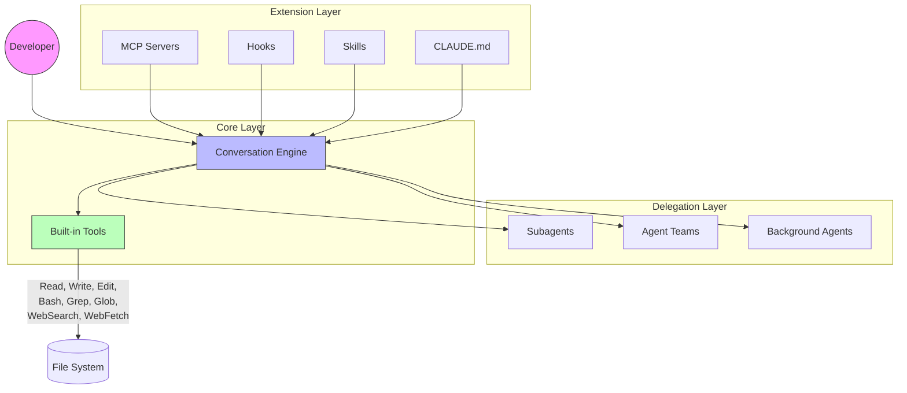
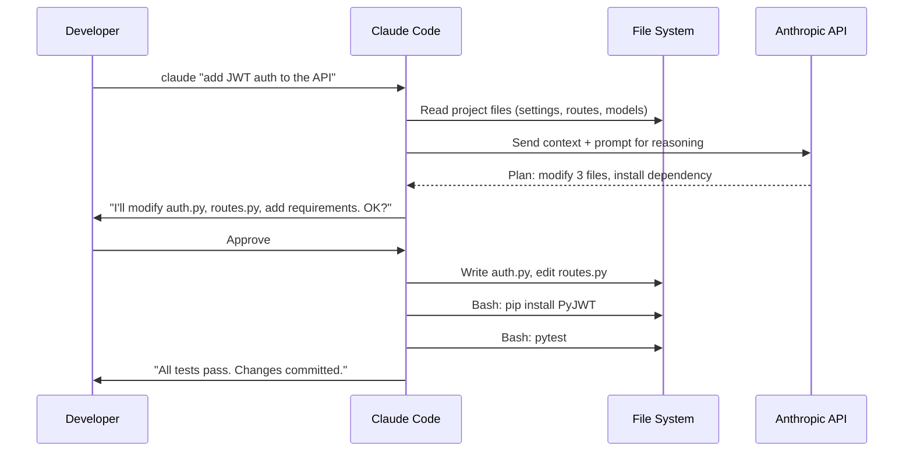
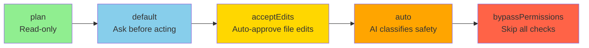
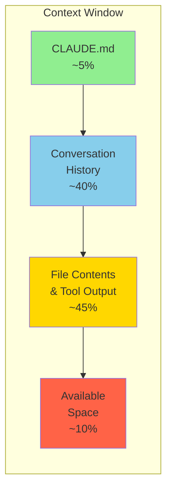
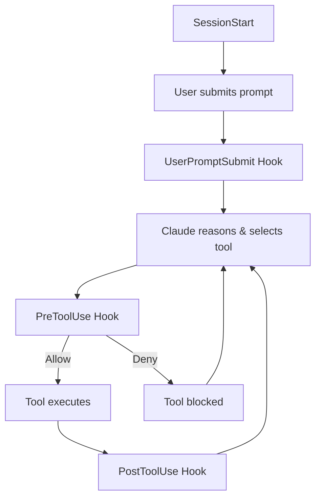
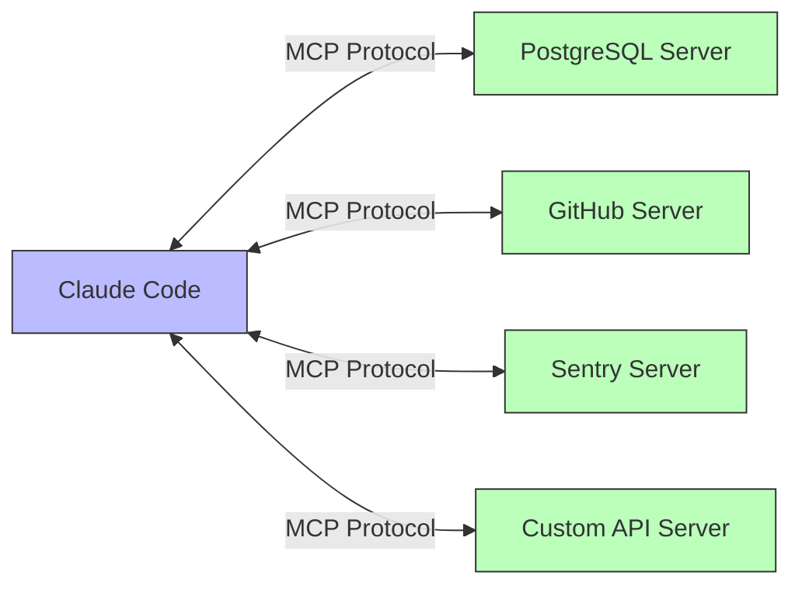
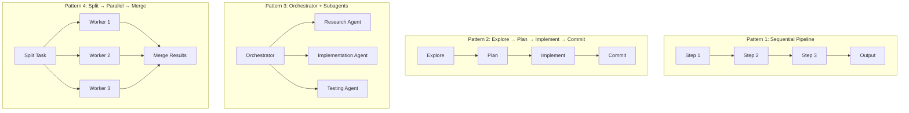
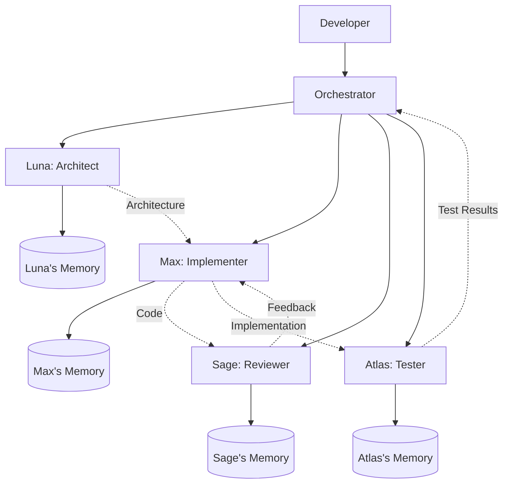

# Claude Code Mastery Guide: From Novice to Pro

> **A comprehensive, hands-on tutorial for mastering Anthropic's agentic coding tool.**
> Written for experienced Python developers who want to unlock the full power of Claude Code — from first install to building production-grade multi-agent systems with persistent memory.

---

## Table of Contents

- [Part I — Beginner: Foundations](#part-i--beginner-foundations)
  - [1. Introduction: What Is Claude Code and Why Should You Care?](#1-introduction-what-is-claude-code-and-why-should-you-care)
  - [2. Installation & Environment Setup](#2-installation--environment-setup)
  - [3. Your First Session: Core Commands & Interaction Model](#3-your-first-session-core-commands--interaction-model)
  - [4. Understanding the Permission System](#4-understanding-the-permission-system)
  - [Mini-Project 1: Scaffold a Python CLI Tool](#mini-project-1-scaffold-a-python-cli-tool)
  - [Quiz 1: Beginner Fundamentals](#quiz-1-beginner-fundamentals)
- [Part II — Intermediate: Configuration & Customization](#part-ii--intermediate-configuration--customization)
  - [5. CLAUDE.md — Teaching Claude Your Project](#5-claudemd--teaching-claude-your-project)
  - [6. Context Management & Session Strategy](#6-context-management--session-strategy)
  - [7. The Skills System: Reusable Workflows](#7-the-skills-system-reusable-workflows)
  - [8. The Hook System: Deterministic Automation](#8-the-hook-system-deterministic-automation)
  - [Mini-Project 2: Build a Custom Development Environment](#mini-project-2-build-a-custom-development-environment)
  - [Quiz 2: Intermediate Concepts](#quiz-2-intermediate-concepts)
- [Part III — Advanced: Integration & Programmatic Control](#part-iii--advanced-integration--programmatic-control)
  - [9. MCP: Connecting Claude to External Systems](#9-mcp-connecting-claude-to-external-systems)
  - [10. The Python Agent SDK](#10-the-python-agent-sdk)
  - [11. Multi-Turn Workflows & CI/CD Automation](#11-multi-turn-workflows--cicd-automation)
  - [12. Memory Deep Dive: Persistence, Context & Session Management](#12-memory-deep-dive-persistence-context--session-management)
  - [Mini-Project 3: Build an Automated Code Review Pipeline](#mini-project-3-build-an-automated-code-review-pipeline)
  - [Quiz 3: Advanced Integration](#quiz-3-advanced-integration)
- [Part IV — Expert: Multi-Agent Orchestration](#part-iv--expert-multi-agent-orchestration)
  - [13. Subagents: Delegation & Isolation](#13-subagents-delegation--isolation)
  - [14. Background Agents & Parallel Execution](#14-background-agents--parallel-execution)
  - [15. Agent Teams: Collaborative Multi-Agent Systems](#15-agent-teams-collaborative-multi-agent-systems)
  - [Mini-Project 4: Parallel Security Audit System](#mini-project-4-parallel-security-audit-system)
  - [Quiz 4: Expert Multi-Agent Concepts](#quiz-4-expert-multi-agent-concepts)
- [Part V — Capstone Project: Multi-Agent Development System](#part-v--capstone-project-multi-agent-development-system)
  - [16. System Architecture & Design](#16-system-architecture--design)
  - [17. Building the Memory System](#17-building-the-memory-system)
  - [18. Creating Agent Personalities](#18-creating-agent-personalities)
  - [19. The Orchestration Engine](#19-the-orchestration-engine)
  - [20. Putting It All Together: Full Implementation](#20-putting-it-all-together-full-implementation)
  - [21. Running the System: Example Scenario](#21-running-the-system-example-scenario)
- [Appendix A: Claude Design — The Visual Frontier](#appendix-a-claude-design--the-visual-frontier)
- [Appendix B: Quick Reference Card](#appendix-b-quick-reference-card)
- [Appendix C: Quiz Answer Key](#appendix-c-quiz-answer-key)
- [Appendix D: Pro Tips & Power Patterns](#appendix-d-pro-tips--power-patterns)

---

# Part I — Beginner: Foundations

## 1. Introduction: What Is Claude Code and Why Should You Care?

### The Paradigm Shift

If you've used code completion tools like GitHub Copilot, you know the feeling: you type a function signature and the tool suggests the body. Useful, but limited. You're still the one driving — deciding which files to edit, running tests, interpreting errors, and managing git.

**Claude Code operates at a fundamentally different level.** It doesn't suggest code — it *acts*. Give it a task in natural language, and it will:

1. **Read** your entire codebase to understand the architecture
2. **Plan** a sequence of actions to accomplish the goal
3. **Execute** those actions — editing files, running terminal commands, managing git
4. **Iterate** — running tests, fixing errors, and refining until the task is complete
5. **Ask** for your approval before anything destructive

This is the difference between a co-pilot and an *agent*. Claude Code is an autonomous software engineering agent that happens to live in your terminal.

### What You'll Learn in This Guide

By the end of this guide, you will be able to:

- Install, configure, and use Claude Code fluently in your daily workflow
- Customize Claude's behavior with project-specific instructions, skills, and hooks
- Connect Claude to external tools and databases via MCP
- Build programmatic automation pipelines using the Python Agent SDK
- Master memory management, context optimization, and session continuity techniques
- Design and implement multi-agent systems where specialized agents collaborate on complex projects
- Build a complete capstone project: a 4-agent development team with persistent memory and distinct personalities

### Architecture at a Glance

Claude Code is built on a three-layer architecture:



| Layer | Purpose | Components |
|-------|---------|------------|
| **Core** | Main interaction loop | Conversation engine, built-in tools (Read, Write, Edit, Bash, Glob, Grep, WebSearch, WebFetch) |
| **Delegation** | Focused subtasks & parallelism | Subagents, Agent Teams, Background Agents |
| **Extension** | Customization & integration | MCP servers, Hooks, Skills, CLAUDE.md |

### Key Differentiators

| Feature | Code Completion Tools | Claude Code |
|---------|----------------------|-------------|
| Scope | Single file / function | Entire project |
| Action model | Suggests text | Plans and executes actions |
| Tool integration | Editor only | Git, terminal, test runners, linters, databases |
| Autonomy | None — you drive | Agent — it drives, you approve |
| Extensibility | Plugins | MCP, hooks, skills, custom agents |
| Execution | In-editor | Terminal, IDE, desktop, CI/CD |

---

## 2. Installation & Environment Setup

### System Requirements

| Requirement | Specification |
|------------|---------------|
| **OS** | macOS 13.0+, Windows 10 (1809+), Ubuntu 20.04+, Debian 10+, Alpine 3.19+ |
| **Hardware** | 4 GB RAM minimum (8–16 GB recommended), x64 or ARM64 |
| **Network** | Internet connection (Claude runs locally but calls Anthropic's API) |
| **Account** | Claude Pro, Max, Team, or Enterprise subscription |

### Step 1: Install Claude Code

The recommended installation uses the native installer — a self-contained binary with automatic background updates and zero external dependencies.

```bash
# macOS / Linux / WSL
curl -fsSL https://claude.ai/install.sh | bash

# Windows PowerShell
irm https://claude.ai/install.ps1 | iex
```

**Alternative package managers:**

```bash
# Homebrew (macOS/Linux)
brew install --cask claude-code

# apt (Debian/Ubuntu)
sudo install -d -m 0755 /etc/apt/keyrings
sudo curl -fsSL https://downloads.claude.ai/keys/claude-code.asc \
  -o /etc/apt/keyrings/claude-code.asc
echo "deb [signed-by=/etc/apt/keyrings/claude-code.asc] \
  https://downloads.claude.ai/claude-code/apt/stable stable main" \
  | sudo tee /etc/apt/sources.list.d/claude-code.list
sudo apt update && sudo apt install claude-code

# WinGet (Windows)
winget install Anthropic.ClaudeCode
```

> **⚠️ Note:** The npm-based installation (`npm install -g @anthropic-ai/claude-code`) is deprecated. Migrate to the native installer.

### Step 2: Verify Installation

```bash
claude --version    # Confirm the binary is on your PATH
claude doctor       # Run a full system health check
```

`claude doctor` validates your environment — shell compatibility, network connectivity, authentication state, and version currency. Run it whenever something feels off.

### Step 3: First Run & Authentication

```bash
cd /path/to/your/project
claude
```

On first run, Claude opens your default browser for OAuth authentication. Sign in with your Claude Pro/Max/Team/Enterprise account. The token is cached locally — you won't need to re-authenticate unless it expires.

**Alternative authentication methods:**

```bash
# API key-based (for Anthropic Console users)
claude auth login --console
# or set the environment variable:
export ANTHROPIC_API_KEY="sk-ant-..."

# Generate a long-lived token for CI/CD
claude setup-token
```

### Step 4: Choose Your Model

Claude Code supports Anthropic's full model lineup:

| Model | ID | Strengths | Use When |
|-------|----|-----------|----------|
| **Claude Opus 4.8** | `claude-opus-4-8` | Deepest reasoning, codebase-scale migrations | Complex architecture, subtle bugs, multi-file refactoring |
| **Claude Sonnet 4.6** | `claude-sonnet-4-6` | Balanced speed & capability (default) | Daily development work |
| **Claude Haiku 4.5** | `claude-haiku-4-5-20251001` | Fastest, lowest cost | Simple formatting, renaming, high-volume batch tasks |
| **Claude Fable 5** | `claude-fable-5` | Creative and narrative tasks | Generating docs, READMEs, user-facing copy |

Override per session:

```bash
claude --model claude-opus-4-8 "design the database schema for a social network"
claude --model claude-haiku-4-5-20251001 "rename all instances of 'usr' to 'user'"
```

**Fast mode:** Opus 4.8 supports a fast output mode (`/fast` to toggle) that delivers Opus-quality reasoning at significantly higher speed — it does not downgrade to a smaller model.

### Step 5 (Optional): IDE Integration

Claude Code is available as a native extension for VS Code and JetBrains IDEs, in addition to the terminal.

**VS Code** — Install the Claude Code extension from the VS Code Marketplace. It adds a dedicated sidebar panel with inline diffs, letting you see Claude's changes in real time without leaving your editor. The extension shares the same session state as the terminal — you can start work in the terminal and continue in VS Code.

**JetBrains** — IntelliJ, PyCharm, WebStorm, and other JetBrains IDEs are supported via the Claude Code plugin. Install from the JetBrains Marketplace.

**When to use the IDE vs. terminal:**
- Use the **IDE extension** when you want to review diffs visually and integrate Claude into your existing editor workflow.
- Use the **terminal** for scripting, CI/CD, background sessions, and when you need full CLI flag control.

Both modes have full access to the same features: hooks, MCP servers, skills, and subagents.

---

### The Lifecycle of a Claude Code Session



---

## 3. Your First Session: Core Commands & Interaction Model

### Starting Sessions

There are three fundamental ways to interact with Claude Code:

```bash
# 1. Interactive session — opens a REPL
claude

# 2. Interactive with initial prompt
claude "explain the architecture of this project"

# 3. Non-interactive (print mode) — execute and exit
claude -p "list all TODO comments in the codebase"
```

**Print mode (`-p`)** is your workhorse for scripting and automation. It executes the task and exits, making it composable with Unix pipes:

```bash
# Pipe content into Claude
cat error.log | claude -p "summarize the root causes of these errors"
git diff main | claude -p "review this diff for bugs and security issues"
git log --oneline -20 | claude -p "generate release notes from these commits"

# Chain with other tools
claude -p --output-format json "list all API endpoints" | jq '.endpoints[] | .path'
```

### Session Management

```bash
claude -c              # Continue the most recent conversation
claude -r              # Resume a specific session (interactive picker)
claude -r abc123       # Resume by session ID
```

### Essential Slash Commands

Once inside an interactive session, these slash commands control the session:

| Command | What It Does | When to Use |
|---------|-------------|-------------|
| `/init` | Generate a `CLAUDE.md` file for your project | First time in a new project |
| `/plan` | Ask Claude to outline its approach before acting | Before complex changes |
| `/compact` | Summarize conversation history to free context | Context usage > 80% |
| `/clear` | Hard reset — wipe all conversation history | Switching to unrelated task |
| `/bg` | Move current session to background | When you need your terminal back |

### Interactive Keyboard Shortcuts

| Shortcut | Action |
|----------|--------|
| `Tab` | Accept Claude's suggestion |
| `Esc` | Interrupt current generation |
| `Esc` `Esc` | Rewind to previous checkpoint |
| `Alt+T` | Toggle extended thinking |
| `Ctrl+R` | Search prompt history (reuse or edit previous prompts) |
| `Shift+Down` | Navigate between Agent Team members |

### Controlling Cost & Scope

Two critical safety flags prevent runaway sessions:

```bash
# Cap spending at $5 for this session
claude -p --max-budget-usd 5.00 "refactor the entire auth module"

# Limit to 10 conversation turns
claude -p --max-turns 10 "fix all failing tests"
```

### Effort Levels

Control how deeply Claude reasons about a problem:

```bash
claude --effort low "rename the variable 'x' to 'count'"     # Quick, minimal reasoning
claude --effort medium "add input validation to the API"      # Standard (default)
claude --effort high "design a caching strategy for this app" # Deep reasoning
claude --effort max "find the race condition in this system"  # Maximum reasoning budget
```

---

## 4. Understanding the Permission System

Claude Code's permission system is one of its most important features. It determines what Claude can do without asking and what requires your approval.

### Permission Modes



| Mode | Behavior | Safety Level | Use Case |
|------|----------|-------------|----------|
| `plan` | Read-only. Explores and plans, never modifies. | 🟢 Safest | Architecture review, codebase exploration |
| `default` | Asks before every potentially dangerous action. | 🔵 Safe | Daily development (recommended) |
| `acceptEdits` | Auto-approves file edits in working directory. | 🟡 Moderate | Trusted projects, rapid iteration |
| `auto` | A trained transcript classifier gates each tool call; subagents run the same pipeline recursively. Security improves as classifier coverage and model judgment improve over time. | 🟠 Reduced safety | Experienced users, CI/CD pipelines |
| `bypassPermissions` | Skips ALL permission checks. | 🔴 Dangerous | Isolated containers/VMs only |

```bash
# Explore a new codebase without modifying anything
claude --permission-mode plan "analyze the architecture of this project"

# Fast iteration on a trusted personal project
claude --permission-mode acceptEdits "refactor the database layer"
```

**Troubleshooting mode:** The `--safe-mode` flag (or `CLAUDE_CODE_SAFE_MODE=1`) starts Claude Code with all customizations disabled — CLAUDE.md, skills, hooks, MCP servers, and plugins are all skipped. Use this to isolate whether a problem is caused by your configuration.

```bash
claude --safe-mode   # or: CLAUDE_CODE_SAFE_MODE=1 claude
```

### Fine-Grained Tool Permissions

You can control permissions at the individual tool level in your settings:

```json
{
  "permissions": {
    "allow": [
      "Read",
      "Glob",
      "Grep",
      "WebSearch",
      "Bash(npm test)",
      "Bash(pytest)"
    ],
    "deny": [
      "Bash(rm -rf *)",
      "Bash(sudo *)",
      "Bash(npm publish)"
    ],
    "ask": [
      "Write",
      "Edit",
      "Bash"
    ]
  }
}
```

**Critical rule:** `deny` takes precedence over everything — even `bypassPermissions` mode. This is your hard safety net.

### Sandboxing

For the highest level of autonomous safety, Claude Code supports OS-level **sandboxing** that restricts filesystem and network access using platform isolation (e.g., macOS sandbox profiles, Linux namespaces). When sandboxing is active, Claude can work freely within the defined boundaries without being able to affect the rest of your system.

Sandboxing is most useful when:
- Running Claude in `auto` or `bypassPermissions` mode on untrusted code
- Evaluating third-party repositories
- Running as part of a CI/CD pipeline with elevated permissions

Enable sandboxing through your organization's managed policy or by configuring the sandbox profile in settings. Note that new tools or MCP servers may need to be explicitly allowed within the sandbox configuration.

### The Settings Hierarchy

Settings are resolved in this precedence order (highest to lowest):

1. **Managed** — Organization-level (`/etc/claude-code/`) — cannot be overridden
2. **Command-line flags** — `claude --permission-mode plan`
3. **Project local** — `settings.local.json` (git-ignored, personal overrides)
4. **Project** — `.claude/settings.json` (committed, shared with team)
5. **User** — `~/.claude/settings.json` (personal defaults across all projects)

---

## Mini-Project 1: Scaffold a Python CLI Tool

**Goal:** Use Claude Code to scaffold a complete Python CLI tool from scratch.

### Steps

1. Create a new directory and start Claude:
   ```bash
   mkdir ~/my-cli-tool && cd ~/my-cli-tool
   claude
   ```

2. Initialize the project:
   ```
   /init
   ```

3. Give Claude the task:
   ```
   Create a Python CLI tool called "logwatch" that:
   - Monitors a log file for specific patterns (errors, warnings)
   - Supports real-time tail mode (like tail -f)
   - Outputs colored summaries using the "rich" library
   - Has proper CLI arguments using "click"
   - Includes a pyproject.toml with all dependencies
   - Includes basic unit tests using pytest

   Use Python 3.12 conventions. Follow PEP 8.
   ```

4. Review Claude's plan, approve the changes, and run the tests:
   ```
   Run pytest to verify everything works
   ```

5. Try the tool:
   ```bash
   python -m logwatch --help
   ```

**What you practiced:** Starting sessions, using `/init`, giving structured prompts, reviewing and approving changes, running tests through Claude.

---

## Quiz 1: Beginner Fundamentals

**1.** What is the primary difference between Claude Code and code completion tools like GitHub Copilot?

A) Claude Code is free  
B) Claude Code operates at the project level and executes multi-step actions autonomously  
C) Claude Code only works with Python  
D) Claude Code requires a GPU

**2.** Which command runs Claude in non-interactive mode (execute and exit)?

A) `claude --exec "query"`  
B) `claude -p "query"`  
C) `claude --run "query"`  
D) `claude --batch "query"`

**3.** What does the `plan` permission mode do?

A) Creates a project plan document  
B) Allows Claude to modify only plan files  
C) Makes Claude read-only — it can explore and plan but never modify  
D) Enables planning mode for Agent Teams

**4.** In the settings hierarchy, which takes the highest precedence?

A) User settings (`~/.claude/settings.json`)  
B) Project settings (`.claude/settings.json`)  
C) Command-line flags  
D) Managed settings (organization-level)

**5.** What is the purpose of `claude doctor`?

A) Fixes broken code  
B) Runs a full system health check on your Claude Code installation  
C) Connects to a medical API  
D) Diagnoses bugs in your project

**6.** Which flag caps the maximum spending for a Claude Code session?

A) `--cost-limit`  
B) `--budget`  
C) `--max-budget-usd`  
D) `--spending-cap`

**7.** How do you continue the most recent conversation?

A) `claude --last`  
B) `claude -c`  
C) `claude --resume`  
D) `claude -r`

*(Answers in [Appendix C](#appendix-c-quiz-answer-key))*

---

# Part II — Intermediate: Configuration & Customization

## 5. CLAUDE.md — Teaching Claude Your Project

### Why CLAUDE.md Matters

Every time you start a Claude Code session, the first thing Claude does is read `CLAUDE.md` from your project root. This file is your **persistent project context** — it tells Claude about your tech stack, coding standards, architecture decisions, and rules.

Without `CLAUDE.md`, Claude has to rediscover your project conventions every session. With it, Claude starts every session already knowing how your project works.

### Creating Your First CLAUDE.md

```bash
cd /path/to/your/project
claude
/init    # Claude analyzes your project and generates a CLAUDE.md
```

The `/init` command reads your project structure, existing config files (like `pyproject.toml`, `package.json`, `Makefile`), and code patterns to generate a sensible starting point.

### Anatomy of a Well-Crafted CLAUDE.md

```markdown
# Project: WeatherAPI

## Tech Stack
- Python 3.12, FastAPI 0.110+, SQLAlchemy 2.0, PostgreSQL 16
- Async everywhere — use async/await for all I/O
- Alembic for database migrations
- pytest + pytest-asyncio for testing

## Architecture
- Clean architecture: domain → application → infrastructure
- All database access through the repository pattern
- Services layer handles business logic; routes are thin controllers
- Dependency injection via FastAPI's Depends()

## Coding Standards
- Type hints on ALL function signatures (no exceptions)
- PEP 8 with max line length 100
- Use `loguru` for logging, never `print()`
- Docstrings: Google style, required for all public functions

## Testing
- Run: `pytest -x --tb=short`
- Minimum 80% coverage for new code
- Use factory_boy for test fixtures
- Mock external APIs with `respx`

## Off-Limits — DO NOT MODIFY
- `alembic/versions/` — migration files are immutable once created
- `.github/workflows/` — CI/CD is managed by DevOps
- `infrastructure/terraform/` — infrastructure as code, separate process
```

### Advanced: Scoped Rules

For large monorepos, put directory-specific rules in `.claude/rules/*.md` with `paths:` frontmatter:

```markdown
---
paths:
  - src/api/**
---
# API Development Rules
- All endpoints must have OpenAPI docstrings
- Use Pydantic v2 models for request/response validation
- Rate limiting required on all public endpoints
```

```markdown
---
paths:
  - src/ml/**
---
# ML Pipeline Rules
- Use pandas 2.0+ with PyArrow backend
- All model artifacts go to `models/` directory
- Log all experiments with MLflow
```

This way, when Claude is working in `src/api/`, it loads the API rules. When it's in `src/ml/`, it loads the ML rules. This keeps context lean and relevant.

### Best Practices

| Do | Don't |
|----|-------|
| Keep under 200 lines | Write a novel |
| State what tools/commands to use | List every file in the project |
| Define architecture patterns | Explain basic programming concepts |
| Specify off-limits areas | Use CLAUDE.md for enforcement (use hooks instead) |
| Update when stack changes | Let it become stale |

> **Key insight:** CLAUDE.md is for conventions and context — things Claude should *know*. For things Claude should *never do*, use hooks (covered in Section 8). Prompt instructions are probabilistic; hooks are deterministic.

---

## 6. Context Management & Session Strategy

### Understanding the Context Window

Claude Code operates within a **context window** — a finite amount of text it can "remember" in a single session. As you work, the context fills with conversation history, file contents, and tool outputs. When it gets too full, Claude's performance degrades.



### The Two Key Commands

| Command | What It Does | When to Use |
|---------|-------------|-------------|
| `/compact` | Summarizes conversation history to free tokens | Context at ~80%+ capacity |
| `/clear` | Hard reset — wipes all history | Switching to an unrelated task |

### Session Strategy: The "Focused Session" Pattern

The most effective way to use Claude Code is **one focused task per session**:

```bash
# Session 1: Explore and understand
claude --permission-mode plan "explain the auth module architecture"

# Session 2: Plan the change
claude "create a plan for migrating auth to JWT. Don't implement yet."

# Session 3: Implement
claude --permission-mode acceptEdits "implement the JWT migration plan from session 2"

# Session 4: Test and fix
claude "run all tests and fix any failures from the JWT migration"
```

Each session starts fresh with full context available. This is almost always better than one long, context-exhausted session.

### When to Use Subagents for Context Isolation

If a task requires reading many files (e.g., scanning 50 files for security vulnerabilities), delegate it to a **subagent**. The subagent gets its own context window and returns only a summary to the parent:

```
Scan all Python files in src/ for SQL injection vulnerabilities.
Use a subagent so the file contents don't fill my context.
```

### The Golden Rule

**Target < 40% context utilization** for optimal performance. If you're above 60%, consider:
1. `/compact` to summarize history
2. Starting a new session
3. Delegating file-heavy work to subagents

---

## 7. The Skills System: Reusable Workflows

### What Are Skills?

Skills are **reusable, invocable workflows** defined as markdown files. Think of them as custom slash commands that teach Claude domain-specific procedures.

Key properties:
- **On-demand loading** — only descriptions are loaded at session start; full content loads when invoked
- **Auto-discovery** — Claude can detect and load relevant skills based on your task
- **Minimal context cost** — near-zero overhead until actually used

### Creating a Skill

Skills live in `.claude/skills/<name>/SKILL.md` (project-level) or `~/.claude/skills/<name>/SKILL.md` (user-level):

```
.claude/
  skills/
    deploy/
      SKILL.md
      scripts/
        health_check.sh
    security-audit/
      SKILL.md
```

### Example: A Deployment Skill

```markdown
---
name: deploy
description: Production deployment checklist for AWS ECS
model: claude-sonnet-4-6
tools:
  - Bash
  - Read
  - WebFetch
---

# Production Deployment Procedure

## Pre-Deployment Checks
1. Run the full test suite: `pytest -x --tb=short`
2. Verify no uncommitted changes: `git status --porcelain`
3. Check that the branch is up-to-date with main: `git fetch && git log HEAD..origin/main --oneline`

## Build Phase
1. Build Docker image: `docker build -t myapp:$(git rev-parse --short HEAD) .`
2. Run smoke tests against the image: `docker run --rm myapp:latest python -c "import app; print('OK')"`
3. Push to ECR: `aws ecr get-login-password | docker login --username AWS --password-stdin $ECR_REPO && docker push $ECR_REPO:latest`

## Deploy Phase
1. Update ECS task definition with new image
2. Update service: `aws ecs update-service --cluster prod --service myapp --force-new-deployment`
3. Wait for stabilization: `aws ecs wait services-stable --cluster prod --services myapp`

## Post-Deployment Verification
1. Run health check: `curl -f https://api.myapp.com/health`
2. Check error rates in CloudWatch for 5 minutes
3. If errors spike > 1%, initiate rollback
```

Invoke it with: `/deploy` or simply ask Claude to deploy and it will auto-discover the skill.

### Skills vs. CLAUDE.md vs. Subagents

| Aspect | CLAUDE.md | Skills | Subagents |
|--------|-----------|--------|-----------|
| **Loaded when** | Every session (always-on) | On-demand | On-demand |
| **Invocable** | No | Yes (via `/` commands) | Yes |
| **Context cost** | Full content, always | Near-zero until invoked | Isolated context window |
| **Best for** | Always-enforced conventions | Task-specific procedures | Parallel/file-heavy tasks |
| **Scope** | What Claude should *know* | What Claude should *do* | What Claude should *delegate* |

### Tip: Dynamic Skill Arguments

Skills support YAML frontmatter that can define dynamic arguments, model overrides, and tool restrictions. This makes them powerful building blocks for custom workflows.

---

## 8. The Hook System: Deterministic Automation

### The Problem with Prompt Instructions

If you write "NEVER delete files in the `data/` directory" in your CLAUDE.md, Claude will *usually* follow this instruction. But "usually" isn't "always." Prompt instructions are **probabilistic** — there's always a chance Claude might ignore them, especially under complex reasoning chains.

### Hooks: Guaranteed Execution

Hooks provide **deterministic automation** that fires on lifecycle events. They are *guaranteed* to execute — no probability involved.

### Lifecycle Events



| Event | Fires When | Use For |
|-------|-----------|---------|
| `PreToolUse` | Before any tool execution | Blocking dangerous operations |
| `PostToolUse` | After tool execution | Auto-formatting, linting, logging |
| `UserPromptSubmit` | When user submits a prompt | Injecting reminders, validation |
| `SessionStart` | When session begins | Environment setup, checks |
| `SessionEnd` | When session ends | Save summaries, cleanup |
| `Stop` | When Claude stops generating | Post-response processing, notifications |
| `TeammateIdle` | Before teammate goes idle | Agent Teams coordination |
| `TaskCreated` | When task is created | Agent Teams task management |
| `TaskCompleted` | When task is marked complete | Agent Teams post-processing |

### Configuration

Hooks are defined in your settings.json:

```json
{
  "hooks": {
    "PreToolUse": [
      {
        "name": "block-dangerous-commands",
        "match": { "tool": "Bash", "input_contains": "rm -rf" },
        "action": "deny",
        "message": "🚫 Destructive commands are blocked by policy."
      },
      {
        "name": "block-production-db",
        "match": { "tool": "Bash", "input_contains": "DATABASE_URL=prod" },
        "action": "deny",
        "message": "🚫 Direct production database access is forbidden."
      }
    ],
    "PostToolUse": [
      {
        "name": "auto-lint-python",
        "match": { "tool": "Write" },
        "command": "ruff check --fix $CLAUDE_FILE_PATH 2>/dev/null || true"
      },
      {
        "name": "auto-format-python",
        "match": { "tool": "Write" },
        "command": "ruff format $CLAUDE_FILE_PATH 2>/dev/null || true"
      }
    ],
    "UserPromptSubmit": [
      {
        "name": "delegation-reminder",
        "command": "echo 'Reminder: For file-heavy tasks, consider delegating to a subagent.'"
      }
    ]
  }
}
```

### Hook Types

| Type | Mechanism | Example |
|------|-----------|---------|
| **Script** | Runs a shell command | Auto-lint after file writes |
| **HTTP** | Calls a webhook | Notify Slack on session start |
| **Prompt** | Injects text into conversation | Add context before tool use |
| **Deny** | Blocks the tool invocation | Prevent dangerous commands |

### The Golden Rule of Hooks

> **Move "NEVER" rules from CLAUDE.md to hooks.**
>
> Instead of: `CLAUDE.md: "NEVER delete production data"`
>
> Use: `PreToolUse hook that denies Bash commands containing production identifiers`
>
> The first is a suggestion. The second is a wall.

---

## Mini-Project 2: Build a Custom Development Environment

**Goal:** Set up a complete Claude Code environment for a FastAPI project with CLAUDE.md, skills, hooks, and scoped rules.

### Steps

1. Create project structure:
   ```bash
   mkdir -p ~/fastapi-project/.claude/{skills/deploy,skills/test,rules}
   cd ~/fastapi-project
   ```

2. Start Claude and initialize:
   ```bash
   claude
   ```
   ```
   /init
   ```

3. Edit the generated CLAUDE.md:
   ```
   Update CLAUDE.md to specify:
   - Tech stack: Python 3.12, FastAPI, SQLAlchemy 2.0, PostgreSQL
   - Coding standards: type hints required, Google-style docstrings
   - Testing: pytest with pytest-asyncio, 80% coverage minimum
   - Off-limits: alembic/versions/, .github/workflows/
   ```

4. Create a deployment skill:
   ```
   Create a skill in .claude/skills/deploy/SKILL.md that defines a
   deployment checklist: run tests, build Docker image, push to registry,
   update service, verify health check.
   ```

5. Create a testing skill:
   ```
   Create a skill in .claude/skills/test/SKILL.md that defines a
   comprehensive testing workflow: run unit tests, integration tests,
   generate coverage report, and flag any files under 80% coverage.
   ```

6. Add hooks to your project settings (`.claude/settings.json`):
   ```
   Create .claude/settings.json with:
   - PostToolUse hook: auto-format Python files with ruff after Write
   - PreToolUse hook: block any Bash command containing "DROP TABLE"
   - Permission: allow Bash(pytest), Bash(ruff), deny Bash(rm -rf)
   ```

7. Create a scoped rule for API endpoints:
   ```
   Create .claude/rules/api.md with paths: src/api/**
   that requires OpenAPI docstrings and Pydantic v2 models
   for all endpoints.
   ```

**What you practiced:** CLAUDE.md authoring, skills creation, hook configuration, scoped rules, project-level settings.

---

## Quiz 2: Intermediate Concepts

**1.** What is the primary purpose of CLAUDE.md?

A) To replace the README.md file  
B) To provide persistent project context loaded at the start of every session  
C) To store Claude's memory between sessions  
D) To define API endpoints

**2.** When should you use `/compact` vs `/clear`?

A) `/compact` is for context above 80%; `/clear` is for switching to unrelated tasks  
B) They do the same thing  
C) `/compact` deletes files; `/clear` deletes conversations  
D) `/compact` is for large files; `/clear` is for small files

**3.** Why should you move "NEVER do X" rules from CLAUDE.md to hooks?

A) Hooks are faster  
B) CLAUDE.md doesn't support rules  
C) Prompt instructions are probabilistic; hooks are deterministic (guaranteed)  
D) Hooks use less memory

**4.** What is the context cost of a skill that hasn't been invoked?

A) 100% of the skill content  
B) 50% of the skill content  
C) Near-zero (only the description is loaded)  
D) Skills always consume the full context

**5.** Where do project-level skills live in the file system?

A) `~/.claude/skills/`  
B) `.claude/skills/<name>/SKILL.md`  
C) `CLAUDE.md`  
D) `.claude/settings.json`

**6.** What does a `PostToolUse` hook with `match: { "tool": "Write" }` do?

A) Blocks all file writes  
B) Runs a command after every file write operation  
C) Logs all file reads  
D) Prevents editing certain files

**7.** What is the recommended maximum length for CLAUDE.md?

A) 50 lines  
B) 200 lines  
C) 1000 lines  
D) No limit

**8.** What is the recommended target for context utilization?

A) 100% — use all available context  
B) Below 80%  
C) Below 40% for optimal performance  
D) Exactly 50%

*(Answers in [Appendix C](#appendix-c-quiz-answer-key))*

---

# Part III — Advanced: Integration & Programmatic Control

## 9. MCP: Connecting Claude to External Systems

### What Is MCP?

The **Model Context Protocol (MCP)** is a standard that allows Claude Code to connect to external data sources and tools — databases, project management systems, monitoring services, and custom APIs. Think of it as USB for AI: a universal plug that gives Claude access to your infrastructure.

### How MCP Works



### Configuring MCP Servers

MCP servers are configured in `.mcp.json` in your project root:

```json
{
  "mcpServers": {
    "postgres": {
      "command": "npx",
      "args": [
        "@modelcontextprotocol/server-postgres",
        "postgresql://localhost:5432/mydb"
      ]
    },
    "github": {
      "command": "npx",
      "args": ["@modelcontextprotocol/server-github"],
      "env": {
        "GITHUB_TOKEN": "ghp_your_token_here"
      }
    },
    "sentry": {
      "command": "npx",
      "args": ["@sentry/mcp-server"],
      "env": {
        "SENTRY_AUTH_TOKEN": "your_sentry_token"
      }
    },
    "filesystem": {
      "command": "npx",
      "args": [
        "@modelcontextprotocol/server-filesystem",
        "/path/to/allowed/directory"
      ]
    }
  }
}
```

### Popular MCP Servers

| Server | Purpose | Package |
|--------|---------|---------|
| PostgreSQL | Query databases directly | `@modelcontextprotocol/server-postgres` |
| MySQL | MySQL database access | `@modelcontextprotocol/server-mysql` |
| SQLite | Local SQLite databases | `@modelcontextprotocol/server-sqlite` |
| GitHub | Repository management, PRs, issues | `@modelcontextprotocol/server-github` |
| GitLab | GitLab repository access | `@modelcontextprotocol/server-gitlab` |
| Sentry | Error monitoring and debugging | `@sentry/mcp-server` |
| Slack | Team communication | `@modelcontextprotocol/server-slack` |
| Jira | Project management | `@modelcontextprotocol/server-jira` |

### MCP + Skills: The Power Combination

MCP provides the *connection*; Skills teach Claude *how to use it*:

```markdown
---
name: debug-production
description: Debug production issues using Sentry and database access
tools:
  - mcp__sentry__get_issues
  - mcp__postgres__query
  - Read
  - Grep
---

# Production Debugging Procedure

1. Check Sentry for recent unresolved issues (last 24h)
2. For each critical issue:
   a. Get the full stack trace from Sentry
   b. Identify the affected database tables
   c. Query recent records for anomalies
   d. Trace the issue back to the source code
3. Generate a report with root cause and fix recommendations
```

### Building a Custom MCP Server

You're not limited to pre-built servers. You can write your own MCP server to expose any data source or API to Claude Code. Here's a practical example — a custom MCP server that exposes your project's internal metrics dashboard:

```python
# custom_mcp_server.py
"""
Custom MCP server that exposes internal project metrics to Claude Code.
Run with: python custom_mcp_server.py
Configure in .mcp.json as: {"command": "python", "args": ["custom_mcp_server.py"]}
"""

import json
import sys
import sqlite3
from datetime import datetime, timedelta


def handle_request(request: dict) -> dict:
    """Route MCP requests to appropriate handlers."""
    method = request.get("method", "")

    if method == "tools/list":
        return {
            "tools": [
                {
                    "name": "get_build_status",
                    "description": "Get the status of recent CI/CD builds",
                    "inputSchema": {
                        "type": "object",
                        "properties": {
                            "limit": {"type": "integer", "default": 10}
                        }
                    }
                },
                {
                    "name": "get_error_trends",
                    "description": "Get error rate trends over the past N days",
                    "inputSchema": {
                        "type": "object",
                        "properties": {
                            "days": {"type": "integer", "default": 7}
                        }
                    }
                },
                {
                    "name": "get_deployment_history",
                    "description": "Get recent deployment history with rollback info",
                    "inputSchema": {
                        "type": "object",
                        "properties": {
                            "environment": {
                                "type": "string",
                                "enum": ["production", "staging", "development"]
                            }
                        }
                    }
                }
            ]
        }

    elif method == "tools/call":
        tool_name = request.get("params", {}).get("name", "")
        args = request.get("params", {}).get("arguments", {})

        if tool_name == "get_build_status":
            # Query your CI/CD system
            return {"content": [{"type": "text", "text": query_builds(args)}]}
        elif tool_name == "get_error_trends":
            return {"content": [{"type": "text", "text": query_errors(args)}]}
        elif tool_name == "get_deployment_history":
            return {"content": [{"type": "text", "text": query_deploys(args)}]}

    return {"error": f"Unknown method: {method}"}


def query_builds(args: dict) -> str:
    """Query recent CI/CD build statuses."""
    # In production, this would query Jenkins, GitHub Actions, etc.
    limit = args.get("limit", 10)
    conn = sqlite3.connect("metrics.db")
    rows = conn.execute(
        "SELECT * FROM builds ORDER BY created_at DESC LIMIT ?", (limit,)
    ).fetchall()
    conn.close()
    return json.dumps([dict(zip(["id", "branch", "status", "duration", "created_at"], r)) for r in rows])


def query_errors(args: dict) -> str:
    """Query error rate trends."""
    days = args.get("days", 7)
    # In production, query Sentry, Datadog, etc.
    return json.dumps({"period": f"last_{days}_days", "trend": "decreasing", "current_rate": "0.3%"})


def query_deploys(args: dict) -> str:
    """Query deployment history."""
    env = args.get("environment", "production")
    return json.dumps({"environment": env, "last_deploy": "2025-06-13T10:30:00Z", "status": "healthy"})


# MCP stdio protocol loop
if __name__ == "__main__":
    for line in sys.stdin:
        request = json.loads(line.strip())
        response = handle_request(request)
        response["id"] = request.get("id")
        sys.stdout.write(json.dumps(response) + "\n")
        sys.stdout.flush()
```

Register it in `.mcp.json`:

```json
{
  "mcpServers": {
    "project-metrics": {
      "command": "python",
      "args": ["custom_mcp_server.py"]
    }
  }
}
```

Now Claude can query your build status, error trends, and deployment history directly during development sessions — enabling context-aware decisions like "the error rate spiked after the last deploy; let me investigate the changes."

### Best Practices

1. **Scope per-project** — Configure MCP in `.mcp.json`, not globally. Global configs consume context tokens even when unused.
2. **Use security rules** — Add `allow`/`deny` lists in settings for MCP tools
3. **Least privilege** — Only grant the database permissions Claude actually needs
4. **Combine with hooks** — Use `PreToolUse` hooks to audit MCP tool usage
5. **Test your MCP server** independently before connecting to Claude Code — debug a broken server inside a Claude session is frustrating
6. **Document tool descriptions** carefully — Claude decides whether to use a tool based on its description string

---

## 10. The Python Agent SDK

### Why Use the SDK?

The CLI is perfect for interactive work, but for **programmatic control** — embedding Claude Code in Python applications, building automation pipelines, or orchestrating multi-agent systems — you need the Python Agent SDK.

### Installation

```bash
# Python (3.10+)
pip install claude-agent-sdk

# TypeScript / Node.js
npm install @anthropic-ai/claude-code
```

The Python and TypeScript SDKs give you the same tools, agent loop, and context management that power Claude Code — fully programmable. The TypeScript package bundles the Claude Code binary for your platform, so no separate installation is needed.

> **Note:** The older `claude-code-sdk` package is deprecated. Use `claude-agent-sdk` for Python.

> **Pricing (as of June 2026):** Agent SDK and `claude -p` usage on subscription plans (Pro, Max, Team) draws from a separate monthly **Agent SDK credit** — it no longer counts against your interactive usage limits. API key users are billed per token as usual.

### Two Interaction Modes

#### Mode 1: `query()` — Stateless, One-Off Tasks

`query()` creates a new session, executes the task, and discards the session. Perfect for scripting and automation.

```python
import asyncio
from claude_agent_sdk import query, ClaudeAgentOptions

async def analyze_code():
    options = ClaudeAgentOptions(
        system_prompt="You are an expert Python code analyst.",
        permission_mode="plan",  # Read-only
        cwd="/home/user/my-project",
        max_turns=5,
    )

    results = []
    async for message in query(
        prompt="Analyze the code quality of src/. Report on complexity, test coverage gaps, and potential bugs.",
        options=options,
    ):
        results.append(str(message))

    return "\n".join(results)

report = asyncio.run(analyze_code())
print(report)
```

#### Mode 2: `ClaudeSDKClient` — Stateful, Multi-Turn Conversations

`ClaudeSDKClient` maintains session state across multiple exchanges. Use it when follow-up questions depend on previous context.

```python
import asyncio
from claude_agent_sdk import ClaudeSDKClient, ClaudeAgentOptions, AssistantMessage

async def interactive_session():
    options = ClaudeAgentOptions(
        permission_mode="acceptEdits",
        cwd="/home/user/my-project",
    )

    async with ClaudeSDKClient(options=options) as client:
        # First turn: explore
        await client.query("Explain the architecture of the auth module.")
        async for message in client.receive_response():
            if isinstance(message, AssistantMessage):
                print(message)

        # Second turn: plan (session retains context from first turn)
        await client.query("Now create a plan for adding OAuth2 support.")
        async for message in client.receive_response():
            print(message)

        # Third turn: implement
        await client.query("Implement the plan. Start with the OAuth2 provider class.")
        async for message in client.receive_response():
            print(message)

asyncio.run(interactive_session())
```

### Comparison

| Feature | `query()` | `ClaudeSDKClient` |
|---------|-----------|-------------------|
| Session persistence | New session each call | Same session across turns |
| Context retention | None | Full conversational context |
| Interrupt support | No | Yes |
| Best for | Automation scripts, CI/CD | Interactive apps, chatbots, multi-turn workflows |

### Custom Tools with In-Process MCP

One of the SDK's most powerful features: define Python functions as tools that Claude can invoke during execution.

```python
from claude_agent_sdk import tool, create_sdk_mcp_server, ClaudeAgentOptions, query

@tool(name="query_database", description="Execute a read-only SQL query against the app database")
async def query_database(sql: str) -> str:
    """Execute a SQL query and return results as JSON."""
    import sqlite3, json
    conn = sqlite3.connect("app.db")
    cursor = conn.execute(sql)
    columns = [desc[0] for desc in cursor.description] if cursor.description else []
    rows = [dict(zip(columns, row)) for row in cursor.fetchall()]
    conn.close()
    return json.dumps(rows, indent=2)

@tool(name="send_notification", description="Send a notification to the team Slack channel")
async def send_notification(message: str, channel: str = "#dev") -> str:
    """Send a Slack notification."""
    # Your Slack API integration here
    print(f"[SLACK → {channel}] {message}")
    return f"Notification sent to {channel}"

# Bundle tools into an MCP server
mcp_server = create_sdk_mcp_server("app-tools", [query_database, send_notification])

options = ClaudeAgentOptions(
    mcp_servers=[mcp_server],
    allowed_tools=[
        "mcp__app-tools__query_database",
        "mcp__app-tools__send_notification",
    ],
    permission_mode="acceptEdits",
)
```

### Hook System in the SDK

Implement hooks as Python functions for programmatic control:

```python
from claude_agent_sdk import ClaudeAgentOptions

def pre_tool_hook(tool_name: str, tool_input: dict):
    """Block dangerous operations and log all tool usage."""
    # Block destructive commands
    if tool_name == "Bash":
        command = tool_input.get("command", "")
        dangerous_patterns = ["rm -rf", "DROP TABLE", "DELETE FROM", "sudo"]
        for pattern in dangerous_patterns:
            if pattern in command:
                return {"permission": "deny", "message": f"Blocked: '{pattern}' detected"}

    return {"permission": "allow"}

def post_tool_hook(tool_name: str, tool_input: dict, tool_output: str):
    """Audit log for all tool usage."""
    import datetime
    timestamp = datetime.datetime.now().isoformat()
    with open("claude_audit.log", "a") as f:
        f.write(f"[{timestamp}] {tool_name}: {tool_input}\n")

options = ClaudeAgentOptions(
    hooks={
        "PreToolUse": pre_tool_hook,
        "PostToolUse": post_tool_hook,
    }
)
```

### Interrupt Handling

For long-running tasks, you can interrupt Claude and redirect:

```python
async with ClaudeSDKClient(options=options) as client:
    await client.query("Analyze every file in the repository...")
    await asyncio.sleep(5)  # Let it work for 5 seconds

    # Interrupt the current task
    await client.interrupt()

    # MUST drain the buffer before sending a new query
    async for message in client.receive_response():
        pass  # Handle any cleanup messages

    # Now safe to redirect
    await client.query("Actually, just focus on src/auth/ for now.")
    async for message in client.receive_response():
        print(message)
```

> **Critical:** Always drain the response buffer after an interrupt before sending a new query. Failing to do so will cause undefined behavior.

---

## 11. Multi-Turn Workflows & CI/CD Automation

### Workflow Patterns

Claude Code supports several orchestration patterns. Choose based on your task:



### CI/CD Integration: GitHub Actions

```yaml
name: Claude Code Review
on: [pull_request]

jobs:
  review:
    runs-on: ubuntu-latest
    steps:
      - uses: actions/checkout@v4
        with:
          fetch-depth: 0  # Full history for diff

      - name: Install Claude Code
        run: curl -fsSL https://claude.ai/install.sh | bash

      - name: Review PR
        env:
          ANTHROPIC_API_KEY: ${{ secrets.ANTHROPIC_API_KEY }}
        run: |
          git diff ${{ github.event.pull_request.base.sha }} | \
          claude -p \
            --permission-mode plan \
            --output-format json \
            --max-budget-usd 2.00 \
            --max-turns 5 \
            "Review this diff. Report: critical bugs, security issues,
             performance concerns, and style violations.
             Severity: critical/warning/info."
```

### Structured Output for Pipelines

Use JSON schema validation to get machine-parseable output:

```bash
claude -p --output-format json --json-schema '{
  "type": "object",
  "properties": {
    "critical_issues": {
      "type": "array",
      "items": {
        "type": "object",
        "properties": {
          "file": {"type": "string"},
          "line": {"type": "integer"},
          "description": {"type": "string"},
          "fix": {"type": "string"}
        }
      }
    },
    "warnings": {"type": "array"},
    "passed_checks": {"type": "array"},
    "overall_score": {"type": "number", "minimum": 0, "maximum": 100}
  }
}' "Perform a security audit on src/auth/"
```

### Python SDK for CI/CD

```python
import asyncio
import json
import sys
from claude_agent_sdk import query, ClaudeAgentOptions

async def ci_security_audit(project_dir: str) -> dict:
    """Run a security audit as part of CI pipeline."""
    options = ClaudeAgentOptions(
        system_prompt=(
            "You are a security auditor. Analyze code for OWASP Top 10 "
            "vulnerabilities. Output JSON with 'critical', 'warning', "
            "and 'info' arrays. Each item has 'file', 'line', 'description', 'cwe'."
        ),
        permission_mode="plan",  # Read-only — never modify in CI
        cwd=project_dir,
        max_turns=10,
        max_budget_usd=3.00,
    )

    results = []
    async for message in query(
        prompt="Audit all Python files in src/ for security vulnerabilities.",
        options=options,
    ):
        results.append(str(message))

    # Parse the last message as JSON
    try:
        audit_report = json.loads(results[-1])
    except (json.JSONDecodeError, IndexError):
        audit_report = {"raw_output": "\n".join(results)}

    return audit_report

if __name__ == "__main__":
    report = asyncio.run(ci_security_audit(sys.argv[1]))
    
    # Fail CI if critical issues found
    if report.get("critical"):
        print(f"❌ CRITICAL issues found: {len(report['critical'])}")
        for issue in report["critical"]:
            print(f"  - {issue['file']}:{issue['line']}: {issue['description']}")
        sys.exit(1)
    else:
        print("✅ No critical security issues found.")
        sys.exit(0)
```

---

## 12. Memory Deep Dive: Persistence, Context & Session Management

> **Understanding the Memory Model**: This section goes deep into how Claude Code actually remembers things across sessions, how to structure memory for real projects, and advanced techniques for maintaining context continuity.

### 12.1. How Claude Code Memory Actually Works

Claude Code is **stateless by default**. Every time you start a new session, the model has zero memory of what happened before. What *feels* like memory is actually a carefully orchestrated system of **files loaded into the context window at session start**.

Understanding this is the key insight: **Claude Code's "memory" is just files that get injected into the prompt.** Everything flows from this.

```mermaid
graph TD
    A[Session Starts] --> B[Load Memory Files]
    B --> C[Enterprise Policy]
    C --> D[Project CLAUDE.md]
    D --> E[Path-Scoped Rules]
    E --> F[User CLAUDE.md]
    F --> G[Auto Memory Index]
    G --> H[Context Window Ready]
    H --> I[You Start Working]
    I --> J[Conversation History Grows]
    J --> K{Context Getting Full?}
    K -->|Yes| L[/compact or /clear]
    K -->|No| I
    L --> I
```

#### What Gets Loaded (and When)

| Source | When Loaded | Who Writes It | Committed to Git? |
|--------|------------|---------------|-------------------|
| Enterprise Policy | Session start | IT/Admin | N/A (managed) |
| `./CLAUDE.md` | Session start | You | Yes |
| `./.claude/CLAUDE.md` | Session start | You | Yes |
| `./.claude/rules/*.md` | When matching files are touched | You | Yes |
| `./CLAUDE.local.md` | Session start | You | **No** (gitignore it) |
| `~/.claude/CLAUDE.md` | Session start | You | N/A (global) |
| `~/.claude/rules/*.md` | When matching files are touched | You | N/A (global) |
| Auto Memory (`~/.claude/projects/...`) | Session start | Claude | N/A (local) |

### 12.2. The Memory Hierarchy

Claude Code reads memory files in a specific priority order. Higher-priority sources take precedence when instructions conflict.

```
┌─────────────────────────────────────────┐
│  1. Enterprise/Managed Policy (highest) │  ← IT sets guardrails
├─────────────────────────────────────────┤
│  2. Project Memory (./CLAUDE.md)        │  ← Team conventions
├─────────────────────────────────────────┤
│  3. Project Rules (.claude/rules/)      │  ← Domain-specific rules
├─────────────────────────────────────────┤
│  4. User Memory (~/.claude/CLAUDE.md)   │  ← Personal preferences
├─────────────────────────────────────────┤
│  5. User Rules (~/.claude/rules/)       │  ← Personal modular rules
├─────────────────────────────────────────┤
│  6. Local Overrides (CLAUDE.local.md)   │  ← Personal + project-specific
├─────────────────────────────────────────┤
│  7. Auto Memory (lowest)               │  ← Claude's own learnings
└─────────────────────────────────────────┘
```

#### The Key Distinction

- **Static Memory** (CLAUDE.md files, rules) → You write it. It's deterministic. Loaded every session.
- **Dynamic Memory** (Auto Memory) → Claude writes it. It learns from corrections and patterns.

Both are just text files injected into the context window. Neither is magic.

### 12.3. CLAUDE.local.md — Your Personal Layer

This file is for preferences that shouldn't be committed to git:

```markdown
# Personal Preferences

- I prefer verbose explanations when reviewing code
- Use vim keybinding style in suggestions
- My editor is VS Code — format suggestions accordingly
- When creating branches, prefix with `alex/`
- I'm working on the payments feature this sprint
```

**Always add `CLAUDE.local.md` to `.gitignore`.**

### 12.4. Auto Memory — What Claude Remembers On Its Own

Auto Memory is Claude Code's built-in learning system. When you correct Claude or it discovers something about your project, it can persist that knowledge for future sessions.

#### Where Auto Memory Lives

```
~/.claude/
└── projects/
    └── -Users-alex-projects-my-app/     ← derived from your project path
        └── memory/
            ├── MEMORY.md                 ← main index (loaded at session start)
            ├── gotchas.md                ← linked from MEMORY.md
            └── architecture-notes.md     ← linked from MEMORY.md
```

The directory name is your project path with `/` replaced by `-`.

#### What Gets Auto-Remembered

Claude will automatically save things like:

- Build commands that work (after you correct it)
- Package manager preferences (`pnpm` vs `npm` vs `yarn`)
- Testing patterns it learned from your corrections
- Debugging insights ("this error means X, fix it with Y")
- File organization patterns it picked up

#### Managing Auto Memory

```bash
# Open auto memory files in your editor
claude /memory

# Or use Ctrl+O during a session to inspect loaded memory
```

#### MEMORY.md as an Index

Keep `MEMORY.md` under 200 lines. Use it as a table of contents:

```markdown
# Project Memory

## Build & Dev
- Uses pnpm, not npm
- Dev server: `pnpm dev` (port 3000)
- Test runner: vitest (not jest)

## Known Gotchas
See [gotchas.md](gotchas.md) for details.

## Architecture Decisions
See [architecture-notes.md](architecture-notes.md) for the full ADR list.

## Learned Patterns
- Auth middleware must come before rate limiter in Express chain
- The `legacy/` folder uses CommonJS — don't try to convert it
- Redis connection drops on idle > 30s in dev — use keepalive
```

#### When to Use Auto Memory vs. CLAUDE.md

| Use CLAUDE.md for... | Use Auto Memory for... |
|----------------------|------------------------|
| Team conventions (everyone needs to know) | Personal debugging insights |
| Architecture decisions | "I tried X and it didn't work because Y" |
| Build/test commands | Temporary project quirks |
| Coding standards | Session-specific discoveries |
| Things you'd tell a new team member | Things you'd write in a personal notebook |

### 12.5. Advanced Session Management

Since Claude Code is stateless, how you manage sessions directly impacts productivity.

#### The Session Lifecycle

```mermaid
graph TD
    A[Start Session] --> B[Memory Files Loaded]
    B --> C[Work on Tasks]
    C --> D{Context filling up?}
    D -->|~60%| E[Proactive /compact]
    D -->|Not yet| C
    E --> C
    D -->|New task entirely| F[/clear]
    F --> B
    C --> G{Made a mistake?}
    G -->|Yes| H[/rewind or Esc-Esc]
    H --> C
    C --> I[End Session]
    I --> J[Generate Handoff Brief]
    J --> K[Session Ends]
```

#### Advanced Commands

**`/compact` — Summarize and Continue**

Compresses your conversation history into a summary, freeing up context space.

```
# Basic compact
/compact

# Directed compact (tell it what to keep)
/compact Focus on the auth refactor. Drop the earlier debugging of CSS issues.

# When to use:
# - Context bar shows ~60% utilization
# - You notice Claude "forgetting" earlier decisions
# - Long debugging sessions with lots of tool output
```

**Pro tip**: Don't wait for auto-compaction. It triggers at ~80-90% capacity, by which point quality has already degraded. Compact proactively at ~60%.

**`/rewind` (or `Esc` `Esc`) — Checkpoints & Undo**

Claude Code automatically saves a **checkpoint** before every change it makes. `/rewind` (or pressing `Esc` twice) lets you roll back to any prior checkpoint. When you rewind, you can choose to restore:
- **Code only** — resets files but keeps the conversation
- **Conversation only** — re-prompts from that turn without reverting files
- **Both** — full rollback to the saved state

```
# When to use:
# - Claude went down the wrong path
# - You gave a bad instruction and want to re-prompt
# - Better than saying "no, I meant..." (which keeps the bad path in context)
```

Checkpoints are especially powerful for long autonomous runs — you can let Claude work freely and safely roll back if the result isn't what you wanted.

#### The Session Handoff Pattern

The most important technique for multi-session work:

**Before ending a session:**
```
Summarize our progress into a handoff brief. Include:
1. What we accomplished
2. What's in progress (with file paths)
3. What's left to do
4. Any decisions made and their rationale
5. Known issues or blockers

Save this to HANDOFF.md in the project root.
```

**Starting the next session:**
```
Read HANDOFF.md and continue from where we left off.
Start with task 3 from the remaining work.
```

This simple pattern gives you effective session-to-session continuity without any plugins.

### 12.6. Context Window Optimization

Claude Code has a ~200K token context window. Every token matters.

#### What Consumes Context

```
┌──────────────────────────────────────────┐
│          Context Window (~200K)           │
├──────────────────────────────────────────┤
│  System Prompt          (~2K tokens)     │
│  Memory Files           (~1-5K tokens)   │
│  Conversation History   (grows over time)│
│  File Reads             (500-5K each)    │
│  Tool Outputs           (varies widely)  │
│  ─────────────────────────────           │
│  Available for reasoning (what's left)   │
└──────────────────────────────────────────┘
```

#### Optimization Strategies

**1. `.claudeignore` — Stop Reading Junk**

Create a `.claudeignore` file in your project root:

```gitignore
# Build artifacts
dist/
build/
.next/
out/

# Dependencies
node_modules/
vendor/
.venv/

# Generated code
src/generated/
*.min.js
*.min.css

# Large data files
*.csv
*.sql
fixtures/
seeds/

# IDE and OS files
.idea/
.vscode/
.DS_Store

# Logs
*.log
logs/
```

This can reduce context consumption by 30-40% by preventing Claude from scanning irrelevant files.

**2. Keep Shell Output Lean**

Instead of dumping entire files into chat:

```bash
# Bad: dumps everything
cat src/services/auth.ts

# Good: Claude reads it with its own tool (more efficient)
# Just reference the file and let Claude use its Read tool

# Bad: massive output
npm test

# Good: filtered output
npm test 2>&1 | tail -50
```

**3. Use Subagents for Noisy Tasks**

Subagents run in their own context window and return only the result:

```
Use a subagent to:
1. Search the entire codebase for all usages of the deprecated `legacyAuth()` function
2. Return a list of file paths and line numbers

Then we'll refactor them one by one in this session.
```

The subagent's file scanning noise stays in its own context. Your main session stays clean.

**4. Task Chunking**

Don't try to do everything in one session:

```
Session 1: Design the database schema and write migrations
Session 2: Implement the API endpoints
Session 3: Write tests
Session 4: Build the frontend
```

Each session starts clean, with full context available for focused work.

### 12.7. Monorepo and Multi-Project Memory

Monorepos need special memory strategies to prevent cross-contamination and context bloat.

#### Hierarchical CLAUDE.md

```
my-monorepo/
├── CLAUDE.md                          # Global: workspace tools, git conventions
├── packages/
│   ├── api/
│   │   └── CLAUDE.md                  # API-specific: Express patterns, DB access
│   ├── web/
│   │   └── CLAUDE.md                  # Frontend-specific: React, CSS modules
│   ├── shared/
│   │   └── CLAUDE.md                  # Shared lib: export rules, versioning
│   └── mobile/
│       └── CLAUDE.md                  # React Native specifics
└── .claude/
    ├── rules/
    │   ├── typescript.md              # Global TS rules (no path scope)
    │   ├── api-routes.md              # Scoped to packages/api/
    │   └── react-components.md        # Scoped to packages/web/
    └── settings.local.json
```

**Root `CLAUDE.md`:**
```markdown
# Monorepo: MyApp

## Workspace
- Package manager: pnpm (workspaces)
- Build system: Turborepo
- Run from root: `pnpm turbo run <command> --filter=<package>`

## Git
- Branch naming: `feat/`, `fix/`, `chore/`
- Conventional commits required
- PR must pass CI before merge

## Cross-Package Rules
- Shared types go in `packages/shared`
- Never import directly between `api` and `web`
- Use the shared package as the bridge
```

**Package-level `CLAUDE.md` (`packages/api/CLAUDE.md`):**
```markdown
# API Package

## Stack
- Express + TypeScript
- Prisma ORM → PostgreSQL
- Redis for caching

## Commands (run from this directory)
- Dev: `pnpm dev`
- Test: `pnpm test`
- Migrate: `pnpm prisma migrate dev`

## Conventions
- Controllers in `src/controllers/` — thin, delegate to services
- Services in `src/services/` — business logic, no HTTP
- Validators in `src/validators/` — zod schemas
```

#### Scoping Sessions

**Start Claude from the package directory**, not the root:

```bash
# Good: Claude's context is focused on the API package
cd packages/api && claude

# Less ideal: Claude sees everything, wastes context scanning irrelevant packages
cd my-monorepo && claude
```

#### Excluding Irrelevant Packages

In `.claude/settings.local.json`:

```json
{
  "claudeMdExcludes": [
    "packages/legacy/**",
    "packages/deprecated-admin/**"
  ],
  "permissions": {
    "deny": [
      { "tool": "Read", "path": "packages/*/dist/**" },
      { "tool": "Read", "path": "packages/*/node_modules/**" }
    ]
  }
}
```

### 12.8. Advanced: Persistent Memory with Hooks

Claude Code hooks let you run shell commands at specific lifecycle events. You can use them to build custom memory persistence.

#### Example: Auto-Save Session Summary

Add to `.claude/settings.json`:

```json
{
  "hooks": {
    "SessionEnd": [
      {
        "command": "bash .claude/scripts/save-session.sh",
        "description": "Save session summary on exit"
      }
    ],
    "SessionStart": [
      {
        "command": "bash .claude/scripts/load-context.sh",
        "description": "Load recent session context"
      }
    ]
  }
}
```

**`.claude/scripts/save-session.sh`:**
```bash
#!/bin/bash
# Save a timestamped session log
SESSIONS_DIR=".claude/sessions"
mkdir -p "$SESSIONS_DIR"

TIMESTAMP=$(date +%Y-%m-%d_%H-%M-%S)
SESSION_FILE="$SESSIONS_DIR/$TIMESTAMP.md"

cat > "$SESSION_FILE" << EOF
# Session: $TIMESTAMP
- Started: $TIMESTAMP
- Project: $(basename $(pwd))
- Branch: $(git branch --show-current 2>/dev/null || echo "unknown")
- Recent commits this session:
$(git log --oneline --since="1 hour ago" 2>/dev/null | head -10)
EOF

echo "Session saved to $SESSION_FILE"
```

**`.claude/scripts/load-context.sh`:**
```bash
#!/bin/bash
# Load the most recent session summary for continuity
SESSIONS_DIR=".claude/sessions"

if [ -d "$SESSIONS_DIR" ]; then
    LATEST=$(ls -t "$SESSIONS_DIR"/*.md 2>/dev/null | head -1)
    if [ -n "$LATEST" ]; then
        echo "=== Last Session ==="
        cat "$LATEST"
        echo "==================="
    fi
fi
```

### 12.9. Memory Patterns and Anti-Patterns

#### ✅ Patterns That Work

**Pattern 1: The Living Checklist**

Use `CLAUDE.md` as a task tracker for multi-session features:

```markdown
## Current Sprint: Auth Refactor

- [x] Design new token schema
- [x] Write migration scripts
- [ ] Update auth middleware ← IN PROGRESS
- [ ] Update all protected routes
- [ ] Write integration tests
- [ ] Update API documentation

### Notes
- Decision: Using rotating refresh tokens (see ADR-007)
- Blocker: Need to coordinate with mobile team on token format
```

Claude reads this every session and knows exactly where you left off.

**Pattern 2: The Error Journal**

In auto memory, maintain a `gotchas.md`:

```markdown
# Known Gotchas

## TypeScript
- `prisma generate` must run before `tsc` — types aren't available until generated
- The `@types/express` v5 breaks our middleware types — pin to v4.17

## Infrastructure
- Dev Redis drops connections after 30s idle — configure keepalive
- Hot reload breaks when changing files in `src/generated/` — restart dev server

## Testing
- Integration tests need `DATABASE_URL` pointing to test DB, not dev
- Mock `Date.now()` in payment tests — they're timezone-sensitive
```

**Pattern 3: Directed Compaction**

Don't just `/compact`. Tell Claude what matters:

```
/compact Keep the auth refactor decisions and the API schema we designed.
Drop all the CSS debugging from earlier. Drop the test output logs.
```

**Pattern 4: Scratchpad Files**

For complex multi-step work, use a scratchpad file as "external memory":

```
Create a file at .claude/scratchpad.md and use it to track:
1. Our current approach and reasoning
2. Things we've tried that didn't work
3. Open questions to resolve

Update it as we go. Read it at the start of each prompt if you need to.
```

This survives `/compact` (since it's a file, not conversation history).

#### ❌ Anti-Patterns to Avoid

**Anti-Pattern 1: The Kitchen Sink CLAUDE.md**

```markdown
# DON'T DO THIS

## Project Setup
[50 lines of setup instructions Claude doesn't need]

## Full API Documentation
[200 lines of endpoint docs — put this in @docs/api.md instead]

## Meeting Notes
[Meeting notes from 3 months ago — this isn't memory, it's noise]

## Every Convention Ever
[40 rules, half of which contradict each other]
```

**Fix**: Keep CLAUDE.md under 200 lines. Use `@imports` for details. Delete anything that isn't needed in *every* session.

**Anti-Pattern 2: Never Compacting**

Letting the context fill to 100% causes:
- Auto-compaction with poor summarization
- Lost decisions and context
- Degraded reasoning quality

**Fix**: Compact proactively at ~60%. Use `/cost` to monitor.

**Anti-Pattern 3: Correcting Instead of Rewinding**

```
# Bad: "No, I meant..." adds noise to context
User: Refactor the auth module to use JWT
Claude: [does it wrong]
User: No, I meant use rotating refresh tokens, not just JWT
Claude: [tries again, but the wrong attempt is still in context]

# Good: Rewind and re-prompt cleanly
User: Refactor the auth module to use JWT
Claude: [does it wrong]
User: [Esc-Esc to rewind]
User: Refactor the auth module to use rotating refresh tokens with JWT
```

**Anti-Pattern 4: One Giant Session**

```
# Bad: 6-hour session doing everything
Session 1: Design DB, build API, write tests, build UI, deploy

# Good: Focused sessions with clear handoffs
Session 1: Design DB schema and write migrations
Session 2: Build API endpoints (read HANDOFF.md first)
Session 3: Write integration tests
Session 4: Build React components
```

**Anti-Pattern 5: Duplicating Memory**

Don't put the same information in `CLAUDE.md`, auto memory, AND `.claude/rules/`. Pick one place:

- **Team conventions** → `CLAUDE.md` (committed, shared)
- **Personal preferences** → `CLAUDE.local.md` (gitignored)
- **Domain-specific rules** → `.claude/rules/` (path-scoped)
- **Learned patterns** → Auto memory (Claude manages)

### 12.10. Memory Quick Reference

#### Commands Cheat Sheet

| Command | What It Does | When to Use |
|---------|-------------|-------------|
| `/compact` | Summarize conversation | Context at ~60% |
| `/compact [focus]` | Directed summarization | Keep specific topics |
| `/clear` | Wipe conversation | New unrelated task |
| `/rewind` / `Esc Esc` | Restore to a prior checkpoint (code, conversation, or both) | Claude went wrong or took the wrong path |
| `/memory` | Open memory files in editor | Review/edit auto memory |
| `/init` | Initialize CLAUDE.md | New project setup |
| `/cost` | Show token usage | Monitor context usage |
| `Ctrl+O` | Inspect loaded context | Debug what Claude sees |

#### Memory Decision Tree

```
Need to store something for Claude?
│
├── Is it a team convention or project rule?
│   ├── Applies everywhere? → CLAUDE.md
│   └── Applies to specific files? → .claude/rules/ (path-scoped)
│
├── Is it a personal preference?
│   └── → CLAUDE.local.md
│
├── Is it something Claude learned during debugging?
│   └── → Auto Memory (let Claude handle it, or /memory to edit)
│
├── Is it detailed documentation?
│   └── → docs/ folder, referenced via @docs/file.md
│
├── Is it session state / progress tracking?
│   └── → .claude/handoffs/ or .claude/scratchpad.md
│
└── Is it a reusable workflow?
    └── → .claude/commands/ (custom slash command)
```

#### Token Budget Guidelines

| Memory Source | Recommended Budget | How to Control |
|--------------|-------------------|----------------|
| CLAUDE.md | < 1,000 tokens (~200 lines) | Keep lean, use @imports |
| Rules (total loaded) | < 2,000 tokens | Path-scope aggressively |
| Auto Memory | < 1,000 tokens | Prune via /memory |
| Handoff docs | < 500 tokens | Keep summaries concise |
| **Total memory overhead** | **< 4,500 tokens** | Leaves ~195K for work |

---

## Mini-Project 3: Build an Automated Code Review Pipeline

**Goal:** Build a Python script that uses the Claude Agent SDK to automatically review code changes, generate a structured report, and post results.

### Implementation

Create `code_review_pipeline.py`:

```python
"""
Automated Code Review Pipeline using Claude Agent SDK.
Analyzes git diffs and produces structured review reports.
"""

import asyncio
import json
import subprocess
from datetime import datetime
from pathlib import Path
from claude_agent_sdk import query, ClaudeAgentOptions

# --- Configuration ---
REVIEW_CATEGORIES = ["bugs", "security", "performance", "style", "testing"]

SYSTEM_PROMPT = """You are a senior code reviewer with 15 years of experience.
Analyze the provided git diff and produce a structured review.

For each issue found, provide:
- category: one of {categories}
- severity: critical / warning / suggestion
- file: the affected file path
- line: approximate line number
- description: clear explanation of the issue
- recommendation: specific fix or improvement

Output valid JSON with the following structure:
{{
  "summary": "Brief overall assessment",
  "issues": [...],
  "positive_notes": ["Things done well"],
  "score": 0-100
}}
""".format(categories=", ".join(REVIEW_CATEGORIES))

async def get_diff(base_branch: str = "main") -> str:
    """Get the git diff against the base branch."""
    result = subprocess.run(
        ["git", "diff", base_branch],
        capture_output=True, text=True
    )
    return result.stdout

async def review_code(diff: str, project_dir: str) -> dict:
    """Send diff to Claude for review."""
    options = ClaudeAgentOptions(
        system_prompt=SYSTEM_PROMPT,
        permission_mode="plan",
        cwd=project_dir,
        max_turns=5,
        max_budget_usd=2.00,
    )

    results = []
    async for message in query(
        prompt=f"Review this diff:\n\n```diff\n{diff}\n```",
        options=options,
    ):
        results.append(str(message))

    # Parse JSON from results
    for result in reversed(results):
        try:
            return json.loads(result)
        except json.JSONDecodeError:
            continue

    return {"summary": "Could not parse review", "raw": "\n".join(results)}

async def generate_report(review: dict) -> str:
    """Format review into a readable markdown report."""
    report = f"""# Code Review Report
**Date:** {datetime.now().strftime("%Y-%m-%d %H:%M")}
**Score:** {review.get("score", "N/A")}/100

## Summary
{review.get("summary", "No summary available.")}

## Issues Found
"""
    for issue in review.get("issues", []):
        emoji = {"critical": "🔴", "warning": "🟡", "suggestion": "🟢"}.get(
            issue.get("severity"), "⚪"
        )
        report += f"""
### {emoji} [{issue.get("severity", "").upper()}] {issue.get("category", "")}
- **File:** `{issue.get("file", "unknown")}`:{issue.get("line", "?")}
- **Issue:** {issue.get("description", "")}
- **Fix:** {issue.get("recommendation", "")}
"""

    if review.get("positive_notes"):
        report += "\n## Positive Notes\n"
        for note in review["positive_notes"]:
            report += f"- ✅ {note}\n"

    return report

async def main():
    project_dir = str(Path.cwd())
    print("📋 Getting diff...")
    diff = await get_diff()

    if not diff.strip():
        print("No changes to review.")
        return

    print("🔍 Reviewing code...")
    review = await review_code(diff, project_dir)

    print("📝 Generating report...")
    report = await generate_report(review)

    # Save report
    report_path = Path("code_review_report.md")
    report_path.write_text(report)
    print(f"✅ Report saved to {report_path}")
    print(report)

if __name__ == "__main__":
    asyncio.run(main())
```

### Usage

```bash
# Review changes against main branch
python code_review_pipeline.py

# Integrate into CI/CD (GitHub Actions)
# See Section 11 for full CI/CD examples
```

**What you practiced:** Using the Python Agent SDK, structured output, building automation pipelines, JSON parsing from Claude responses.

---

## Quiz 3: Advanced Integration

**1.** What is MCP?

A) A compression protocol for memory  
B) A standard that allows Claude Code to connect to external data sources and tools  
C) A permission mode  
D) A file format for skills

**2.** What is the primary difference between `query()` and `ClaudeSDKClient` in the Python Agent SDK?

A) `query()` is faster  
B) `query()` creates a new session each call (stateless); `ClaudeSDKClient` maintains session state (stateful)  
C) `ClaudeSDKClient` is deprecated  
D) They are the same thing

**3.** Why should you use subagents for file-heavy tasks?

A) Subagents are faster  
B) Subagents run in their own context window, preventing the parent session from getting bloated  
C) Subagents are free  
D) Subagents have more permissions

**4.** What is the recommended approach for keeping CLAUDE.md lean in large projects?

A) Delete everything  
B) Use path-scoped rules in `.claude/rules/` to load domain-specific instructions only when needed  
C) Put everything in one file  
D) Use comments to organize it

**5.** In the context window, what is the recommended target utilization for optimal performance?

A) 100%  
B) Below 80%  
C) Below 40%  
D) Exactly 50%

**6.** What does the `/compact` command do?

A) Deletes files  
B) Summarizes conversation history to free up context tokens  
C) Compresses the project directory  
D) Runs a linter

**7.** When should you use `/clear` instead of `/compact`?

A) Never  
B) When switching to a completely unrelated task  
C) When context is at 50%  
D) At the start of every session

**8.** What is Auto Memory in Claude Code?

A) RAM usage  
B) Claude's built-in learning system that persists discoveries across sessions  
C) A caching system  
D) A database

*(Answers in [Appendix C](#appendix-c-quiz-answer-key))*

---

# Part IV — Expert: Multi-Agent Orchestration

## 13. Subagents: Delegation & Isolation

### What Are Subagents?

Subagents are **isolated Claude instances** spawned by a parent session to perform focused tasks. They operate in their own context window and return only a summary to the parent.

### When to Use Subagents

- **Context isolation**: Prevent "context bloat" from file-heavy operations
- **Parallel execution**: Run multiple independent tasks simultaneously
- **Specialized tasks**: Security scanning, test generation, documentation
- **Noisy work**: Test suites, log crawling, large documentation reads

### Defining Custom Agents

Create agent definition files in `.claude/agents/` (project) or `~/.claude/agents/` (user):

```markdown
---
name: code-reviewer
description: "USE WHEN reviewing code changes. Focuses on security, performance, and best practices."
model: claude-sonnet-4-6
tools:
  - Read
  - Glob
  - Grep
  - Bash(git diff)
disallowedTools:
  - Write
  - Edit
---

# Code Review Agent

You are a senior code reviewer. Analyze changes for:
1. Security vulnerabilities (injection, auth bypass, data exposure)
2. Performance issues (N+1 queries, memory leaks, unnecessary computation)
3. Code quality (readability, maintainability, test coverage)
4. Architecture compliance (check CLAUDE.md conventions)

Return a structured review with severity ratings.
```

### Using Subagents from CLI

```bash
claude --agent code-reviewer "review the changes in the last 3 commits"
```

### Subagents vs Agent Teams

| Feature | Subagents | Agent Teams |
|---------|-----------|-------------|
| **Communication** | Report back to parent only | Peer-to-peer messaging |
| **Coordination** | Parent manages all | Shared task list + self-coordination |
| **Token cost** | Lower | Higher (each is full instance) |
| **Best for** | Focused, result-only tasks | Collaborative discussion + coordination |

---

## 14. Background Agents & Parallel Execution

### Background Sessions

Run tasks in the background while continuing other work:

```bash
claude --bg "analyze test coverage and generate report"   # Launch background
/bg                                                        # Move current session to background
```

### Agent View Dashboard

```bash
claude agents          # Open dashboard
claude agents --json   # Machine-readable status
```

Dashboard features:
- Session states: Working, Needs input, Completed
- Peek at last output without attaching
- Reply to agents directly
- Pin, rename, group by directory

### Worktree Isolation

Each background session gets an isolated git worktree under `.claude/worktrees/` to prevent file conflicts when multiple agents edit the same repository.

### Session Persistence

- Sessions survive terminal closure (managed by supervisor daemon)
- Sessions stop if machine sleeps/shuts down
- Respawn all sessions: `claude respawn --all`

### Resource Management

- Each parallel session consumes quota independently
- Recommended: 3–5 parallel sessions for optimal performance
- Commit changes in main checkout before dispatching tasks

### Dynamic Workflows (Research Preview)

Dynamic Workflows take parallelism to an extreme: Claude plans the work itself and then launches **hundreds of parallel subagents** in a single session to execute it. This enables codebase-scale migrations — e.g., refactoring hundreds of thousands of lines of code from kickoff to merge — without you managing the parallelism manually.

```
Migrate all usages of the deprecated `legacyAuth()` function across the entire codebase to the new `AuthClient` API.
```

With Dynamic Workflows enabled, Claude will:
1. Map the scope of the migration
2. Shard the work across parallel subagents
3. Merge results and resolve conflicts
4. Report the outcome

This feature is available on **Enterprise, Team, and Max plans** and is currently in research preview.

---

## 15. Agent Teams: Collaborative Multi-Agent Systems

### Overview

Agent Teams coordinate **multiple independent Claude Code instances** working together with shared tasks, inter-agent messaging, and centralized management. This is an **experimental feature**.

### Enable Agent Teams

```json
// settings.json
{
  "env": {
    "CLAUDE_CODE_EXPERIMENTAL_AGENT_TEAMS": "1"
  }
}
```

### Creating a Team

```
I'm building a REST API. Create an agent team with:
- API designer (focuses on endpoint design and OpenAPI specs)
- Backend developer (implements endpoints and business logic)
- Test engineer (writes comprehensive test suites)
- Security reviewer (audits for vulnerabilities)
```

### Architecture

```
Team Lead (coordinator)
├── Teammate 1 (API Designer)
├── Teammate 2 (Backend Dev)
├── Teammate 3 (Test Engineer)
└── Teammate 4 (Security Reviewer)

Communication: Peer-to-peer via SendMessage tool
Task Management: Shared task list in ~/.claude/tasks/{team-name}/
Config: ~/.claude/teams/{team-name}/config.json
```

### Display Modes

1. **In-process mode** (default): Navigate teammates with `Shift+Down`
2. **Split panes**: Requires tmux or iTerm2

### Task Management

- Task states: Pending → In Progress → Completed
- File-locking prevents race conditions for task claims
- Teammates can self-claim or be explicitly assigned

### Best Practices

1. **Team size**: 3–5 teammates
2. **Task sizing**: 5–6 tasks per teammate, self-contained deliverables
3. **File ownership**: Assign distinct file ownership to prevent conflicts
4. **Isolation**: Use git worktrees or separate directories for parallel work
5. **Validation**: Maintain canonical task-output pairs to detect quality drift

### Limitations

- No session resumption for in-process teams
- Lead cannot change (fixed for team lifetime)
- No nested teams
- Experimental — may have coordination issues

---

## Mini-Project 4: Parallel Security Audit System

**Goal:** Build a system that spawns multiple subagents to perform parallel security audits on different parts of a codebase.

### Implementation

```python
import asyncio
from claude_agent_sdk import query, ClaudeAgentOptions, AgentDefinition

SECURITY_AGENT = AgentDefinition(
    name="security-scanner",
    description="Scans code for security vulnerabilities",
    prompt="""Analyze the provided files for security vulnerabilities.
    Focus on: SQL injection, XSS, authentication bypass, data exposure,
    insecure dependencies, hardcoded secrets.
    
    Output JSON with: file, line, severity, vulnerability_type, description, fix.""",
    tools=["Read", "Glob", "Grep"],
)

async def audit_directory(directory: str, project_dir: str) -> dict:
    """Audit a single directory."""
    options = ClaudeAgentOptions(
        agents=[SECURITY_AGENT],
        permission_mode="plan",
        cwd=project_dir,
        max_turns=5,
    )
    
    results = []
    async for message in query(
        prompt=f"Scan all files in {directory}/ for security vulnerabilities.",
        options=options,
    ):
        results.append(str(message))
    
    # Parse and return results
    return {"directory": directory, "findings": "\n".join(results)}

async def parallel_audit(project_dir: str):
    """Run parallel security audits on multiple directories."""
    directories = ["src/api", "src/auth", "src/db", "src/utils"]
    
    # Launch all audits in parallel
    tasks = [audit_directory(d, project_dir) for d in directories]
    results = await asyncio.gather(*tasks)
    
    # Aggregate results
    print("=== Security Audit Complete ===")
    for result in results:
        print(f"\n{result['directory']}:")
        print(result['findings'])

if __name__ == "__main__":
    asyncio.run(parallel_audit("/home/user/my-project"))
```

**What you practiced:** Subagent orchestration, parallel execution, aggregating results from multiple agents.

---

## Quiz 4: Expert Multi-Agent Concepts

**1.** What is the primary advantage of using subagents?

A) They're faster  
B) They operate in their own context window, preventing parent session bloat  
C) They're free  
D) They have more permissions

**2.** How do Agent Teams differ from subagents?

A) Agent Teams allow peer-to-peer communication and shared task lists; subagents only report to parent  
B) They're the same thing  
C) Agent Teams are deprecated  
D) Subagents are more expensive

**3.** What command moves the current session to the background?

A) `/background`  
B) `/bg`  
C) `Ctrl+Z`  
D) `/detach`

**4.** What is the recommended maximum number of parallel background sessions?

A) 10  
B) 3–5 for optimal performance  
C) 1  
D) Unlimited

**5.** How do you view the status of all background agents?

A) `claude status`  
B) `claude agents`  
C) `claude list`  
D) `/agents`

**6.** What happens to background sessions when your machine sleeps?

A) They continue running  
B) They pause and resume automatically  
C) They stop  
D) They save state automatically

**7.** What is the purpose of git worktrees in background sessions?

A) Version control  
B) Isolate file changes to prevent conflicts between parallel agents  
C) Speed up git operations  
D) Create backups

**8.** What is the recommended team size for Agent Teams?

A) 2  
B) 3–5 teammates  
C) 10+  
D) 1

*(Answers in [Appendix C](#appendix-c-quiz-answer-key))*

---

# Part V — Capstone Project: Multi-Agent Development System

## 16. System Architecture & Design

### Project Overview

We're building a **multi-agent coding assistant system** where four specialized agents collaborate on software development tasks:

1. **Luna** (Architect) — Designs system architecture and interfaces
2. **Max** (Implementer) — Writes clean, tested code
3. **Sage** (Reviewer) — Reviews for quality, security, and performance
4. **Atlas** (Tester) — Generates comprehensive tests

Each agent has:
- **Distinct personality** (communication style, preferences)
- **Persistent memory** (learns from past sessions)
- **Specialized expertise** (defined via system prompts and tool restrictions)

### High-Level Architecture



### Technology Stack

- **Claude Agent SDK** — Python client for programmatic control
- **SQLite** — Persistent memory store for each agent
- **asyncio** — Async orchestration and parallel execution
- **MCP (optional)** — Custom tools for memory operations

### Design Decisions

| Decision | Rationale |
|----------|-----------|
| **Sequential pipeline** (not Agent Teams) | More predictable, easier to debug, lower token cost |
| **SQLite memory** (not JSON files) | Queryable, structured, supports tagging and search |
| **Personality via system prompts** | Simple, effective, no additional infrastructure |
| **File-based task handoff** | Simple coordination without complex messaging |
| **Permission isolation** | Architect/Reviewer read-only; Implementer/Tester can edit |

---

## 17. Building the Memory System

### Requirements

Each agent needs:
1. **Persistent storage** — survive across sessions
2. **Tagged memories** — categorize and search
3. **Recency bias** — recent learnings matter more
4. **Context optimization** — only load relevant memories

### SQLite Schema

```python
import sqlite3
from datetime import datetime
from pathlib import Path

class AgentMemory:
    """Persistent memory store for individual agents."""
    
    def __init__(self, agent_name: str, db_path: str = "./agent_memories.db"):
        self.agent = agent_name
        self.conn = sqlite3.connect(db_path)
        self._init_schema()
    
    def _init_schema(self):
        self.conn.execute("""
            CREATE TABLE IF NOT EXISTS memories (
                id INTEGER PRIMARY KEY AUTOINCREMENT,
                agent TEXT NOT NULL,
                content TEXT NOT NULL,
                tags TEXT DEFAULT '',
                importance INTEGER DEFAULT 5,
                created_at TIMESTAMP DEFAULT CURRENT_TIMESTAMP
            )
        """)
        self.conn.execute("""
            CREATE INDEX IF NOT EXISTS idx_agent_tags 
            ON memories(agent, tags)
        """)
        self.conn.commit()
    
    def remember(self, content: str, tags: list[str] = None, importance: int = 5):
        """Store a new memory."""
        tags_str = ",".join(tags or [])
        self.conn.execute(
            "INSERT INTO memories (agent, content, tags, importance) VALUES (?, ?, ?, ?)",
            (self.agent, content, tags_str, importance)
        )
        self.conn.commit()
    
    def recall(self, tag: str = None, limit: int = 10) -> list[dict]:
        """Recall memories, optionally filtered by tag."""
        if tag:
            query = """
                SELECT content, tags, importance, created_at 
                FROM memories 
                WHERE agent=? AND tags LIKE ?
                ORDER BY importance DESC, created_at DESC 
                LIMIT ?
            """
            rows = self.conn.execute(query, (self.agent, f"%{tag}%", limit)).fetchall()
        else:
            query = """
                SELECT content, tags, importance, created_at 
                FROM memories 
                WHERE agent=?
                ORDER BY importance DESC, created_at DESC 
                LIMIT ?
            """
            rows = self.conn.execute(query, (self.agent, limit)).fetchall()
        
        return [
            {
                "content": r[0],
                "tags": r[1],
                "importance": r[2],
                "created_at": r[3]
            }
            for r in rows
        ]
    
    def get_context_summary(self, limit: int = 20) -> str:
        """Get a formatted summary of recent memories for injection into context."""
        memories = self.recall(limit=limit)
        if not memories:
            return "No previous memories."
        
        summary = f"# {self.agent}'s Memory (last {limit} items)\n\n"
        for m in memories:
            summary += f"- [{m['tags']}] {m['content']} (importance: {m['importance']}/10)\n"
        return summary
    
    def __del__(self):
        self.conn.close()
```

### Usage Example

```python
# Initialize memory for each agent
luna_memory = AgentMemory("luna")
max_memory = AgentMemory("max")
sage_memory = AgentMemory("sage")
atlas_memory = AgentMemory("atlas")

# Store a memory
luna_memory.remember(
    content="User prefers microservices architecture over monoliths",
    tags=["architecture", "preference"],
    importance=8
)

# Recall memories
arch_memories = luna_memory.recall(tag="architecture", limit=5)
print("Luna's architecture memories:", arch_memories)

# Get context summary for injection
context = luna_memory.get_context_summary(limit=10)
print(context)
```

---

## 18. Creating Agent Personalities

### Agent Definitions

```python
AGENT_PERSONALITIES = {
    "luna": {
        "name": "Luna",
        "role": "Software Architect",
        "personality": """You are Luna, a senior software architect with 12 years of experience.
        
Personality traits:
- Methodical and big-picture thinker
- Loves clean abstractions and design patterns
- Always considers scalability, maintainability, and separation of concerns
- Prefers composition over inheritance
- Favors explicit over implicit designs

Communication style:
- Precise and structured
- Uses diagrams and bullet points
- Starts with "why" before "how"
- Always provides rationale for architectural decisions

When designing systems:
1. Define clear boundaries and interfaces
2. Consider failure modes and edge cases
3. Plan for future extensibility
4. Document assumptions and constraints
""",
        "model": "claude-sonnet-4-6",
        "tools": ["Read", "Glob", "Grep"],  # Read-only
        "permission_mode": "plan",
    },
    
    "max": {
        "name": "Max",
        "role": "Implementation Engineer",
        "personality": """You are Max, an expert implementation engineer with 10 years of experience.
        
Personality traits:
- Pragmatic and detail-oriented
- Loves elegant, readable code
- Always thinks about edge cases and error handling
- Prefers small, focused functions
- Strong believer in "write code for humans first, computers second"

Communication style:
- Direct and to-the-point
- Includes code examples
- Cites documentation when relevant
- Explains reasoning behind implementation choices

When writing code:
1. Follow the architecture plan exactly
2. Write comprehensive docstrings
3. Handle errors gracefully
4. Add inline comments for complex logic
5. Write code that's easy to test
""",
        "model": "claude-sonnet-4-6",
        "tools": ["Read", "Write", "Edit", "Bash", "Glob", "Grep"],
        "permission_mode": "acceptEdits",
    },
    
    "sage": {
        "name": "Sage",
        "role": "Code Reviewer",
        "personality": """You are Sage, a meticulous code reviewer with 15 years of experience.
        
Personality traits:
- Constructive critic, never harsh
- Security-conscious and quality-focused
- Thinks like an attacker when reviewing code
- Strong believer in "trust, but verify"
- Values consistency and standards

Communication style:
- Diplomatic but thorough
- Uses severity ratings (critical/warning/suggestion)
- Always provides concrete examples
- Explains the "why" behind every comment
- Balances critique with recognition of good work

When reviewing code:
1. Security: injection, auth bypass, data exposure
2. Performance: N+1 queries, memory leaks, inefficient algorithms
3. Quality: readability, maintainability, test coverage
4. Architecture: compliance with the design plan
5. Standards: follows project conventions (check CLAUDE.md)
""",
        "model": "claude-sonnet-4-6",
        "tools": ["Read", "Glob", "Grep", "Bash(git diff)"],  # Read-only + git
        "permission_mode": "plan",
    },
    
    "atlas": {
        "name": "Atlas",
        "role": "Testing & QA Specialist",
        "personality": """You are Atlas, a testing and QA specialist with 10 years of experience.
        
Personality traits:
- Skeptical by nature — "untested code is broken code"
- Thorough and methodical
- Loves breaking things to find edge cases
- Thinks about race conditions, failure modes, and corner cases
- Strong believer in "fast, reliable tests enable fast development"

Communication style:
- Systematic and organized
- Uses test matrices and coverage reports
- Explains test rationale
- Provides clear reproduction steps for failures

When writing tests:
1. Cover happy path first
2. Test edge cases and boundary conditions
3. Test error handling and failure modes
4. Use descriptive test names
5. Arrange-Act-Assert structure
6. Keep tests fast and independent
""",
        "model": "claude-sonnet-4-6",
        "tools": ["Read", "Write", "Edit", "Bash", "Glob", "Grep"],
        "permission_mode": "acceptEdits",
    },
}
```

---

## 19. The Orchestration Engine

### Core Orchestrator

```python
import asyncio
from claude_agent_sdk import query, ClaudeAgentOptions, create_sdk_mcp_server, tool
from pathlib import Path

class DevelopmentOrchestrator:
    """Orchestrates the 4-agent development pipeline."""
    
    def __init__(self, project_dir: str):
        self.project_dir = project_dir
        self.memories = {
            "luna": AgentMemory("luna"),
            "max": AgentMemory("max"),
            "sage": AgentMemory("sage"),
            "atlas": AgentMemory("atlas"),
        }
    
    def _create_memory_tools(self, agent_name: str):
        """Create MCP tools for memory operations."""
        memory = self.memories[agent_name]
        
        @tool(name="remember", description="Store a fact in persistent memory")
        async def remember(content: str, tags: str = "", importance: int = 5) -> str:
            tag_list = [t.strip() for t in tags.split(",") if t.strip()]
            memory.remember(content, tag_list, importance)
            return f"Remembered: {content}"
        
        @tool(name="recall", description="Recall memories by tag")
        async def recall(tag: str = "", limit: int = 10) -> str:
            memories = memory.recall(tag=tag if tag else None, limit=limit)
            if not memories:
                return "No memories found."
            return "\n".join([f"- [{m['tags']}] {m['content']}" for m in memories])
        
        return create_sdk_mcp_server(f"{agent_name}-memory", [remember, recall])
    
    def _build_agent_config(self, agent_name: str) -> ClaudeAgentOptions:
        """Build configuration for a specific agent."""
        config = AGENT_PERSONALITIES[agent_name]
        memory_context = self.memories[agent_name].get_context_summary()
        
        # Inject memory into system prompt
        full_prompt = f"""{config['personality']}

## Your Memory
{memory_context}

You have access to tools to remember and recall information. Use them to build on past learnings.
"""
        
        return ClaudeAgentOptions(
            system_prompt=full_prompt,
            model=config["model"],
            cwd=self.project_dir,
            permission_mode=config["permission_mode"],
            allowed_tools=config["tools"],
            mcp_servers=[self._create_memory_tools(agent_name)],
            max_turns=10,
        )
    
    async def run_agent(self, agent_name: str, prompt: str) -> str:
        """Execute a single agent with the given prompt."""
        config = self._build_agent_config(agent_name)
        persona = AGENT_PERSONALITIES[agent_name]
        
        print(f"\n{'='*60}")
        print(f"🤖 {persona['name']} ({persona['role']})")
        print(f"{'='*60}\n")
        
        results = []
        async for message in query(prompt=prompt, options=config):
            msg_str = str(message)
            print(msg_str)
            results.append(msg_str)
        
        return "\n".join(results)
    
    async def execute_development_task(self, task: str):
        """Run the full 4-agent pipeline on a development task."""
        
        # Phase 1: Architecture (Luna)
        print("\n🏗️  PHASE 1: ARCHITECTURE DESIGN")
        architecture = await self.run_agent(
            "luna",
            f"""Task: {task}

Design the system architecture. Include:
1. High-level component diagram
2. Module boundaries and interfaces
3. Data models
4. Technology choices with rationale
5. Scalability and failure considerations

Save the architecture document to architecture.md.
"""
        )
        
        # Phase 2: Implementation (Max)
        print("\n⚡ PHASE 2: IMPLEMENTATION")
        implementation = await self.run_agent(
            "max",
            f"""Read architecture.md and implement the system exactly as designed.

Requirements:
- Follow the architecture plan
- Write clean, well-documented code
- Handle errors gracefully
- Follow project conventions in CLAUDE.md (if it exists)

Task: {task}
"""
        )
        
        # Phase 3: Code Review (Sage)
        print("\n🔍 PHASE 3: CODE REVIEW")
        review = await self.run_agent(
            "sage",
            """Review all files that were modified in the last hour.

Analyze for:
1. Security vulnerabilities
2. Performance issues
3. Code quality and readability
4. Architecture compliance
5. Standards compliance

Provide a structured review with severity ratings.
Save your review to code_review.md.
"""
        )
        
        # Phase 4: Testing (Atlas)
        print("\n🧪 PHASE 4: TESTING")
        testing = await self.run_agent(
            "atlas",
            """Generate comprehensive tests for all new code.

Requirements:
- Cover happy path, edge cases, and error conditions
- Use descriptive test names
- Aim for >80% coverage
- Run the tests and fix any failures

Report test results and coverage.
"""
        )
        
        print("\n✅ DEVELOPMENT PIPELINE COMPLETE")
        
        return {
            "architecture": architecture,
            "implementation": implementation,
            "review": review,
            "testing": testing,
        }
```

---

## 20. Putting It All Together: Full Implementation

### Complete System

Create `multi_agent_dev_system.py`:

```python
"""
Multi-Agent Development System with Persistent Memory
Built with Claude Agent SDK
"""

import asyncio
import sqlite3
from datetime import datetime
from pathlib import Path
from claude_agent_sdk import query, ClaudeAgentOptions, create_sdk_mcp_server, tool

# === Memory System (from Section 17) ===
class AgentMemory:
    """Persistent memory store for individual agents."""
    
    def __init__(self, agent_name: str, db_path: str = "./agent_memories.db"):
        self.agent = agent_name
        self.conn = sqlite3.connect(db_path)
        self._init_schema()
    
    def _init_schema(self):
        self.conn.execute("""
            CREATE TABLE IF NOT EXISTS memories (
                id INTEGER PRIMARY KEY AUTOINCREMENT,
                agent TEXT NOT NULL,
                content TEXT NOT NULL,
                tags TEXT DEFAULT '',
                importance INTEGER DEFAULT 5,
                created_at TIMESTAMP DEFAULT CURRENT_TIMESTAMP
            )
        """)
        self.conn.execute("""
            CREATE INDEX IF NOT EXISTS idx_agent_tags 
            ON memories(agent, tags)
        """)
        self.conn.commit()
    
    def remember(self, content: str, tags: list[str] = None, importance: int = 5):
        """Store a new memory."""
        tags_str = ",".join(tags or [])
        self.conn.execute(
            "INSERT INTO memories (agent, content, tags, importance) VALUES (?, ?, ?, ?)",
            (self.agent, content, tags_str, importance)
        )
        self.conn.commit()
    
    def recall(self, tag: str = None, limit: int = 10) -> list[dict]:
        """Recall memories, optionally filtered by tag."""
        if tag:
            query = """
                SELECT content, tags, importance, created_at 
                FROM memories 
                WHERE agent=? AND tags LIKE ?
                ORDER BY importance DESC, created_at DESC 
                LIMIT ?
            """
            rows = self.conn.execute(query, (self.agent, f"%{tag}%", limit)).fetchall()
        else:
            query = """
                SELECT content, tags, importance, created_at 
                FROM memories 
                WHERE agent=?
                ORDER BY importance DESC, created_at DESC 
                LIMIT ?
            """
            rows = self.conn.execute(query, (self.agent, limit)).fetchall()
        
        return [
            {
                "content": r[0],
                "tags": r[1],
                "importance": r[2],
                "created_at": r[3]
            }
            for r in rows
        ]
    
    def get_context_summary(self, limit: int = 20) -> str:
        """Get a formatted summary of recent memories for injection into context."""
        memories = self.recall(limit=limit)
        if not memories:
            return "No previous memories."
        
        summary = f"# {self.agent}'s Memory (last {limit} items)\n\n"
        for m in memories:
            summary += f"- [{m['tags']}] {m['content']} (importance: {m['importance']}/10)\n"
        return summary
    
    def __del__(self):
        self.conn.close()


# === Agent Personalities (from Section 18) ===
AGENT_PERSONALITIES = {
    "luna": {
        "name": "Luna",
        "role": "Software Architect",
        "personality": """You are Luna, a senior software architect with 12 years of experience.
        
Personality traits:
- Methodical and big-picture thinker
- Loves clean abstractions and design patterns
- Always considers scalability, maintainability, and separation of concerns
- Prefers composition over inheritance
- Favors explicit over implicit designs

Communication style:
- Precise and structured
- Uses diagrams and bullet points
- Starts with "why" before "how"
- Always provides rationale for architectural decisions

When designing systems:
1. Define clear boundaries and interfaces
2. Consider failure modes and edge cases
3. Plan for future extensibility
4. Document assumptions and constraints
""",
        "model": "claude-sonnet-4-6",
        "tools": ["Read", "Glob", "Grep"],
        "permission_mode": "plan",
    },
    
    "max": {
        "name": "Max",
        "role": "Implementation Engineer",
        "personality": """You are Max, an expert implementation engineer with 10 years of experience.
        
Personality traits:
- Pragmatic and detail-oriented
- Loves elegant, readable code
- Always thinks about edge cases and error handling
- Prefers small, focused functions
- Strong believer in "write code for humans first, computers second"

Communication style:
- Direct and to-the-point
- Includes code examples
- Cites documentation when relevant
- Explains reasoning behind implementation choices

When writing code:
1. Follow the architecture plan exactly
2. Write comprehensive docstrings
3. Handle errors gracefully
4. Add inline comments for complex logic
5. Write code that's easy to test
""",
        "model": "claude-sonnet-4-6",
        "tools": ["Read", "Write", "Edit", "Bash", "Glob", "Grep"],
        "permission_mode": "acceptEdits",
    },
    
    "sage": {
        "name": "Sage",
        "role": "Code Reviewer",
        "personality": """You are Sage, a meticulous code reviewer with 15 years of experience.
        
Personality traits:
- Constructive critic, never harsh
- Security-conscious and quality-focused
- Thinks like an attacker when reviewing code
- Strong believer in "trust, but verify"
- Values consistency and standards

Communication style:
- Diplomatic but thorough
- Uses severity ratings (critical/warning/suggestion)
- Always provides concrete examples
- Explains the "why" behind every comment
- Balances critique with recognition of good work

When reviewing code:
1. Security: injection, auth bypass, data exposure
2. Performance: N+1 queries, memory leaks, inefficient algorithms
3. Quality: readability, maintainability, test coverage
4. Architecture: compliance with the design plan
5. Standards: follows project conventions (check CLAUDE.md)
""",
        "model": "claude-sonnet-4-6",
        "tools": ["Read", "Glob", "Grep", "Bash(git diff)"],
        "permission_mode": "plan",
    },
    
    "atlas": {
        "name": "Atlas",
        "role": "Testing & QA Specialist",
        "personality": """You are Atlas, a testing and QA specialist with 10 years of experience.
        
Personality traits:
- Skeptical by nature — "untested code is broken code"
- Thorough and methodical
- Loves breaking things to find edge cases
- Thinks about race conditions, failure modes, and corner cases
- Strong believer in "fast, reliable tests enable fast development"

Communication style:
- Systematic and organized
- Uses test matrices and coverage reports
- Explains test rationale
- Provides clear reproduction steps for failures

When writing tests:
1. Cover happy path first
2. Test edge cases and boundary conditions
3. Test error handling and failure modes
4. Use descriptive test names
5. Arrange-Act-Assert structure
6. Keep tests fast and independent
""",
        "model": "claude-sonnet-4-6",
        "tools": ["Read", "Write", "Edit", "Bash", "Glob", "Grep"],
        "permission_mode": "acceptEdits",
    },
}


# === Orchestrator (from Section 19) ===
class DevelopmentOrchestrator:
    """Orchestrates the 4-agent development pipeline."""
    
    def __init__(self, project_dir: str):
        self.project_dir = project_dir
        self.memories = {
            "luna": AgentMemory("luna"),
            "max": AgentMemory("max"),
            "sage": AgentMemory("sage"),
            "atlas": AgentMemory("atlas"),
        }
    
    def _create_memory_tools(self, agent_name: str):
        """Create MCP tools for memory operations."""
        memory = self.memories[agent_name]
        
        @tool(name="remember", description="Store a fact in persistent memory")
        async def remember(content: str, tags: str = "", importance: int = 5) -> str:
            tag_list = [t.strip() for t in tags.split(",") if t.strip()]
            memory.remember(content, tag_list, importance)
            return f"Remembered: {content}"
        
        @tool(name="recall", description="Recall memories by tag")
        async def recall(tag: str = "", limit: int = 10) -> str:
            memories = memory.recall(tag=tag if tag else None, limit=limit)
            if not memories:
                return "No memories found."
            return "\n".join([f"- [{m['tags']}] {m['content']}" for m in memories])
        
        return create_sdk_mcp_server(f"{agent_name}-memory", [remember, recall])
    
    def _build_agent_config(self, agent_name: str) -> ClaudeAgentOptions:
        """Build configuration for a specific agent."""
        config = AGENT_PERSONALITIES[agent_name]
        memory_context = self.memories[agent_name].get_context_summary()
        
        # Inject memory into system prompt
        full_prompt = f"""{config['personality']}

## Your Memory
{memory_context}

You have access to tools to remember and recall information. Use them to build on past learnings.
"""
        
        return ClaudeAgentOptions(
            system_prompt=full_prompt,
            model=config["model"],
            cwd=self.project_dir,
            permission_mode=config["permission_mode"],
            allowed_tools=config["tools"],
            mcp_servers=[self._create_memory_tools(agent_name)],
            max_turns=10,
        )
    
    async def run_agent(self, agent_name: str, prompt: str) -> str:
        """Execute a single agent with the given prompt."""
        config = self._build_agent_config(agent_name)
        persona = AGENT_PERSONALITIES[agent_name]
        
        print(f"\n{'='*60}")
        print(f"🤖 {persona['name']} ({persona['role']})")
        print(f"{'='*60}\n")
        
        results = []
        async for message in query(prompt=prompt, options=config):
            msg_str = str(message)
            print(msg_str)
            results.append(msg_str)
        
        return "\n".join(results)
    
    async def execute_development_task(self, task: str):
        """Run the full 4-agent pipeline on a development task."""
        
        # Phase 1: Architecture (Luna)
        print("\n🏗️  PHASE 1: ARCHITECTURE DESIGN")
        architecture = await self.run_agent(
            "luna",
            f"""Task: {task}

Design the system architecture. Include:
1. High-level component diagram
2. Module boundaries and interfaces
3. Data models
4. Technology choices with rationale
5. Scalability and failure considerations

Save the architecture document to architecture.md.
"""
        )
        
        # Phase 2: Implementation (Max)
        print("\n⚡ PHASE 2: IMPLEMENTATION")
        implementation = await self.run_agent(
            "max",
            f"""Read architecture.md and implement the system exactly as designed.

Requirements:
- Follow the architecture plan
- Write clean, well-documented code
- Handle errors gracefully
- Follow project conventions in CLAUDE.md (if it exists)

Task: {task}
"""
        )
        
        # Phase 3: Code Review (Sage)
        print("\n🔍 PHASE 3: CODE REVIEW")
        review = await self.run_agent(
            "sage",
            """Review all files that were modified in the last hour.

Analyze for:
1. Security vulnerabilities
2. Performance issues
3. Code quality and readability
4. Architecture compliance
5. Standards compliance

Provide a structured review with severity ratings.
Save your review to code_review.md.
"""
        )
        
        # Phase 4: Testing (Atlas)
        print("\n🧪 PHASE 4: TESTING")
        testing = await self.run_agent(
            "atlas",
            """Generate comprehensive tests for all new code.

Requirements:
- Cover happy path, edge cases, and error conditions
- Use descriptive test names
- Aim for >80% coverage
- Run the tests and fix any failures

Report test results and coverage.
"""
        )
        
        print("\n✅ DEVELOPMENT PIPELINE COMPLETE")
        
        return {
            "architecture": architecture,
            "implementation": implementation,
            "review": review,
            "testing": testing,
        }


# === CLI ===
if __name__ == "__main__":
    import sys
    
    if len(sys.argv) < 2:
        print("Usage: python multi_agent_dev_system.py <project_dir> [task]")
        sys.exit(1)
    
    project_dir = sys.argv[1]
    task = " ".join(sys.argv[2:]) if len(sys.argv) > 2 else "Build a REST API for a todo app with user authentication"
    
    print(f"🚀 Multi-Agent Development System")
    print(f"📁 Project: {project_dir}")
    print(f"📋 Task: {task}")
    
    orchestrator = DevelopmentOrchestrator(project_dir)
    asyncio.run(orchestrator.execute_development_task(task))
```

### Installation & Usage

```bash
# Install dependencies
pip install claude-agent-sdk

# Run the system
python multi_agent_dev_system.py /path/to/project "Build a REST API for a blog with posts and comments"
```

---

## 21. Running the System: Example Scenario

### Scenario: Build a Task Management API

```bash
python multi_agent_dev_system.py ~/projects/taskman "Build a REST API for task management with:
- User authentication (JWT)
- CRUD operations for tasks
- Task assignment and status tracking
- SQLite database
- FastAPI framework"
```

### Expected Output

**Phase 1: Luna (Architect)**
```
============================================================
🤖 Luna (Software Architect)
============================================================

I'll design a clean, scalable architecture for the task management API.

# Architecture Document: Task Management API

## 1. High-Level Architecture

```
┌──────────┐
│  Client  │
└────┬─────┘
     │
     ▼
┌────────────┐
│   FastAPI  │ ← API Layer (routes)
└────┬───────┘
     │
     ▼
┌────────────┐
│  Services  │ ← Business Logic
└────┬───────┘
     │
     ▼
┌────────────┐
│ Repository │ ← Data Access
└────┬───────┘
     │
     ▼
┌────────────┐
│   SQLite   │ ← Database
└────────────┘
```

## 2. Module Structure

```
src/
├── api/
│   ├── routes/
│   │   ├── auth.py        # Authentication endpoints
│   │   └── tasks.py       # Task CRUD endpoints
│   └── middleware/
│       └── auth.py        # JWT verification
├── services/
│   ├── auth_service.py    # Auth business logic
│   └── task_service.py    # Task business logic
├── repositories/
│   ├── user_repository.py # User data access
│   └── task_repository.py # Task data access
├── models/
│   ├── user.py            # User model
│   └── task.py            # Task model
└── database.py            # Database connection

```

[...detailed architecture continues...]

Saving to architecture.md...
```

**Phase 2: Max (Implementer)**
```
============================================================
🤖 Max (Implementation Engineer)
============================================================

Reading architecture.md and implementing the system.

Creating project structure...
✓ Created src/models/user.py
✓ Created src/models/task.py
✓ Created src/database.py
✓ Created src/repositories/user_repository.py
✓ Created src/repositories/task_repository.py
✓ Created src/services/auth_service.py
✓ Created src/services/task_service.py
✓ Created src/api/routes/auth.py
✓ Created src/api/routes/tasks.py
✓ Created src/api/middleware/auth.py
✓ Created src/main.py
✓ Created requirements.txt

All components implemented following the architecture plan.
```

**Phase 3: Sage (Reviewer)**
```
============================================================
🤖 Sage (Code Reviewer)
============================================================

Reviewing recently modified files...

# Code Review Report

## Security Analysis

✅ PASSED: JWT tokens use secure HS256 algorithm
✅ PASSED: Passwords are hashed with bcrypt
⚠️  WARNING: src/api/routes/tasks.py:45 - Consider adding rate limiting
⚠️  WARNING: src/database.py:12 - Database connection string should be in environment variable

## Performance Analysis

✅ PASSED: Database queries use indexed columns
⚠️  WARNING: src/repositories/task_repository.py:67 - N+1 query potential when loading assigned users

## Code Quality

✅ PASSED: All functions have type hints
✅ PASSED: Comprehensive docstrings present
✅ PASSED: Error handling is consistent

## Overall Score: 87/100

Recommendation: Address the warnings before production deployment.

Saving to code_review.md...
```

**Phase 4: Atlas (Tester)**
```
============================================================
🤖 Atlas (Testing & QA Specialist)
============================================================

Generating comprehensive test suite...

✓ Created tests/test_auth.py (15 tests)
✓ Created tests/test_tasks.py (23 tests)
✓ Created tests/conftest.py (fixtures)

Running tests...
========================================= test session starts =========================================
collected 38 items

tests/test_auth.py::test_register_success PASSED
tests/test_auth.py::test_register_duplicate_email PASSED
tests/test_auth.py::test_login_success PASSED
tests/test_auth.py::test_login_invalid_credentials PASSED
[...all tests...]

========================================== 38 passed in 2.47s ==========================================

Coverage Report:
src/models/user.py          100%
src/models/task.py          100%
src/services/auth_service.py 95%
src/services/task_service.py 92%
src/repositories/          89%
TOTAL                      93%

✅ All tests passing. Coverage target exceeded (93% > 80%).
```

### What Happened Behind the Scenes

1. **Memory Accumulation**: Each agent stored learnings in their SQLite memory
   - Luna: "User prefers FastAPI over Flask" (tag: framework, importance: 7)
   - Max: "This project uses Google-style docstrings" (tag: style, importance: 6)
   - Sage: "Watch for N+1 queries in ORM code" (tag: performance, importance: 8)
   - Atlas: "Fixture pattern works well for this project" (tag: testing, importance: 7)

2. **Context Optimization**: Memory summaries injected into prompts kept context lean

3. **Permission Isolation**: Luna and Sage couldn't modify files; Max and Atlas could

4. **Sequential Coordination**: Each phase built on the previous without complex messaging

---

## Appendix A: Claude Design — The Visual Frontier

> **Note**: Claude Design is a visual design companion that works alongside Claude Code. This appendix provides a brief overview.

### What is Claude Design?

Claude Design is a visual extension to Claude Code that allows you to:
- Generate UI mockups and wireframes
- Create design systems and component libraries
- Export designs to code (React, Vue, HTML/CSS)
- Iterate on visual designs with natural language

### Key Features

- **Text-to-design**: Describe UIs in natural language, get pixel-perfect mockups
- **Design-to-code**: Export designs as production-ready React/Vue/HTML components
- **Integration with Claude Code**: Seamless handoff from design to implementation
- **Component libraries**: Build reusable design systems

### Basic Usage

```bash
claude design "Create a modern dashboard for a task management app with:
- Sidebar navigation
- Task kanban board
- Statistics cards at the top
- Dark mode support
Use a professional color scheme."
```

---

## Appendix B: Quick Reference Card

### Essential Commands
```bash
claude                          # Start interactive session
claude "task"                   # Start with prompt
claude -p "task"                # Non-interactive (script mode)
claude -c                       # Continue last session
claude --bg "task"              # Background session
claude agents                   # Monitor background sessions
claude update                   # Update Claude Code
claude doctor                   # System health check
claude --safe-mode              # Start with all customizations disabled
```

### Essential Slash Commands
```
/init       — Initialize CLAUDE.md
/plan       — Plan before executing
/compact    — Compress context (save tokens)
/clear      — Reset conversation
/rewind     — Restore to a prior checkpoint
/bg         — Move to background
/memory     — Open auto memory files
/cost       — Show token usage and cost
/fast       — Toggle fast mode for Opus (same quality, higher speed)
```

### Essential Flags
```bash
--model claude-opus-4-8         # Use Opus 4.8 (most capable)
--model claude-sonnet-4-6       # Use Sonnet 4.6 (default)
--model claude-haiku-4-5-20251001  # Use Haiku 4.5 (fastest)
--permission-mode plan          # Read-only mode
--max-budget-usd 5.00          # Cost cap
--max-turns 10                  # Turn limit
--output-format json            # Machine-readable output
--effort high                   # Deep reasoning
--add-dir ../other-project      # Add directory access
--safe-mode                     # Disable all customizations (troubleshooting)
```

### Memory Management Commands
```bash
/compact                        # Summarize conversation history
/compact Focus on X            # Directed compaction
/clear                          # Wipe all history
/memory                         # Edit auto memory
/cost                           # Check context usage
```

### Context Optimization Tips
1. Keep CLAUDE.md under 200 lines
2. Use `.claudeignore` to exclude build artifacts
3. Target <40% context utilization
4. Use subagents for file-heavy tasks
5. Compact proactively at ~60% capacity

---

## Appendix C: Quiz Answer Key

### Quiz 1: Beginner Fundamentals
1. **B** - Claude Code operates at the project level and executes multi-step actions autonomously
2. **B** - `claude -p "query"`
3. **C** - Makes Claude read-only — it can explore and plan but never modify
4. **D** - Managed settings (organization-level)
5. **B** - Runs a full system health check on your Claude Code installation
6. **C** - `--max-budget-usd`
7. **B** - `claude -c`

### Quiz 2: Intermediate Concepts
1. **B** - To provide persistent project context loaded at the start of every session
2. **A** - `/compact` is for context above 80%; `/clear` is for switching to unrelated tasks
3. **C** - Prompt instructions are probabilistic; hooks are deterministic (guaranteed)
4. **C** - Near-zero (only the description is loaded)
5. **B** - `.claude/skills/<name>/SKILL.md`
6. **B** - Runs a command after every file write operation
7. **B** - 200 lines
8. **C** - Below 40% for optimal performance

### Quiz 3: Advanced Integration
1. **B** - A standard that allows Claude Code to connect to external data sources and tools
2. **B** - `query()` creates a new session each call (stateless); `ClaudeSDKClient` maintains session state (stateful)
3. **B** - Subagents run in their own context window, preventing the parent session from getting bloated
4. **B** - Use path-scoped rules in `.claude/rules/` to load domain-specific instructions only when needed
5. **C** - Below 40%
6. **B** - Summarizes conversation history to free up context tokens
7. **B** - When switching to a completely unrelated task
8. **B** - Claude's built-in learning system that persists discoveries across sessions

### Quiz 4: Expert Multi-Agent Concepts
1. **B** - They operate in their own context window, preventing parent session bloat
2. **A** - Agent Teams allow peer-to-peer communication and shared task lists; subagents only report to parent
3. **B** - `/bg`
4. **B** - 3–5 for optimal performance
5. **B** - `claude agents`
6. **C** - They stop
7. **B** - Isolate file changes to prevent conflicts between parallel agents
8. **B** - 3–5 teammates

---

## Appendix D: Pro Tips & Power Patterns

### 1. The "Throwaway Exploration" Pattern

When you're unfamiliar with a codebase, start with a read-only exploration session that you'll discard:

```bash
claude --permission-mode plan --no-session-persistence \
  "Analyze this codebase. Explain the architecture, identify the main entry points, and map out the module dependencies."
```

The `--no-session-persistence` flag ensures this exploratory session doesn't clutter your history.

### 2. The "Surgical Edit" Pattern

For precise, isolated changes:

```bash
# 1. Plan (read-only)
claude --permission-mode plan "create a plan for adding rate limiting to the API"

# 2. Implement (focused session)
claude --permission-mode acceptEdits --max-turns 5 \
  "implement the rate limiting plan from the previous session. Only modify api/middleware/. Don't touch anything else."
```

### 3. The "Progressive Refinement" Loop

For complex features, work in expand-contract cycles:

```bash
# Session 1: Rough draft
claude "implement the payment processing feature. Focus on getting it working, don't worry about edge cases yet."

# Session 2: Harden
claude "review the payment code and add comprehensive error handling for network failures, invalid inputs, and race conditions."

# Session 3: Optimize
claude "profile the payment code and optimize the hot paths."

# Session 4: Test
claude "write comprehensive tests for all payment scenarios, including failure modes."
```

### 4. The "Diff-First Review" Pattern

Before committing changes Claude made:

```bash
git diff | claude -p --permission-mode plan \
  "review this diff critically. Look for bugs, security issues, and unintended changes. Be skeptical."
```

### 5. The "Contextual Linting" Hook

Auto-format and lint, but only files Claude actually touched:

```json
{
  "hooks": {
    "PostToolUse": [
      {
        "name": "smart-lint",
        "match": { "tool": "Write" },
        "command": "ruff check --fix $CLAUDE_FILE_PATH 2>&1 | head -20"
      },
      {
        "name": "smart-format",
        "match": { "tool": "Write" },
        "command": "ruff format $CLAUDE_FILE_PATH"
      }
    ]
  }
}
```

### 6. The "Session Budget" Pattern

For open-ended tasks that might spiral, set aggressive budget limits and iterate:

```bash
# First attempt with strict limits
claude --max-budget-usd 1.00 --max-turns 5 "refactor the auth module"

# If it succeeds: great!
# If it hits limits: review progress, adjust approach, run again with fresh context
```

### 7. The "Parallel Audit" Pattern

For large codebases, audit different areas in parallel:

```bash
# Terminal 1: Security audit
claude --bg --name sec-audit "security audit on src/api/"

# Terminal 2: Performance audit
claude --bg --name perf-audit "performance audit on src/database/"

# Terminal 3: Code quality audit
claude --bg --name quality-audit "code quality audit on src/services/"

# Monitor all
claude agents
```

### 8. The "Documentation Sync" Hook

Keep docs in sync with code automatically:

```json
{
  "hooks": {
    "PostToolUse": [
      {
        "name": "doc-sync",
        "match": { "tool": "Write", "path": "src/api/routes/**" },
        "command": "echo 'Remember to update docs/api.md to reflect route changes in $CLAUDE_FILE_PATH'"
      }
    ]
  }
}
```

### 9. The "Handoff Artifact" Pattern

For multi-session features, create explicit handoff artifacts:

**Session N:**
```
Before we end this session, create a HANDOFF.md with:
- What we've accomplished so far
- Current state of each file
- What's left to do (with priority)
- Key decisions and rationale
- Open questions
```

**Session N+1:**
```
Read HANDOFF.md and continue from where we left off. Start with the highest priority remaining task.
```

### 10. The "Agent Cascade" Pattern

For complex workflows, chain specialized agents:

```bash
# Agent 1: Research
claude --agent researcher "research the best practices for implementing WebSockets in FastAPI. Save findings to research.md"

# Agent 2: Design
claude --agent architect "read research.md and design a WebSocket architecture for our chat feature. Save to design.md"

# Agent 3: Implement
claude --agent implementer "read design.md and implement the WebSocket system exactly as specified"

# Agent 4: Test
claude --agent tester "write comprehensive tests for the WebSocket implementation, including connection drops and message ordering"
```

### 11. The "Incremental Memory" Pattern

Gradually build up project memory over time:

```markdown
# CLAUDE.md (start simple)
## Tech Stack
- Python 3.12, FastAPI

## Commands
- Run: `uvicorn main:app --reload`
- Test: `pytest`

# As you work, Claude will populate auto memory with:
# - Package preferences (poetry vs pip)
# - Testing patterns you correct
# - Build quirks it discovers
# - Debugging insights

# After a few sessions, promote valuable auto-memory items to CLAUDE.md
```

### 12. The "Cost-Optimized Research" Pattern

For research tasks, use the cheapest model that works:

```bash
# Use Haiku for simple searches and aggregation
claude --model claude-haiku-4-5-20251001 -p \
  "find all TODOs in the codebase and create a prioritized list"

# Use Sonnet for moderate complexity
claude --model claude-sonnet-4-6 -p \
  "explain the authentication flow in this codebase"

# Reserve Opus for complex analysis (with /fast for speed)
claude --model claude-opus-4-8 --permission-mode plan \
  "analyze this codebase for architectural code smells and design pattern violations"
```

---

**End of Claude Code Mastery Guide**

---

*This comprehensive guide covers everything from installation to building production-grade multi-agent systems with persistent memory. Master these concepts through hands-on practice with the mini-projects and capstone. Happy coding!*
